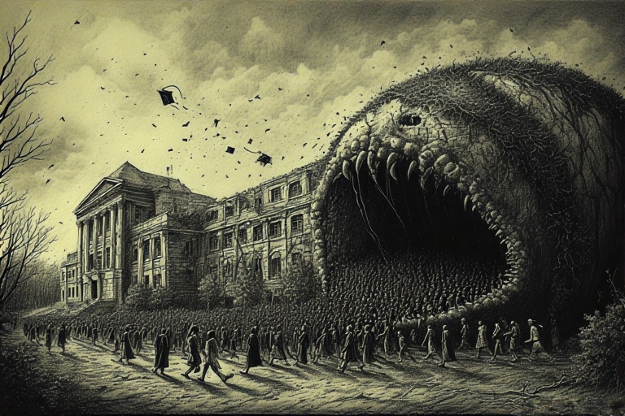


## <u>TLDR - Summary:</u>

India's higher education system has become a parasitic institution that extracts money while providing minimal education. Engineering colleges can't teach, graduates lack real skills despite having degrees, and society has normalized this dysfunction. We've created "educated-yet-ignorant" graduates who possess credentials but no competence, leading to massive resource waste and civilizational decline. The system survives through monopolistic control over degree distribution rather than educational quality.



# <u>The Great Abdication: How India's Educational Institutions Became Parasites on Society's Dreams</u>

We stand witness to one of the most devastating institutional failures of our time: the systematic transformation of India's higher educational system from engines of human capital development into elaborate theaters of credentialism. This phenomenon—what we term *educational parasitism*—represents institutions that extract societal resources while providing minimal genuine value, surviving purely through monopolistic control over credentials that society has been conditioned to accept as meaningful.

## <u>1. Defining Educational Parasitism: The Anatomy of Institutional Failure</u>

Educational parasitism occurs when learning institutions maintain their social legitimacy and economic viability not through the quality of education they provide, but through their gatekeeping function in credentialization processes. Unlike biological parasites that weaken their hosts gradually, educational parasites create a more insidious form of damage: they manufacture what we might call *parha-likha-anparh*—the educated-yet-ignorant graduate who possesses degrees but lacks genuine competence.

This represents more than mere pedagogical incompetence; it signals a fundamental breakdown in the social contract between educational institutions and society. When ninety-nine percent of engineering colleges cannot effectively teach their core subjects, we witness not isolated failures but systemic collapse masquerading as educational expansion.

## <u>2. The Credentialization Trap: Manufacturing Human Capital Stagflation</u>

The contemporary Indian higher education landscape exhibits characteristics remarkably similar to economic stagflation—credential inflation occurring simultaneously with competency stagnation. Students spend four years in engineering programs, companies hire these graduates for roles requiring no engineering knowledge, and society perpetuates this elaborate charade because each participant benefits from maintaining the fiction.

This dynamic creates what economists recognize as a classic coordination failure. Educational institutions profit from fee collection without delivering education, employers fill human resource requirements on paper while conducting extensive screening processes that effectively ignore formal credentials, and students receive degrees that function primarily as expensive signaling devices rather than indicators of actual capability.

The most troubling aspect lies in society's normalization of this dysfunction. We have collectively accepted that *"college nahi parhayega"* (colleges won't teach)—an abdication that would be unthinkable in other sectors. We would never accept hospitals that don't heal, courts that don't deliver justice, or bridges that don't bear weight, yet we have embraced educational institutions that don't educate.

## <u>3. The Export-Import Syndrome: Protected Markets and Innovation Deficit</u>

Indian educational institutions operate within what we might characterize as an import-substitution model of learning—they provide domestic alternatives to genuine education while remaining protected from international competition or meaningful quality assessment. Just as companies operating solely in protected domestic markets lack innovation incentives, our educational institutions face no external validation of their output quality.

This creates profound information asymmetries. Parents and students cannot easily assess educational quality, while employers develop elaborate screening mechanisms precisely because they cannot trust the credentials the system produces. The result is massive resource misallocation—society invests heavily in educational infrastructure that produces negative value.

Consider the research infrastructure in premier institutions, where expensive imported equipment sits in laboratories that function more as museums than centers of innovation. PhD students describe their research environments as decorative spaces designed for publication generation rather than genuine scientific inquiry. This represents the completion of a vicious cycle where form has completely divorced from function.

## <u>4. The Demographic Dividend Delusion: Staggered Unemployment as Policy</u>

India's educational expansion strategy reflects what we term the "demographic dividend fallacy"—the belief that simply credentializing large numbers of people would automatically translate into economic growth. Instead, we have implemented a Chinese-style approach to unemployment management, keeping people in educational institutions longer to delay their entry into saturated job markets.

This strategy creates what economists call "staggered unemployment"—a system where potential joblessness is temporarily hidden within extended educational timelines rather than being addressed through genuine skill development or job creation. The recent phenomenon of major corporations indefinitely delaying onboarding for hundreds of graduates perfectly illustrates this system's ultimate unsustainability.

## <u>5. The Missing Markets Problem: When Money Cannot Motivate</u>

This analysis reveals a fundamental challenge that extends beyond education into broader questions of social organization. Certain essential social functions—teaching, research, military service—may require motivational structures beyond simple financial incentives. Modern market economies assume that sufficient monetary rewards can attract talent to any necessary social function, but this assumption proves inadequate for roles requiring intrinsic motivation, social prestige, or long-term commitment.

Traditional social structures once provided non-monetary incentives through guaranteed status, social recognition, and occupational pride. The breakdown of these structures without adequate market-based alternatives has created what economists recognize as "missing markets"—areas where necessary social functions lack effective coordination mechanisms.

This analysis leads us to an uncomfortable but important recognition: some form of occupational specialization with social reinforcement may be economically necessary, even if we reject the oppressive aspects of historical caste systems. The challenge lies in creating such specialization through voluntary rather than hereditary mechanisms.

## <u>6. Global Competition and the Inevitability of Reckoning</u>

India's educational dysfunction occurs within an increasingly competitive global context. As other developing regions rapidly improve their educational systems and artificial intelligence automates routine tasks, our elaborate system of credential distribution faces inevitable obsolescence. The comparison with Sub-Saharan Africa proves particularly sobering—regions we once considered less developed are now implementing educational reforms that may soon surpass our capabilities.

This global competitive pressure creates what we might call "civilizational stakes." A society that cannot effectively transmit knowledge and skills to its younger generation has placed its long-term survival at risk. We face the potential end of India's demographic dividend not because our population is aging, but because we systematically waste human potential through institutional failure.
