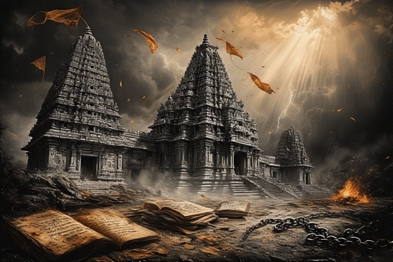

***Read the Main Article here - [How India's Founding Fathers Murdered a Civilisation](https://vicharamanjari.onrender.com/posts/our_founding_fathers/)***

***For a list of actions against the Hindu Society in entire Indian subcontinent, refer to - [The Death of The Indian Subcontinent](https://vicharamanjari.onrender.com/posts/subcontinent)***

## <u>**III. Hindu Reformers and Their Vision for Hinduism**</u>

The 19th and early 20th centuries witnessed a significant wave of Hindu reform movements, driven by a desire to revitalize and redefine Hinduism in response to colonial critiques and internal social challenges. These movements sought to purify religious practices, address social evils, and articulate a modern Hindu identity that could serve as a foundation for national resurgence.

### <u>**A. Early Reformers and Monotheistic Tendencies**</u>

#### <u>**Raja Ram Mohan Roy (Brahmo Samaj)**</u>

Raja Ram Mohan Roy, often hailed as the "Father of the Indian Renaissance," founded the Brahmo Samaj in Kolkata in 1828.3 This pivotal social and religious movement advocated for a monotheistic form of Hinduism, known as Brahmoism. Roy explicitly rejected idol worship and ritualism, believing in "one formless being from the Rig Veda who is 'Brahman'".2 He contended that "meaningless ritualistic polytheism had strayed from the original meaning of Vedas".15 His efforts were aimed at "purifying Hinduism by eliminating idolatry, superstition, and social evils" like sati (widow burning) and child marriage.2 Roy played a significant role in the abolition of sati in 1829.2 He also championed women's education and rights.2 Roy's statements, such as "The superstitious practices which deform the Hindu religion have nothing to do with the pure spirit of its dictates" and "It is necessary that some change should take place in their religion," underscore his reformist zeal.5 He was also critical of Christian missionaries' attempts to convert Hindus and Muslims.5

The advocacy for a monotheistic "Brahmoism" and the rejection of idolatry by Raja Ram Mohan Roy, along with similar stances by Dayananda Saraswati, represent a notable internal tension within Hinduism. Historically, Hinduism has embraced a diverse range of theological expressions, including polytheism, pantheism, and monism.15 The push towards monotheism by these reformers can be understood as an attempt to rationalize Hinduism in the face of Western critiques, to align it with Abrahamic religious structures, or to return to what they perceived as a "purer" Vedic essence. This dynamic illustrates a process of internal re-evaluation and adaptation, where some sought to simplify and unify Hindu theological understanding, even as the tradition itself continued to embrace plurality.

#### <u>**Dayananda Saraswati (Arya Samaj)**</u>

Maharshi Dayananda Saraswati established the Arya Samaj in 1875, leading a significant social and religious reform movement in North India.2 His core philosophy centered on a return to the Vedas, which he regarded as the "only true uncorrupted sources of Dharma" and "the eternal knowledge of God" containing "the ultimate truth that does not decay or die".2 Dayananda vehemently rejected idolatry, caste restrictions, untouchability, and child marriage, while advocating for equal status and opportunities for women.2 He famously stated, "The worship of anything made by hands, whether painted or graven images, is in the same category as the worship of bricks, stones, and wood".17

Dayananda opposed "Brahmanism," which he believed had corrupted the knowledge of the Vedas, as strongly as he opposed Christianity and Islam.6 He also rejected the Puranas for containing "too many false pieces of information that can mislead people" and dismissed astrology as a "fraud".18 The Arya Samaj inspired many revolutionaries and political leaders of the Indian Independence movement, including Ramprasad Bismil, Bhagat Singh, Shyamji Krishnavarma, Bhai Paramanand, and Lala Lajpat Rai.6 He also initiated the 'Shuddhi' (purification) movement in the early 20th century, aiming to bring back people who had converted to Islam and Christianity into the Hindu fold.3

The internal critiques of Hinduism's social evils, such as sati, child marriage, caste, and idolatry, by figures like Raja Ram Mohan Roy and Dayananda Saraswati, were not merely religious endeavors but were deeply intertwined with their vision for a modernized and stronger India capable of resisting colonial dominance.2 By "purifying" Hinduism and promoting rationalism and social equality, these reformers aimed to make Hindu society resilient and relevant in a changing world. This internal reform process, driven by a desire to remove perceived "blemished traditions" 17, became a foundational element in forging a distinct national identity and fostering patriotic ideas.6 The act of self-critique within Hinduism thus served as a powerful engine for national self-assertion.

### <u>**B. Spiritual Nationalism and Revivalism**</u>

#### <u>**Swami Vivekananda (Ramakrishna Mission)**</u>

Swami Vivekananda emerged as a central personality in the development of a new stream of Hinduism in the late 19th and early 20th centuries, founding the Ramakrishna Mission in 1897.3 Educated in contemporary Western thought, he re-interpreted Advaita Vedanta, presenting it as the essence of Hindu spirituality. He combined this with disciplines like yoga and the concept of social service to form what he termed "practical Vedanta," emphasizing the universality of all religions and the importance of selfless service.2

A major component of Vivekananda's message was nationalism. He viewed his efforts as a revitalization of the Hindu nation, which he believed could counteract Western materialism.6 His ideas became a significant inspiration for Hindu nationalism, with the Rashtriya Swayamsevak Sangh (RSS) considering him akin to the Bhagavad Gita.6 Vivekananda's influence extended to prominent figures such as Rabindranath Tagore, Mahatma Gandhi, Subhas Chandra Bose, and Sri Aurobindo.3 His appreciation of *Kshatriya dharma*—the duty of the warrior—provided a philosophical bridge to the militaristic views of Subhas Chandra Bose, as Vivekananda believed that violence could be *dharmic* if used in defense of truth.19

#### <u>**Sri Aurobindo Ghosh**</u>

Sri Aurobindo Ghosh transitioned from a radical political activist to an internationally influential Guru, redefining Hinduism for the modern age.20 During his early revolutionary phase, Aurobindo intricately fused political and spiritual ideas. He integrated European philosophy, particularly the works of Hegel and Nietzsche, with Hindu theology, drawing heavily from the Tantric mother goddess Kali and Bengali Shaktism (the worship of latent creative energy).20 This synthesis led to a radical political discourse that emphasized embodied spirituality, heroic sacrifice, and transformative violence.

Aurobindo developed the concept of the "revolutionary Sannyasi" as a central symbolic archetype in his political theology. He argued that such a figure could "kill with sanctity," thereby making violent revolution "spiritually transcendent, without murderous stain." He notably stated, "war is the law of creation".20 Aurobindo organized a network of underground terrorist cells and encouraged politicized students in Bengal to embrace this militant spirituality.20 In his later years, he developed "Integral Yoga," a system of experimental mysticism that offered a life-affirming metaphysics of divine evolution and a global outlook.20

Aurobindo was critical of what he perceived as an overly pacifist or passive approach to political struggle. He stated that "Hinduism recognizes human nature and makes no such impossible demand" as saintly sufferance in politics, arguing that imposing the "Brahminical duty of saintly sufferance" would "destroy society and the race".21 He believed that aggression was unjust only when unprovoked and violence unrighteous when used wantonly or for unrighteous ends.21 He emphasized the "realisation of the Motherhood of God in the country" as the "sap which keeps nationalism alive".21 Aurobindo also articulated a "Hindu synthesis, the synthesis of Vedanta," which he considered the highest synthesis, broad enough to include "the Moslem and his culture" within an "Indian Nationalism, largely Hindu in its spirit and traditions".22 His influence extended across the political spectrum, including Gandhian mobilization and Hindu nationalism.20 However, it is important to note that Hindu nationalist organizations later recast Aurobindo in a right-wing mold to assert Hindu dominance, a portrayal that stands in sharp contrast with his original inclusive and "anarchic" outlook.20

The approaches of Swami Vivekananda and Sri Aurobindo illustrate the wide range of interpretations within "Hindu nationalism." Vivekananda's vision emphasized spiritual strength and cultural pride, envisioning India as a spiritual leader to the world.6 In contrast, Sri Aurobindo, while also rooted in Hindu spirituality, explicitly incorporated "divine violence" and the concept of the "revolutionary Sannyasi" 20 as legitimate means for achieving national liberation. This demonstrates that "Hindu nationalism" was not a monolithic ideology but encompassed a wide range of approaches, from non-violent spiritual regeneration to the justification of armed struggle. This internal diversity within Hindu nationalist thought highlights the complex moral and strategic debates among those who sought to leverage Hindu identity for national purposes.

## <u>**IV. The Indian National Congress: Diverse Religious and Secular Stances**</u>

The Indian National Congress, as the leading political force in the independence movement, comprised a wide array of individuals with diverse views on religion, secularism, and the role of Hinduism in a future independent India. While officially espousing secularism, the personal beliefs and political strategies of its leaders often reflected a complex and sometimes contradictory relationship with religious identity.

### <u>**A. Mahatma Gandhi: Religion as Moral and Political Force**</u>

Mahatma Gandhi, a pivotal figure in the Indian freedom struggle, was born into a Gujarati Hindu Modh Bania family, and his religious background was eclectic, deeply influenced by Hinduism and Jainism. These influences instilled in him profound beliefs in non-violence (ahimsa), vegetarianism, and a deep respect for all religions.23 He famously articulated this belief by stating, "Religions are different roads converging upon the same point".23

Gandhi coined the concept of "Sarva Dharma Sama Bhava," which embodies the equality of all religions or, more literally, "same feeling towards all religions." He first used this phrase in September 1930 in his communications to followers to quell divisions between Hindus and Muslims, and it became a key tenet of Indian secularism.25 Gandhi held an unshakeable conviction that "Truth is God" and that it was impossible to separate religion from politics. He famously declared, "who who say that religion has nothing to do with politics do not know what religion means".27 For Gandhi, religion was to be measured by its impact on the activities of daily life rather than by religious rituals or temple observances.27

He led nationwide campaigns for significant social reforms, including easing poverty, expanding women's rights, fostering religious and ethnic amity, and most notably, ending untouchability. He actively encouraged members of the lowest "untouchable" (Harijan or Dalit) castes to participate in the civil disobedience movement, a stance that generated considerable controversy.24 Gandhi's vision of an independent India based on religious pluralism, however, faced significant challenges from emerging Muslim nationalism in the early 1940s, which ultimately led to the demand for a separate homeland.24

Gandhi's religious approach and the concept of "Sarva Dharma Samabhava" drew critiques from Hindu nationalist perspectives. Scholars like Koenraad Elst argue that "Sarva Dharma Samabhava" is a "recent creation" not inherent to Hindu tradition, viewing it as an "untenable statement" that "rejects the Hindu humanist conception of religious teachings" and "espouses the Islamic prophetic conception of religious teachings (as being God-given messages)".26 Elst characterized it as a "make-believe, which is held up to fool Hindus".26 The Hindu Mahasabha explicitly rejected Gandhi's idea of Hindu-Muslim unity 29, and prominent right-wing historian Sita Ram Goel also criticized Gandhi's policies on inter-religious relations.30

### <u>**B. Jawaharlal Nehru: Secularism, Rationalism, and State Policy**</u>

Jawaharlal Nehru, India's first Prime Minister, was widely regarded as a Westernized intellectual and an atheist, expressing a strong aversion to organized religion.31 He viewed organized religion as a "reactionary force" that thrived on "narrow mysticism and superstitious beliefs" and was often "ever-ready...to preserve vested political interests".33 Nehru believed in the power of science and philosophy to foster critical reasoning and self-reliance, actively positioning "scientific reason against religious faith".31

He advocated for a secular state that would separate itself from religion and be "indifferent, if not hostile, to it".31 However, his views were complex; he acknowledged India's deep religious diversity and accepted a broader ethical or moral sense of "religion".31 Nehru believed India was a plural society, not one with a single religious affiliation, recognizing the historical emergence of Buddhism and Jainism as responses to Hinduism, and acknowledging the significance of Christianity and Islam.34 His secular credentials were rooted in a "rational humanistic attitude towards life," prioritizing the betterment of life in the present over metaphysical concerns.34 He consistently denounced religious communalism, whether Hindu, Muslim, or Sikh.33

Nehru played a pivotal role in the implementation of the Hindu Code Bills (1955-1958), a landmark legislative effort that aimed to codify and reform Hindu personal law. These bills effectively abolished religious law in favor of a common law code for Hindus, significantly improving the position of women by granting full inheritance rights to widows and daughters, enforcing monogamy, and permitting divorce.4 He famously stated, "I think a country can be judged by the status of its women" and argued that existing "laws and traditions in India suppress women".39 Nehru believed these reforms would "do a special service to Hindu religion, which will progress; otherwise, the Hindu society will become weak".39

Nehru's championing of the Hindu Code Bills represents a critical moment where the post-independence secular state directly intervened in the personal laws of the majority religion.4 This was not merely about establishing religious equality *between* faiths but about legislating social reform *within* Hinduism itself, challenging traditional practices like polygamy, unequal inheritance, and caste barriers in marriage. This action, while progressive and aimed at women's empowerment 37, was perceived by conservative elements, such as the Hindu Mahasabha 29 and the RSS 41, as an attack on Hindu tradition. This highlights the inherent tension in India's unique model of secularism, where the state reserves the right to reform religious practices in the interest of social justice, leading to ongoing debates about religious autonomy versus state intervention.

Nehruvian secularism faced significant critiques from Hindu nationalist viewpoints. Sita Ram Goel considered Nehru's politics "ruinous for India's civilisation" and his secularism "false secularism" that "weakened the Hindu fabric of the nation" and supported the "unwarranted colonial veto right of monotheistic" religions.30 Goel argued that the term "secularism" in post-independence India became a "euphemism for Hindu-baiting".42 Arun Shourie, another prominent critic, critiqued "secularists" for appropriating the label and for making "concessions" to minority religions (particularly Muslims) that he argued violated the spirit of secularism and did not genuinely help the minority communities.43 RSS publications like

*Organiser* explicitly opposed the Hindu Code Bill.41

### <u>**C. Sardar Vallabhbhai Patel: Pragmatism and Communal Dynamics**</u>

Sardar Vallabhbhai Patel, a key leader in the Indian National Congress, demonstrated a pragmatic approach to religious and communal issues that evolved over time. Initially, he showed solidarity with Muslims, supporting the Khilafat Movement and expressing that Hindus could not stand by unaffected when their "fellow countrymen thus in distress".44

However, his attitude shifted significantly after the Partition of India. He was observed promoting anti-Muslim militias, suggesting he had "already given licences to two or three Hindu dealers for the sale of arms".44 Patel strongly supported the reconstruction of the Somnath temple, declaring that its restoration would be a "point of honour and sentiment with the Hindu public".44

Following Mahatma Gandhi's assassination, Patel, then Home Minister, invited members of the Hindu Mahasabha and RSS to join the Congress, while obliquely criticizing Nehru's approach of attempting to "crush the RSS".44 He negotiated with RSS leaders, demanding that they adopt a formal written constitution, give up secrecy, and pledge loyalty to the Indian Constitution and the Tricolor flag. Patel aimed to "eradicate" the "madness" of the RSS while seeking to utilize their "bravery, power and courage".44 The ban on the RSS was subsequently lifted after they complied with these demands.6 Patel is also remembered as the "patron saint of India's civil servants".46

The Indian National Congress officially aimed for a "secular and undivided struggle" for independence 47 and established India as a "sovereign, socialist, secular democratic state".49 However, the views and actions of its most prominent leaders reveal deep internal complexities. Gandhi explicitly integrated religion into politics and promoted "Sarva Dharma Sama Bhava" 25, a concept critiqued by some as a "make-believe".26 Nehru, an atheist, sought a strict separation of state and religion and actively reformed Hindu personal law through the Hindu Code Bills.31 Patel, while pragmatic, shifted from advocating Muslim solidarity to supporting Hindu militias and temple reconstruction.44 This indicates that the INC's "secularism" was not a uniform, ideologically consistent doctrine but a complex, often pragmatic, and evolving response to India's diverse religious landscape and communal tensions, accommodating a wide spectrum of personal beliefs from deeply religious to staunchly rationalist.

### <u>**D. Other Key INC Figures**</u>

#### <u>**Bal Gangadhar Tilak**</u>

Bal Gangadhar Tilak, an orthodox Maharashtrian Brahman, held the conviction that the Indian populace could only be galvanized for the freedom struggle through "appeals couched in religious terms".4 He strategically utilized Hindu religious festivals, such as the annual Ganesh festival (Ganesh Chaturthi) and the Shivaji festival, for nationalist propaganda.4 The Shivaji festival, in particular, aimed to commemorate Shivaji as a Hindu hero who fought against Muslim power.51

Tilak interpreted the Bhagavad Gita not as a call to renunciation but as a "call to action" and "selfless service to humanity," an interpretation that profoundly influenced later leaders, including Mahatma Gandhi.4 He published inflammatory articles in his paper

*Kesari*, quoting the Bhagavad Gita to justify killing oppressors.51 While his nationalism initially appealed to the upper classes, his deliberate use of religious symbolism aimed to popularize the movement among ordinary people.51 Despite his religious nationalism, when asked about envisioning a Maratha-type government for Free India, he stated that such a system was "outmoded" in the twentieth century and that he desired a "genuine federal system for Free India, where every religion and race would be equal".51

The strategic importance of religious symbolism in mass mobilization is evident in Bal Gangadhar Tilak's deliberate use of Hindu religious festivals (Ganesh, Shivaji) and the Bhagavad Gita to "arouse" nationalist sentiment and popularize the freedom movement.4 This approach, while effective in uniting segments of the Hindu population, also carried the inherent risk of communalizing the national movement by appealing to a specific religious identity. This contrasts sharply with Nehru's aversion to organized religion 33 and highlights a fundamental difference in how leaders approached the integration of religion into the political struggle, with long-term implications for Hindu-Muslim relations and the secular fabric of the nation.

#### <u>**Rabindranath Tagore**</u>

Rabindranath Tagore, a renowned intellectual, played a significant role in spreading patriotic awareness through his works.1 He was notably influenced by Swami Vivekananda.3 Tagore's literary contributions blended Indian and Western philosophies, thereby fostering a cultural awakening in India.12

#### <u>**Madan Mohan Malviya**</u>

Madan Mohan Malviya is mentioned as a leader associated with Hindu nationalism.6 He initially supported the Hindu Mahasabha.29

#### <u>**Female Leaders**</u>

Prominent female leaders such as Sarojini Naidu, Vijaya Lakshmi Pandit, Pritilata Waddedar, and Kasturba Gandhi actively promoted the emancipation of Indian women and their participation in the freedom struggle.1 While the provided information does not detail their specific religious views on Hinduism, their actions contributed significantly to social reform within the broader context of the independence movement.

## <u>**V. Radical Critiques and Anti-Hindu Movements**</u>

Beyond the mainstream political discourse, the period also saw radical critiques of Hinduism and the emergence of movements that challenged its foundational tenets, particularly the caste system. These movements often sought a complete break from existing religious and social structures, advocating for revolutionary change.

### <u>**A. B.R. Ambedkar: Annihilation of Caste and Conversion**</u>

B.R. Ambedkar, born into a caste classified as "untouchable," experienced firsthand the severe discrimination and bitterness of the Hindu caste system, which he vehemently denounced throughout his life.16 He was a vehement modern Buddhist critic of Hinduism.16 Ambedkar consistently argued that the marginalized status of Dalits was directly attributable to the Hindu caste ideology embedded in scriptures like the Manusmriti.16 He firmly believed that "It is not possible to break Caste without annihilating the religious notions on which it, the Caste system, is founded".56 He famously stated that "what is wrong is their religion, which has inculcated this notion of Caste".56 As a powerful symbolic act of defiance against the Manusmriti's perceived role in perpetuating caste, he publicly burned the text in 1927.54

Ambedkar viewed Brahmanism and patriarchy as intricately linked in perpetuating the suffering and low status of women in Indian society. He championed women's rights, advocating for their equal status in education and property, and regarded the Hindu Code Bill as a "Charter of Women's Rights in Free India".40 His profound disillusionment with Hinduism led him to renounce it and convert to Buddhism in 1956, along with hundreds of thousands of his followers, thereby initiating the Dalit Buddhist movement.16 He chose Buddhism due to its Indian roots, its ethical and moral framework, its explicit lack of a caste system, and its compatibility with scientific thought.53 As part of the conversion ceremony, he laid down 22 vows, which included explicit rejection of Hindu gods (Brahma, Vishnu, Mahesh, Rama, Krishna, Gouri, Ganapati) and the theory of incarnation.53 Ambedkar believed that Buddhism represented a "revolution" against Vedic tradition, embodying the ideals of "Liberty, Equality and Fraternity" that he sought for Indian society.58

The detailed accounts of B.R. Ambedkar and E.V. Ramasamy Periyar unequivocally demonstrate that the caste system was the central and most intolerable aspect of Hinduism for them, driving their radical critiques and actions.53 Ambedkar's conviction that caste is inextricably linked to Hindu religious notions 56 led him to conclude that only a complete break from Hinduism, through conversion to Buddhism, could liberate Dalits.58 Similarly, Periyar's anti-Brahminism and atheism were rooted in his belief that religious dogma, particularly Brahminical Hinduism, served as a tool for maintaining social hierarchies and exploiting marginalized communities.59 For these figures, religious reform was deemed insufficient; a fundamental societal and religious revolution was considered necessary to achieve equality and dignity.

### <u>**B. E.V. Ramasamy Periyar: Atheism, Anti-Brahminism, and Social Revolution**</u>

E.V. Ramasamy Periyar, a prominent social reformer from Tamil Nadu, was a staunch atheist and rationalist who virulently opposed religion.59 He believed that "men of religion invented myths and superstitions to keep the innocent and ignorant people in darkness and to go on exploiting them".60 Periyar was a harsh critic of Brahminical Hinduism in Tamil Nadu, but his critique also extended to Islam, Buddhism, and Christianity.60

He argued that the concept of God was a construct primarily used by religious authorities, particularly Brahmins, to maintain social hierarchies and exploit marginalized communities.59 In 1925, he founded the Self-Respect Movement, which aimed to liberate people from the "shackles of caste and religious oppression" by rejecting God and divine authority.59 Periyar condemned Brahminical scriptures, especially the Manusmriti, Vedas, and Puranas, as instruments that reinforced social and gender inequalities and legitimized caste-based discrimination.59 He notably declared his intent to burn Manusmriti and Ramayana.61

Periyar famously broke idols of "Brahamanic gods" to symbolize his protest against religious superstition and to provoke people to question their blind faith.59 He explicitly stated, "Wherever we see a temple, we must go inside and break all the idols inside. Wherever we find a Paapaan, we must kill and destroy him".61 He conveyed to Mahatma Gandhi that "Hindu religion with its caste-system and the Dominance of Brahmins in the society should be put an end to first" before fighting for India's freedom.61 Periyar viewed India's independence as merely a "made over" to Brahmins and North Indian Merchants, advocating for a "separate Sovereign State" of "Tamil Nadu for Tamils".61 He argued that the terms "Hindu" and "Hinduism" were not indigenous and that accepting them meant admitting "Aryan principles" which led to "political enslavement".60

### <u>**C. Other Dissenting Voices and Movements**</u>

#### <u>**Vanchi Iyer**</u>

Vanchi Iyer was a revolutionary who assassinated British Collector Robert Ashe in 1911.9 In a letter found after his suicide, Vanchi Iyer explicitly stated that the British were "destroying the sanathana dharma of the Hindus" and that his act was intended to "drive out the English and get swarajyam and restore sanathana dharma".8 He accused King George V of being a "mlecha" (foreigner/barbarian) and "cow-eater".8 His act was seen by his orthodox Brahmin father as "against Brahminism," leading to his father's refusal to collect his body.9 A controversial narrative, alleged by some Tamil Nadu outfits, claims Vanchi Iyer was a casteist who killed Ashe for interfering with Brahminism by supporting a pregnant "outcast woman".63

*The Hindu* (Tamil) later apologized for publishing this specific unverified claim.

While Vanchi Iyer's assassination of Robert Ashe was explicitly framed as an act to "restore sanathana dharma" 8 against perceived British threats, this seemingly "pro-Hindu" act was rooted in a traditional, almost static, understanding of a sacred order. This stands in stark contrast to the revolutionary actions of Ambedkar and Periyar, who, while not directly addressing "Sanatan Dharma," implicitly or explicitly rejected its traditional, caste-ridden interpretations. For them, true social progress meant dismantling the very structures that traditional "Sanatan Dharma" might have been seen to uphold. The controversy surrounding Vanchi Iyer's motives 63 further complicates this, suggesting that even within traditionalist circles, there could be internal disagreements or interpretations that blur the lines between religious defense and caste preservation. This reveals a profound ideological chasm regarding the very essence and future of Hindu society.

#### <u>**Syed Mir Nisar Ali Titumir**</u>

Syed Mir Nisar Ali Titumir was an Islamic preacher who led a peasant uprising against Hindu Zamindars and the British in Bengal during the 19th century.64 He preached a puritanical Wahabi Islam, urging Muslims to abandon "un-Islamic practices" like veneration of Sufi graves and folk syncretism.66 Titumir considered Hindu Zamindars "usurpers of power" and aimed to transform India from "dar al-Harb (house of heathens)" into "dar al-Islam (house of Islam)".66 His followers engaged in direct religious provocations against Hindus, including "seizing and killing a cow, sprinkling the blood over the walls of a Hindu temple, and hanging up the carcass in front of that building. Then, a Brahman was killed." These acts were explicitly described as "vengeance" and "desecration to avenge a previously demolished mosque".66 Raids on Hindu establishments were also accompanied by "desecration of idols".65

Syed Mir Nisar Ali Titumir's Islamic revivalist movement demonstrates how religious fervor, when combined with socio-economic grievances against Hindu Zamindars and anti-colonial sentiment, could manifest in violent communal acts like cow slaughter and temple desecration.65 This illustrates that religious identity was not always a unifying force for national independence but could also be a potent source of internal conflict and division. This historical example provides a critical counterpoint to the ideal of Hindu-Muslim unity often propagated by figures like Gandhi, highlighting the deep-seated religious antagonisms that also shaped the period.

## <u>**VI. Hindu Nationalist Narratives and Historical Interpretations**</u>

The freedom struggle and the early years of independent India also saw the rise of Hindu nationalist ideologies, which offered distinct interpretations of India's past, present, and future, often in contrast to the secular vision of the Indian National Congress. These narratives frequently sought to redefine Indian identity through a Hindu lens.

### <u>**A. Vinayak Damodar Savarkar and the Ideology of Hindutva**</u>

Vinayak Damodar Savarkar articulated the political ideology of "Hindutva" (meaning 'Hinduness') in 1923.6 Despite being a non-religious rationalist, Savarkar aimed to define "Hindu" not by religious practice but by cultural justification and a shared sense of belonging to India as both "Fatherland and Holyland".6 This definition was explicitly designed to exclude Abrahamic religions (Judaism, Christianity, Islam), whose holy lands were considered "far off in Arabia or Palestine".6

Savarkar believed that "Muslims were the real enemies, not the British," as their Islamic ideology posed "a threat to the real nation, namely Hindu Rashtra".7 His concept of "Hindu Rashtra" (Hindu Polity) advocated for the protection of Hindu people and their culture, insisting that political and economic systems should be rooted in native thought.6 His ideology has been described as a variant of "right-wing extremism," "almost fascist in the classical sense," adhering to a concept of homogenized majority and cultural hegemony, and a "separatist ideology".6 Some analysts, however, dispute the "fascist" label, suggesting it is an extreme form of "conservatism" or "ethnic absolutism".7 Savarkar's ideas heavily influenced Keshav Baliram Hedgewar, the founder of the Rashtriya Swayamsevak Sangh (RSS).67

### <u>**B. Hindu Mahasabha and Rashtriya Swayamsevak Sangh (RSS)**</u>

#### <u>**Hindu Mahasabha**</u>

The Hindu Mahasabha was formed in Calcutta in 1915, with Vinayak Damodar Savarkar later becoming its president.29 Its core ideology was that India should be a nation primarily for Hindus, where Hindus would have "more rights and power" and minorities would have "fewer rights and representation".29 The Mahasabha explicitly rejected Mahatma Gandhi's ideal of Hindu-Muslim unity, believing that Muslims could "never be loyal to a free India" and advocating for a "clear separation between Hindus and Muslims".29 It opposed the secular vision of the Indian National Congress.29 The organization also opposed social reforms promoted by the British, such as the abolition of untouchability, banning child marriage, and granting more rights to women, viewing these as threats to "Hindu traditions".29 The Hindu Mahasabha supported the partition of India, believing a separate Hindu nation was needed.29 Its decline after independence was partly due to its association with Mahatma Gandhi's assassination in 1948 by Nathuram Godse, a former member.6

#### <u>**Rashtriya Swayamsevak Sangh (RSS)**</u>

The Rashtriya Swayamsevak Sangh (RSS) was founded in 1925 by Keshav Baliram Hedgewar, who was deeply influenced by Savarkar's Hindutva ideology.6 From its inception, the RSS opposed joining the Indian independence movement against British rule.45 It portrayed itself as a social movement focused on strengthening Hindu society, deliberately avoiding direct affiliation with political organizations fighting the British.68 The RSS rejected Gandhi's willingness to cooperate with Muslims.68

M.S. Golwalkar, who led the RSS from 1940, further strengthened this isolation, stating that the RSS was pledged to achieve freedom through "defending religion and culture," not by fighting the British.68 He openly admitted that the RSS did not participate in the Quit India Movement or the Royal Indian Navy mutiny.68 British authorities noted that RSS speakers urged members to "keep aloof from the anti-British movements" and that the organization "scrupulously kept itself within the law".68

The RSS was banned after Mahatma Gandhi's assassination. Sardar Vallabhbhai Patel, then Home Minister, stated that "RSS men expressed joy and and distributed sweets after Gandhiji's death" and that their speeches were "full communal poison".6 The ban was lifted after the RSS adopted a formal constitution pledging loyalty to the Indian Constitution and the Tricolor flag.6 The RSS emphasizes dedication, discipline, and paramilitary training to restore strength and foster unity among Hindus of all castes and classes.67 It advocates the ideology of "Akhand Bharat" (Undivided India), insisting on the subcontinent's geographical and cultural unity under Hindu majoritarian rule.67

### <u>**C. Critiques of Mainstream Historical Narratives (Right-Wing Authors)**</u>

The user's explicit request to "scour the lesser known sources, every small person's blog on the internet, every lesser known author's book, especially all the right wing sources" \[User Query] highlights a perceived bias in mainstream historical narratives. Several right-wing authors have offered alternative interpretations of India's freedom struggle and the role of religion, often challenging established academic consensus.

#### <u>**Sita Ram Goel**</u>

Sita Ram Goel was a prominent right-wing historian and intellectual who vehemently opposed Jawaharlal Nehru's politics, viewing them as "ruinous for India's civilisation" and his secularism as "false secularism" that "weakened the Hindu fabric of the nation" and supported the "unwarranted colonial veto right of monotheistic" religions.30 Goel argued that the term "secularism" in post-independence India became a "euphemism for Hindu-baiting".42 He saw Hindu resurgence as a necessary "bulwark against clerical and political regimentation".30 Goel was critical of the notion of a "Ganga-Yamuna synthesis," viewing it as a high-brow aristocratic concept, and argued that Hinduism, despite its philosophical depth, had to accept the periodic destruction of its temples under Mughal rule.30 He also criticized the RSS for sacrificing intellectual freedom for discipline and for its tendency to homogenize the Hindu nation.30 Goel authored significant works including *How I Became a Hindu*, *The Story of Islamic Imperialism in India*, and *Hindu Temples: What Happened to Them*.70 His writings were often controversial and subject to attempts at banning and legal cases for allegedly "outraging religious feelings".70

#### <u>**Koenraad Elst**</u>

Koenraad Elst, a Belgian Indologist known for his right-wing views on Indian history and religion, has extensively critiqued Mahatma Gandhi's religious philosophy. He argues that Gandhi's concept of "Sarva Dharma Samabhava" is a "recent creation" not inherent to Hindu tradition, viewing it as an "untenable statement" and a "make-believe" that "fools Hindus".26 Elst contends that this concept "rejects the Hindu humanist conception of religious teachings" and instead "espouses the Islamic prophetic conception of religious teachings (as being God-given messages)".26 His works include *Why I Killed the Mahatma- Uncovering Godse's Defence*, *Negationism in India: Concealing the Record of Islam*, and *Who is a Hindu?*.71

#### <u>**Arun Shourie**</u>

Arun Shourie, an Indian author, journalist, and politician, has also offered critiques of mainstream secularism and historical interpretations. He criticizes "secularists" for appropriating the label and for effectively using religion for their own ends.43 Shourie argues that "concessions" accorded to minority religions, particularly Muslims, violate the spirit of secularism and often do not genuinely benefit the lay members of those communities.43 He posits that religious texts are man-made, contain contradictions, and that direct experience should be a more reliable guide in religious matters than the "diktat of some intermediary".43 Shourie advocates for a Uniform Civil Code in India.43 His notable works include *Indian Controversies* and *The New Icon: Savarkar and the Facts*, in which he offers a critical perspective on Savarkar.43

#### <u>**Works cited**</u>

1. Indian independence movement \- Wikipedia, accessed July 28, 2025, [https://en.wikipedia.org/wiki/Indian\_independence\_movement](https://en.wikipedia.org/wiki/Indian_independence_movement)  
2. Hindu reform movements of the 19th and 20th centuries | Intro to ..., accessed July 28, 2025, [https://library.fiveable.me/introduction-hinduism/unit-11/hindu-reform-movements-19th-20th-centuries/study-guide/xaiDn9vwrGSclg1w](https://library.fiveable.me/introduction-hinduism/unit-11/hindu-reform-movements-19th-20th-centuries/study-guide/xaiDn9vwrGSclg1w)  
3. Hindu reform movements \- Wikipedia, accessed July 28, 2025, [https://en.wikipedia.org/wiki/Hindu\_reform\_movements](https://en.wikipedia.org/wiki/Hindu_reform_movements)  
4. Hinduism \- Struggle, Independence, India | Britannica, accessed July 28, 2025, [https://www.britannica.com/topic/Hinduism/The-struggle-for-independence](https://www.britannica.com/topic/Hinduism/The-struggle-for-independence)  
5. 15 of the best Quotes by Ram Mohan Roy | Quoteikon, accessed July 28, 2025, [https://www.quoteikon.com/ram-mohan-roy-quotes.html](https://www.quoteikon.com/ram-mohan-roy-quotes.html)  
6. Hindu nationalism \- Wikipedia, accessed July 28, 2025, [https://en.wikipedia.org/wiki/Hindu\_nationalism](https://en.wikipedia.org/wiki/Hindu_nationalism)  
7. Hindutva \- Wikipedia, accessed July 28, 2025, [https://en.wikipedia.org/wiki/Hindutva](https://en.wikipedia.org/wiki/Hindutva)  
8. Today 110 years ago, freedom fighter Vanchinathan Iyer killed ..., accessed July 28, 2025, [https://www.reddit.com/r/IndiaSpeaks/comments/o1wyqy/today\_110\_years\_ago\_freedom\_fighter\_vanchinathan/](https://www.reddit.com/r/IndiaSpeaks/comments/o1wyqy/today_110_years_ago_freedom_fighter_vanchinathan/)  
9. Vanchinathan \- Wikipedia, accessed July 28, 2025, [https://en.wikipedia.org/wiki/Vanchinathan](https://en.wikipedia.org/wiki/Vanchinathan)  
10. Sanatana Dharma: an advanced text book of Hindu religion and ethics, accessed July 28, 2025, [https://www.rarebooksocietyofindia.org/book\_archive/196174216674\_10152693130586675.pdf](https://www.rarebooksocietyofindia.org/book_archive/196174216674_10152693130586675.pdf)  
11. SANATANA DHARMA \- Jainworld, accessed July 28, 2025, [https://jainworld.jainworld.com/JWEnglish/Sanatan%20Dharma.pdf](https://jainworld.jainworld.com/JWEnglish/Sanatan%20Dharma.pdf)  
12. Indian Renaissance Leaders: Architects of Modern India, accessed July 28, 2025, [https://sleepyclasses.com/indian-renaissance-leaders/](https://sleepyclasses.com/indian-renaissance-leaders/)  
13. 19th Century Social and Religious Reforms Movements in India \- BYJU'S, accessed July 28, 2025, [https://byjus.com/free-ias-prep/19th-century-social-religious-reforms/](https://byjus.com/free-ias-prep/19th-century-social-religious-reforms/)  
14. Socio-Religious Reform Movements In 19th And 20th Century India \- Only IAS, accessed July 28, 2025, [https://pwonlyias.com/ncert-notes/socio-religious-reform-movements-india/](https://pwonlyias.com/ncert-notes/socio-religious-reform-movements-india/)  
15. Raja Ram Mohan Roy's monotheistic Hinduism : r/IndianHistory \- Reddit, accessed July 28, 2025, [https://www.reddit.com/r/IndianHistory/comments/1gfg6ka/raja\_ram\_mohan\_roys\_monotheistic\_hinduism/](https://www.reddit.com/r/IndianHistory/comments/1gfg6ka/raja_ram_mohan_roys_monotheistic_hinduism/)  
16. Criticism of Hinduism \- Wikipedia, accessed July 28, 2025, [https://en.wikipedia.org/wiki/Criticism\_of\_Hinduism](https://en.wikipedia.org/wiki/Criticism_of_Hinduism)  
17. Swami Dayanand Saraswati: The Luminary Founder of Arya Samaj II, accessed July 28, 2025, [https://hinduinfopedia.org/swami-dayanand-saraswati-the-luminary-founder-of-arya-samaj-ii/](https://hinduinfopedia.org/swami-dayanand-saraswati-the-luminary-founder-of-arya-samaj-ii/)  
18. Dayananda Saraswati \- Wikipedia, accessed July 28, 2025, [https://en.wikipedia.org/wiki/Dayananda\_Saraswati](https://en.wikipedia.org/wiki/Dayananda_Saraswati)  
19. Vivekananda and Bose: Soul and Flame of Indian Nationalism \- Yours Positively, accessed July 28, 2025, [https://yourspositively.com/vivekananda-and-bose-soul-and-flame-of-indian-nationalism/](https://yourspositively.com/vivekananda-and-bose-soul-and-flame-of-indian-nationalism/)  
20. Spiritual violence and the divine revolution of Sri Aurobindo Ghosh ..., accessed July 28, 2025, [https://www.cam.ac.uk/research/features/spiritual-violence-and-the-divine-revolution-of-sri-aurobindo-ghosh](https://www.cam.ac.uk/research/features/spiritual-violence-and-the-divine-revolution-of-sri-aurobindo-ghosh)  
21. Sri Aurobindo on Politics and Nationalism \- surasA.net, accessed July 28, 2025, [https://surasa.net/aurobindo/on\_nation/](https://surasa.net/aurobindo/on_nation/)  
22. Sri Aurobindo on Nationalism, accessed July 28, 2025, [https://auromere.wordpress.com/2013/02/02/sri-aurobindo-on-nationalism/](https://auromere.wordpress.com/2013/02/02/sri-aurobindo-on-nationalism/)  
23. Bringing Down an Empire: Gandhi and Civil Disobedience \- Teach Democracy, accessed July 28, 2025, [https://teachdemocracy.org/bill-of-rights-in-action/bria-16-3-b-bringing-down-an-empire-gandhi-and-civil-disobedience](https://teachdemocracy.org/bill-of-rights-in-action/bria-16-3-b-bringing-down-an-empire-gandhi-and-civil-disobedience)  
24. Mahatma Gandhi \- Wikipedia, accessed July 28, 2025, [https://en.wikipedia.org/wiki/Mahatma\_Gandhi](https://en.wikipedia.org/wiki/Mahatma_Gandhi)  
25. Sarva Dharma Sama Bhava \- Wikipedia, accessed July 28, 2025, [https://en.wikipedia.org/wiki/Sarva\_Dharma\_Sama\_Bhava](https://en.wikipedia.org/wiki/Sarva_Dharma_Sama_Bhava)  
26. Sarva Dharma Samabhava \- Pragyata, accessed July 28, 2025, [https://pragyata.com/sarva-dharma-samabhava/](https://pragyata.com/sarva-dharma-samabhava/)  
27. Gandhi's Religion: Politics, Faith, and Hermeneutics, accessed July 28, 2025, [https://gandhiji.ca/wp-content/uploads/2018/04/Vinay-Lal\_GandhisReligion\_Politics-Faith-Hermeneutics.pdf](https://gandhiji.ca/wp-content/uploads/2018/04/Vinay-Lal_GandhisReligion_Politics-Faith-Hermeneutics.pdf)  
28. The Indian Independence Struggle (1930-1931) | ICNC, accessed July 28, 2025, [https://www.nonviolent-conflict.org/indian-independence-struggle-1930-1931/](https://www.nonviolent-conflict.org/indian-independence-struggle-1930-1931/)  
29. Hindu Mahasabha: Origins, Beliefs, Major Leaders And Influence\! \- Testbook, accessed July 28, 2025, [https://testbook.com/ias-preparation/hindu-mahasabha](https://testbook.com/ias-preparation/hindu-mahasabha)  
30. My Recollection of Shri Sitaram Goel \- Chintan \- India Foundation, accessed July 28, 2025, [https://chintan.indiafoundation.in/articles/my-recollection-of-shri-sitaram-goel/](https://chintan.indiafoundation.in/articles/my-recollection-of-shri-sitaram-goel/)  
31. Nehru against Nehruvians | CSDS, accessed July 28, 2025, [https://www.csds.in/uploads/custom\_files\_new/1526552964\_Nehru%20against%20Nehruvians.pdf](https://www.csds.in/uploads/custom_files_new/1526552964_Nehru%20against%20Nehruvians.pdf)  
32. Nehru against Nehruvians: on religion and secularism \- Research Bank, accessed July 28, 2025, [https://acuresearchbank.acu.edu.au/item/8qx53/nehru-against-nehruvians-on-religion-and-secularism](https://acuresearchbank.acu.edu.au/item/8qx53/nehru-against-nehruvians-on-religion-and-secularism)  
33. Jawaharlal Nehru and the Communal Problem \- Frontier articles on Society & Politics, accessed July 28, 2025, [https://frontierweekly.com/articles/vol-51/51-50/51-50-Jawaharlal%20Nehru%20and%20the%20Communal%20Problem.html](https://frontierweekly.com/articles/vol-51/51-50/51-50-Jawaharlal%20Nehru%20and%20the%20Communal%20Problem.html)  
34. Nehru and his Views on Secularism \- Indian National Congress, accessed July 28, 2025, [https://inc.in/congress-sandesh/tribute/nehru-and-his-views-on-secularism](https://inc.in/congress-sandesh/tribute/nehru-and-his-views-on-secularism)  
35. Hindu code bills \- Wikipedia, accessed July 28, 2025, [https://en.wikipedia.org/wiki/Hindu\_code\_bills](https://en.wikipedia.org/wiki/Hindu_code_bills)  
36. testbook.com, accessed July 28, 2025, [https://testbook.com/ias-preparation/hindu-code-bill\#:\~:text=The%20Hindu%20Code%20Bill%20made,and%20reshape%20Brahminical%20patriarchal%20standards.](https://testbook.com/ias-preparation/hindu-code-bill#:~:text=The%20Hindu%20Code%20Bill%20made,and%20reshape%20Brahminical%20patriarchal%20standards.)  
37. The Hindu Code Bill: Revisiting the Intersectional Feminist Legacy of Dr. Ambedkar, accessed July 28, 2025, [https://www.allaboutambedkaronline.com/post/the-hindu-code-bill-revisiting-the-intersectional-feminist-legacy-of-dr-ambedkar](https://www.allaboutambedkaronline.com/post/the-hindu-code-bill-revisiting-the-intersectional-feminist-legacy-of-dr-ambedkar)  
38. Hindu Code Bill \- Babasaheb Dr. B.R. Ambedkar, accessed July 28, 2025, [https://mea.gov.in/Images/attach/amb/Volume\_14\_01.pdf](https://mea.gov.in/Images/attach/amb/Volume_14_01.pdf)  
39. Nehru's Word: Laws and traditions in India suppress women, hence the Hindu Code Bill, accessed July 28, 2025, [https://www.nationalheraldindia.com/national/nehrus-word-laws-and-traditions-in-india-suppress-women](https://www.nationalheraldindia.com/national/nehrus-word-laws-and-traditions-in-india-suppress-women)  
40. 3\. Hindu Code Bill : Dr. B. R. Ambedkar's Mission for Women's Inclusion and Empowerment \- asha paras international journal of gender studies, accessed July 28, 2025, [https://www.apijgs.com/attachments/03-%20Hindu%20Code%20Bill%20%20Dr.%20B.%20R.%20Ambedkar%E2%80%99s%20Mission%20for%20%20Women%E2%80%99s%20Inclusion%20and%20Empowerment.pdf](https://www.apijgs.com/attachments/03-%20Hindu%20Code%20Bill%20%20Dr.%20B.%20R.%20Ambedkar%E2%80%99s%20Mission%20for%20%20Women%E2%80%99s%20Inclusion%20and%20Empowerment.pdf)  
41. Organiser (magazine) \- Wikipedia, accessed July 28, 2025, [https://en.wikipedia.org/wiki/Organiser\_(magazine)](https://en.wikipedia.org/wiki/Organiser_\(magazine\))  
42. India's Secularism: New Name for National Subversion by Sita Ram Goel | Goodreads, accessed July 28, 2025, [https://www.goodreads.com/book/show/1247545.India\_s\_Secularism](https://www.goodreads.com/book/show/1247545.India_s_Secularism)  
43. Arun Shourie: Indian Controversies \- CSE \- IIT Kanpur, accessed July 28, 2025, [https://www.cse.iitk.ac.in/users/amit/other/essays/shourie.html](https://www.cse.iitk.ac.in/users/amit/other/essays/shourie.html)  
44. Sardar and the Swayamsevaks | Carnegie Endowment for International Peace, accessed July 28, 2025, [https://carnegieendowment.org/posts/2013/12/sardar-and-the-swayamsevaks?lang=en](https://carnegieendowment.org/posts/2013/12/sardar-and-the-swayamsevaks?lang=en)  
45. Hindu Mahasabha, RSS stayed away from freedom struggle: Historians, accessed July 28, 2025, [https://www.theindianpanorama.news/festival/hindu-mahasabha-rss-stayed-away-from-freedom-struggle-historians/](https://www.theindianpanorama.news/festival/hindu-mahasabha-rss-stayed-away-from-freedom-struggle-historians/)  
46. Vallabhbhai Patel \- Wikipedia, accessed July 28, 2025, [https://en.wikipedia.org/wiki/Vallabhbhai\_Patel](https://en.wikipedia.org/wiki/Vallabhbhai_Patel)  
47. The Idea of Religious Minorities and Social Cohesion in India's Constitution: Reflections on the Indian Experience \- MDPI, accessed July 28, 2025, [https://www.mdpi.com/2077-1444/12/11/910](https://www.mdpi.com/2077-1444/12/11/910)  
48. Indian National Congress \- Never Such Innocence, accessed July 28, 2025, [https://www.neversuchinnocence.com/indian-national-congress-partition-of-british-india](https://www.neversuchinnocence.com/indian-national-congress-partition-of-british-india)  
49. India: Religious Freedom Issues \- Congress.gov, accessed July 28, 2025, [https://www.congress.gov/crs-product/R45303](https://www.congress.gov/crs-product/R45303)  
50. Indian National Congress \- Wikipedia, accessed July 28, 2025, [https://en.wikipedia.org/wiki/Indian\_National\_Congress](https://en.wikipedia.org/wiki/Indian_National_Congress)  
51. Bal Gangadhar Tilak \- New World Encyclopedia, accessed July 28, 2025, [https://www.newworldencyclopedia.org/entry/Bal\_Gangadhar\_Tilak](https://www.newworldencyclopedia.org/entry/Bal_Gangadhar_Tilak)  
52. Bal Gangadhar Tilak \- Wikipedia, accessed July 28, 2025, [https://en.wikipedia.org/wiki/Bal\_Gangadhar\_Tilak](https://en.wikipedia.org/wiki/Bal_Gangadhar_Tilak)  
53. Dr. B. R. Ambedkar And Mass Conversion To Buddhism \- Journal of Namibian Studies : History Politics Culture, accessed July 28, 2025, [https://namibian-studies.com/index.php/JNS/article/download/4561/3165/9376](https://namibian-studies.com/index.php/JNS/article/download/4561/3165/9376)  
54. "AMBEDKAR'S LEGACY: THE FORGOTTEN HINDU CODE BILL", accessed July 28, 2025, [https://universalinstitutions.com/ambedkars-legacy-the-forgotten-hindu-code-bill/](https://universalinstitutions.com/ambedkars-legacy-the-forgotten-hindu-code-bill/)  
55. DR. AMBEDKAR'S JOURNEY FROM HINDUISM TO BUDDHISM : SOME ISSUES \- Serials Publications, accessed July 28, 2025, [https://serialsjournals.com/abstract/25174\_4-pawan\_mishra.pdf](https://serialsjournals.com/abstract/25174_4-pawan_mishra.pdf)  
56. Some Important Quotes From 'Annihilation of Caste' Book | Velivada, accessed July 28, 2025, [https://velivada.com/2020/05/16/important-quotes-annihilation-of-caste-book-babasaheb-ambedkar/](https://velivada.com/2020/05/16/important-quotes-annihilation-of-caste-book-babasaheb-ambedkar/)  
57. Annihilation of Caste (B.R. Ambedkar, 1936\) \- abolition notes, accessed July 28, 2025, [https://abolitionnotes.org/br-ambedkar/annihilation](https://abolitionnotes.org/br-ambedkar/annihilation)  
58. Why Ambedkar's Logic on Conversion Is a Radical Solution to the Caste System \- The Wire, accessed July 28, 2025, [https://m.thewire.in/article/caste/recounting-ambedkars-logic-for-conversion](https://m.thewire.in/article/caste/recounting-ambedkars-logic-for-conversion)  
59. A Deeper Study On Ramasami Periyar Of Tamil Nadu On Non-Existence Of Ishwar (God) \- IJCRT, accessed July 28, 2025, [https://ijcrt.org/papers/IJCRT2501266.pdf](https://ijcrt.org/papers/IJCRT2501266.pdf)  
60. Religious views of Periyar \- Wikipedia, accessed July 28, 2025, [https://en.wikipedia.org/wiki/Religious\_views\_of\_Periyar](https://en.wikipedia.org/wiki/Religious_views_of_Periyar)  
61. Here is a Ready Reckoner of E.V. Ramaswamy Naicker's Career of Anti-Hindu and Separatist Activism: From his Own Biography \- The Dharma Dispatch, accessed July 28, 2025, [https://www.dharmadispatch.in/commentary/here-is-a-ready-reckoner-of-ev-ramaswamy-naickers-career-of-anti-hindu-and-separatist-activism-from-his-own-biography](https://www.dharmadispatch.in/commentary/here-is-a-ready-reckoner-of-ev-ramaswamy-naickers-career-of-anti-hindu-and-separatist-activism-from-his-own-biography)  
62. Why was Collector Ashe shot dead by Vanchinathan? \- Quora, accessed July 28, 2025, [https://www.quora.com/Why-was-Collector-Ashe-shot-dead-by-Vanchinathan](https://www.quora.com/Why-was-Collector-Ashe-shot-dead-by-Vanchinathan)  
63. Vanchinathan \- Bharatpedia, accessed July 28, 2025, [https://en.bharatpedia.org/wiki/Vanchinathan](https://en.bharatpedia.org/wiki/Vanchinathan)  
64. Hinduism and politics \- RE:ONLINE, accessed July 28, 2025, [https://www.reonline.org.uk/knowledge/hindu-worldview-traditions/hinduism-and-politics/](https://www.reonline.org.uk/knowledge/hindu-worldview-traditions/hinduism-and-politics/)  
65. Titumir \- Wikiquote, accessed July 28, 2025, [https://en.wikiquote.org/wiki/Titumir](https://en.wikiquote.org/wiki/Titumir)  
66. Titu Mir a freedom fighter or a Jihadist | IndiaFactsIndiaFacts, accessed July 28, 2025, [https://indiafacts.org/titu-mir-freedom-fighter-jihadist/](https://indiafacts.org/titu-mir-freedom-fighter-jihadist/)  
67. Rashtriya Swayamsevak Sangh (RSS) | History, Ideology, & Facts | Britannica, accessed July 28, 2025, [https://www.britannica.com/topic/Rashtriya-Swayamsevak-Sangh](https://www.britannica.com/topic/Rashtriya-Swayamsevak-Sangh)  
68. Rashtriya Swayamsevak Sangh \- Wikipedia, accessed July 28, 2025, [https://en.wikipedia.org/wiki/Rashtriya\_Swayamsevak\_Sangh](https://en.wikipedia.org/wiki/Rashtriya_Swayamsevak_Sangh)  
70. Sita Ram Goel \- Wikipedia, accessed July 28, 2025, [https://en.wikipedia.org/wiki/Sita\_Ram\_Goel](https://en.wikipedia.org/wiki/Sita_Ram_Goel)  
71. List of books by author Koenraad Elst \- ThriftBooks, accessed July 28, 2025, [https://www.thriftbooks.com/a/koenraad-elst/938129/](https://www.thriftbooks.com/a/koenraad-elst/938129/)  
72. Books authored by Koenraad Elst \- Exotic India Art, accessed July 28, 2025, [https://www.exoticindiaart.com/book-author/koenraad+elst/](https://www.exoticindiaart.com/book-author/koenraad+elst/)  
73. A sharp writer and an eloquent speaker: Rajmohan Gandhi reviews Arun Shourie's The New Icon — Savarkar and the Facts \- The Hindu, accessed July 28, 2025, [https://www.thehindu.com/books/books-reviews/hinduism-religion-savarkar-fundamentalist-india-review-arun-shourie-the-new-icon-savarkar-and-the-facts/article69233234.ece](https://www.thehindu.com/books/books-reviews/hinduism-religion-savarkar-fundamentalist-india-review-arun-shourie-the-new-icon-savarkar-and-the-facts/article69233234.ece)  
74. Review \- The New Icon by Arun Shourie : r/IndiansRead \- Reddit, accessed July 28, 2025, [https://www.reddit.com/r/IndiansRead/comments/1iaes1g/review\_the\_new\_icon\_by\_arun\_shourie/](https://www.reddit.com/r/IndiansRead/comments/1iaes1g/review_the_new_icon_by_arun_shourie/)27 For Gandhi, religion was to be measured by its impact on the activities of daily life rather than by religious rituals or temple observances.27