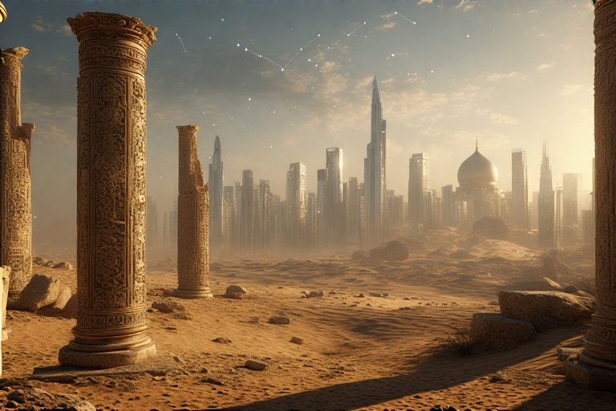

Imagine a world where the very ideas that make modern life possible—policy, science, economy, culture—simply didn’t exist within the faiths that now dominate swaths of our planet. That might seem unthinkable, yet history shows that the foundational concepts underpinning our societies were forged elsewhere: in the city-states and republics of the Mediterranean, in the rich intellectual ferment of ancient Persia and India. When Rome coined words like “politics” and “policy,” and later when Greco-Roman thinkers wrestled with the birth of natural philosophy, they were laying bricks for a future civilization that their spiritual heirs would later claim as their own—often without acknowledging the origin.

Take the word “policy,” for instance. In Hindi it translates neatly to नीति, but in Urdu—and in many languages deeply rooted in, but not even remotely created by the Abrahamic traditions—there simply isn’t an equivalent concept; the lexicon lacks that very category. It wasn’t until the Romans distilled civic order into legal codes that the idea of systematic governance took shape. Science, too, is a Roman legacy: scientific inquiry, as we understand it, didn’t spring from desert sands but from the Hellenistic academies of Athens and Alexandria. When “white people did the science,” it wasn’t because of skin color, but because the infrastructure of critical thought—universities, libraries, schools of rhetoric—had already been constructed centuries earlier.

Fast-forward to today and you see the uneven legacy of those ancient achievements. Look at modern Islamic nations: few can boast a domestic concept of “development” beyond the immediate extraction of oil. The moment a country like the UAE decides to build infrastructure, attract tourism, or host cultural extravaganzas, it’s implicitly stepping away from strict doctrinal orthodoxy. They legalize alcohol in designated zones, erect temples in the heart of Arabia, build casinos and world-class opera houses—tiny islands of cosmopolitanism in a sea of tradition—because they know that without embracing those non-Abrahamic roots of progress, they have no economy beyond hydrocarbons.

India offers a mirror too. Despite being the cradle of Indus Valley civilization, much of modern India stands metaphorically on the ashes of its own heritage. The Sanskrit word for law, the Vedantic debates on duty and polity—all of that rich tapestry has been sidelined in favor of colonial hangovers and post-colonial politics. If India had truly built on its ancient institutions rather than inheriting the Roman-Scottish legal framework via the British, its trajectory might look very different.

Then there’s Pakistan—a geopolitical counterweight born out of India’s partition. It exists as a Frankenstein’s monster of ideas alien to its own soil, borrowing systems of governance and law without the scaffolding of deep native traditions. Half its budget goes toward servicing debt, its economy limping along, its citizens watching as it perpetually teeters on collapse or stagnation. That’s the destiny awaiting any “desert cult” that refuses to marry its faith with the institutional legacies of past civilizations.

What happens when you deny the lessons of Rome, Greece, Persia, and India? You get an infinite regress—a society that never truly advances but circles endlessly, stuck in purity spirals of doctrine and tradition. No breakthroughs in science. No coherent policy. No sustainable economy. That’s the real “dark age,” not some medieval footnote but a perpetual condition.

The lesson is clear: faith and modernity aren’t enemies, but faith alone is woefully insufficient. To progress, societies must embrace the skeletons of ancient minds—those architects of politics, law, science, and culture—and weave them into the fabric of their own identity. Without that fusion, they risk circling forever in a desert of their own making, never finding the oasis of genuine advancement.
