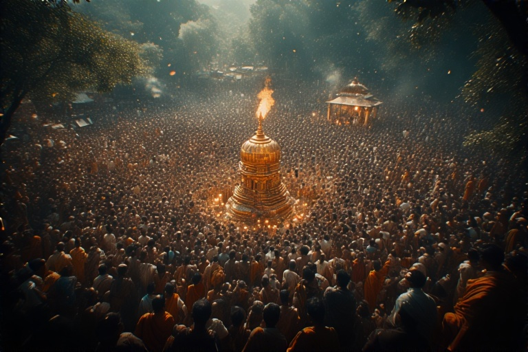


## <u>TLDR - Executive Summary:</u>

Bengal's transformation from the epicenter of Hindu nationalist awakening to communist stronghold represents a catastrophic constitutional paradox of civilizational proportions. The very region that produced Bankim Chandra Chatterjee's Vande Mataram, Aurobindo Ghosh's revolutionary spirituality, and the Jugantar secret societies—intellectual architects of Hindu constitutional thought—ultimately embraced an ideology fundamentally antithetical to its civilizational foundations.

### Key Timeline of Events:
- ***The Golden Epoch (1838-1920):*** Bengali intellectuals created sophisticated frameworks fusing Vedantic philosophy with militant nationalism; Chatterjee sanctified motherland-devotion as constitutional principle; Aurobindo transformed spiritual disciplines into revolutionary methodology; secret organizations operated as parallel governmental structures rooted in dharmic principles.
- ***The Fatal Pivot (1920-1945):*** Subhas Chandra Bose, despite personal Vedantic sympathies, explicitly repudiated Hindu Mahasabha as "traitors" and embraced secular nationalism; his Forward Bloc represented tactical pragmatism over civilizational coherence; this created ideological vacuum subsequently exploited by communist organizers.
- ***The Communist Capture (1945-2000):*** Bengal's intellectual sophistication became vulnerability to ideological colonization; systematic delegitimization of indigenous knowledge systems through "cultural gerrymandering" of collective memory; celebration of collaborationist figures (Ram Mohan Roy) over revolutionary spiritualists (Aurobindo Ghosh).
- ***Constitutional Implications:*** Bengal's trajectory illustrates how intellectual elites, divorced from popular cultural moorings, serve as vectors for ideological subversion rather than guardians of constitutional tradition; contrasts sharply with Maharashtra's continued celebration of Shivaji as both historical figure and constitutional inspiration; raises fundamental questions about relationship between cultural identity, intellectual sophistication, and constitutional stability in diverse federal systems.
- ***The Contemporary Reckoning:*** Bengal's transformation represents not merely regional political history but illuminates deepest challenges facing constitutional democracy in culturally diverse societies; whether this constitutes temporary historical aberration or permanent civilizational loss remains the defining question for India's broader constitutional experiment in balancing unity with diversity, modernity with tradition.



# The Bengali Paradox: From Hindu Renaissance to Communist Hegemony - A Constitutional and Civilizational Analysis

## Preface: The Intellectual Enigma of Bengal's Transformation

The transformation of Bengal from the epicenter of Hindu nationalist awakening to the bastion of communist ideology represents one of the most profound civilizational paradoxes in modern Indian history; a metamorphosis so complete and counterintuitive that it demands rigorous constitutional, cultural, and historical excavation. How did the very soil that nurtured Bankim Chandra Chatterjee's *Vande Mataram*, Aurobindo Ghosh's revolutionary spirituality, and the Jugantar's secret societies ultimately embrace an ideology fundamentally antithetical to its civilizational moorings?

## I. The Golden Epoch: Bengal as the Crucible of Hindu Nationalist Consciousness

### The Literary and Philosophical Foundation

The Bengali Renaissance, far from being merely a cultural awakening, constituted the intellectual and spiritual foundation of what would later crystallize into organized Hindu nationalist consciousness. Bankim Chandra Chatterjee (1838-1894) did not merely pen literature; he crafted a theological-political framework that sanctified the motherland as *Bharat Mata*—a divine feminine principle worthy of ultimate devotion. His *Anandamath* (1882) represented a sophisticated synthesis of Shakta theology and anti-colonial resistance, establishing devotional patriotism as both spiritual practice and political imperative.

The constitutional significance of this literary nationalism cannot be overstated; Chatterjee's conception of *Vande Mataram* as both hymn and constitutional principle would later influence the ideological substratum of independent India's national identity, even as secular interpretations would attempt to sanitize its explicitly Hindu theological foundations.

### The Revolutionary Synthesis: Spirituality as Political Praxis

The emergence of secret revolutionary organizations like Jugantar and Anushilan Samiti represented an unprecedented fusion of Vedantic philosophy and militant nationalism. Aurobindo Ghosh, the intellectual architect of this movement, demonstrated how ancient Hindu spiritual disciplines could be transmuted into revolutionary methodology; the very term "Yugantar" (New Era/Transition of Epochs) invoked cyclical time concepts from Hindu cosmology to justify violent resistance against colonial rule.

Consider the constitutional implications: these organizations operated as parallel governmental structures, complete with oath-taking ceremonies rooted in Vedic ritual, hierarchical organization reflecting traditional *ashrama* systems, and a judicial process that drew upon *dharmashastra* principles. Bagha Jatin's daily recitation of the *Chandi* as revolutionary discipline exemplifies how spiritual practice became constitutional methodology.

### The Intellectual Giants: Constructing Hindu Constitutional Thought

Bipin Chandra Pal's advocacy of "New Patriotism" grounded in Vaishnav bhakti while simultaneously attacking caste discrimination and child marriage represented a sophisticated constitutional vision; one that sought to reform Hindu society from within its own theological framework rather than through wholesale Western importation. His criticism of Gandhi's methods as rooted in "magic" rather than "logic" reveals the Bengal school's commitment to rational Hindu philosophy as the basis for political organization.

Rabindranath Tagore's 1924 observation that "Muslims cannot confine their patriotism to any one country... Meaningless ritual keeps the Hindus divided into a hundred sects. So, we are suffering from a series of defeats." demonstrates the prescient constitutional analysis that would later manifest in Partition's tragic vindication. Tagore's cultural nationalism, while rejecting crude communalism, nevertheless recognized the civilizational foundations necessary for constitutional coherence.

## II. The Great Divergence: Subhas Chandra Bose and the Secular Seduction

### The Fatal Compromise: Universalism Over Particularism

Subhas Chandra Bose, despite his personal admiration for Vedanta and Vivekananda, represented the first major Bengali leader to explicitly repudiate the Hindu Mahasabha and embrace secular nationalism. His 1940 Jhargram speech declaring "Hindu Mahasabha has desecrated religion; banish these traitors" marked a constitutional watershed—the moment when Bengal's most charismatic leader chose abstract universal principles over civilizational rootedness.

From a constitutional perspective, Bose's Forward Bloc represented a fundamental category error; the belief that political independence could be achieved through tactical alliances (Nazi, Communist, or otherwise) without regard for the deeper civilizational coherence necessary for sustainable constitutional order. His pragmatic secularism, while tactically understandable, severed the organic connection between Bengali political leadership and its cultural foundations.

### The Intellectual Tragedy: Winning Independence, Losing Bharatvarsha

Bose won independent India but lost Bharat; he won West Bengal but lost joi bangla; he won the state but lost the soul — the profound constitutional tragedy of Bengal's trajectory. Bose's success in mobilizing anti-colonial sentiment through secular nationalism inadvertently prepared the ground for post-independence communist hegemony by delegitimizing Hindu cultural nationalism as "communal" and "regressive."

Constitutional theory teaches us that successful democracies require shared cultural foundations; Bose's rejection of Hindu nationalist legitimacy, however well-intentioned, created an ideological vacuum that communist organizers would expertly exploit.

## III. The Communist Capture: Ideological Colonization of the Bengali Mind

### The Paradox of Intellectual Surrender

How does "the most literate state" embrace an ideology fundamentally hostile to its civilizational heritage? The answer lies in understanding communist strategy as sophisticated constitutional subversion; not merely economic reorganization, but the systematic delegitimization of indigenous knowledge systems, spiritual practices, and cultural institutions.

The celebration of Ram Mohan Roy over Aurobindo Ghosh represents this ideological inversion perfectly; Roy's collaborationist reformism becomes "progressive" while Ghosh's revolutionary spirituality becomes "reactionary." This historical revisionism constitutes what constitutional scholars might recognize as "cultural gerrymandering"—the manipulation of collective memory to serve partisan political ends.

### The Bell Curve Hypothesis: Intellectual Hubris and Political Naivety

Bengal's very intellectual sophistication became its constitutional weakness. The Bengali *bhadralok* class, convinced of their cultural superiority, proved remarkably susceptible to Western ideological frameworks that flattered their sense of progressive enlightenment while undermining their civilizational foundations.

This phenomenon has profound implications for constitutional design in diverse societies; intellectual elites, divorced from popular cultural moorings, may serve as vectors for ideological colonization rather than guardians of constitutional tradition.

## IV. Constitutional Lessons: The Price of Civilizational Amnesia

### The Maharashtrian Counter-Example

The contrast with Maharashtra illuminates Bengal's tragedy; while Bengal abandoned its revolutionary heroes for communist icons, Maharashtra continues to celebrate Shivaji as both historical figure and constitutional inspiration. This cultural continuity has provided Maharashtra with ideological resources for resisting various forms of cultural colonization while maintaining democratic legitimacy.

Constitutional theory suggests that successful federal systems require constituent units with strong cultural identities; Bengal's ideological self-mutilation has reduced it from a civilizational powerhouse to a dependent state requiring constant federal intervention.

### The Contemporary Reckoning

Today's Bengal stands as a constitutional cautionary tale; a state that possessed perhaps the richest intellectual resources for developing indigenous constitutional thought instead chose ideological self-exile. The question remains whether this transformation represents a temporary historical aberration or a permanent civilizational loss.

## Conclusion: Toward Constitutional Renaissance or Continued Decline?

The Bengali transformation from Hindu nationalist vanguard to communist stronghold represents more than regional political history; it illuminates fundamental questions about the relationship between cultural identity, intellectual sophistication, and constitutional stability.

Can Bengal recover its civilizational moorings while maintaining democratic legitimacy? Or does its trajectory represent the inevitable fate of traditional societies confronted with modern ideological pressures? These questions transcend regional politics to touch upon the deepest challenges facing constitutional democracy in culturally diverse societies.

The answer may determine not merely Bengal's future, but the broader success of India's constitutional experiment in balancing unity with diversity, modernity with tradition, and political democracy with civilizational continuity. In this sense, Bengal's story remains unfinished—a constitutional drama whose final act has yet to be written.