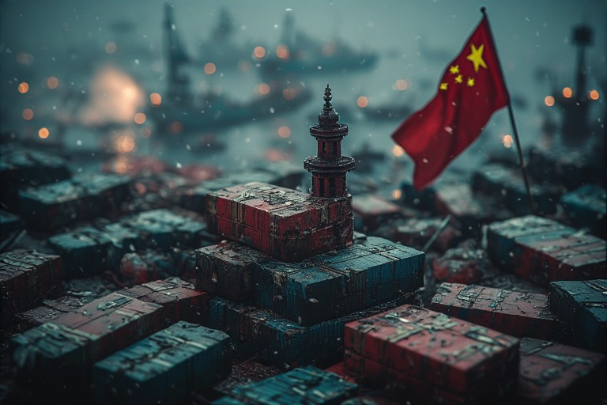



The announcement of potential 500% tariffs on countries importing Russian energy marks another chapter in the West's economic containment strategy. But beneath the headlines about sanctions and trade wars lies a deeper question: why does China find itself surrounded by hostile neighbors while America dominates its hemisphere?



## <u>The Neighborhood Problem</u>

China faces a strategic paradox that few rising powers have successfully navigated. Unlike the United States, which secured friendly relations across the Western Hemisphere through a combination of economic incentives and occasional force, China has managed to alienate nearly every country on its periphery. Japan, South Korea, India, Taiwan, and most of Southeast Asia maintain either hostile or deeply skeptical stances toward Beijing.

This isn't a minor diplomatic inconvenience. It's a fundamental weakness that could prove fatal to Chinese ambitions.

Consider the contrast with American strategy. The United States doesn't just dominate through military might—it dominates through geography. Friendly neighbors to the north and south, vast oceans providing natural barriers, and a network of buffer states and allies projecting power globally. China has none of this. Instead, it has one vulnerable coastline, all of which can be blockaded by Japan and allied naval forces.

## <u>The Soviet Echo</u>

History offers a cautionary tale. The Soviet Union, despite its nuclear arsenal and military power, ultimately crumbled under the pressure of hostile neighbors on its borders. The USSR spent enormous resources maintaining buffer states and puppet regimes, yet the constant threat from NATO countries and the economic drain of confrontation proved unsustainable.

Russia learned this lesson well, which explains its current paranoia about NATO expansion and its insistence on maintaining buffer states like Belarus. China, however, seems determined to repeat the same mistakes without even securing the buffer states that might provide breathing room.

## <u>The Infrastructure Delusion</u>

Faced with potential naval blockades, China has invested heavily in overland infrastructure projects—roads through Pakistan, connections through Iran, access through Bangladesh. This represents a fundamental misunderstanding of strategic vulnerability.

Infrastructure through unstable nations is not a substitute for secure sea lanes. Roads can be bombed. Land routes through developing countries create dependencies on regimes that can change overnight. Sea lanes, once secured, offer resilience and scale that no amount of overland infrastructure can match. The Belt and Road Initiative, for all its ambition, cannot solve the basic problem that China's single coastline makes it uniquely vulnerable to blockade.

## <u>The Taiwan Threshold</u>

Taiwan represents the ultimate test of this strategic weakness. The island isn't just symbolically important—it's the linchpin of both Chinese ambitions and American economic interests. The global semiconductor industry, which essentially props up the entire American tech economy, depends on Taiwanese manufacturing. NVIDIA's extraordinary market gains in 2025 rest on chips fabricated in Taiwan.

If China could successfully take Taiwan, the geopolitical calculus would shift dramatically. The West, now deeply dependent on Chinese manufacturing, would have limited options for response once the fait accompli was established. The current moment may represent China's best window—Western dependence on Chinese exports is at its peak, creating hesitation that might not exist in a decade.

But the "if" is enormous. A failed invasion would be catastrophic, and the military challenges are formidable.

## <u>The Bandwidth Problem</u>

Perhaps the deepest issue is one of institutional capacity. America can send trillions of dollars to multiple countries simultaneously while its citizens barely notice. It maintains an entire apparatus of think tanks, NGOs, and diplomatic infrastructure dedicated to managing global relationships. China, despite its economic growth, remains internally focused—its authoritarian system requires constant attention to domestic control, leaving limited resources for external engagement.

This isn't just about money. It's about strategic attention and organizational capacity. When your entire system is built on controlling a massive population, that imperative will always consume the lion's share of resources and talent. External relationships become an afterthought, managed opportunistically rather than systematically.

## <u>The Development Paradox</u>

There's a broader pattern here about national development. Countries that successfully developed did so rapidly once they found their strategic rhythm. South Korea, Taiwan, Singapore, Japan—all experienced explosive growth over relatively short periods once they discovered what worked. The same is true of China's own economic rise from the 1980s onward.

Slow, grinding development through sheer effort typically indicates a flawed strategy. If progress requires constant struggle against mounting resistance, you're probably doing it wrong. The path of least resistance exists for a reason—it usually represents the natural fit between a nation's advantages and the opportunities available.

China found its rhythm with export-led manufacturing. But it has yet to find a comparable formula for geopolitical influence, instead defaulting to strategies that create resistance rather than cooperation.

## <u>The Clock Is Ticking</u>

The window for Chinese strategic options is narrowing. Every year that passes brings Western manufacturing capacity closer to decoupling from Chinese dependence. Semiconductor fabs are being built in America and Europe. Supply chains are diversifying. The leverage that Chinese manufacturing currently provides will diminish.

Once that decoupling is complete, China's position weakens substantially. The hostile neighborhood becomes a trap rather than merely an inconvenience. The lack of secure sea access becomes crippling. The absence of genuine allies becomes isolation.

Perhaps the most striking aspect of China's strategic position is how avoidable it was. The hostility of neighboring countries isn't an accident of geography or an inevitable result of Chinese power. It's the consequence of specific choices—territorial disputes pushed aggressively, economic relationships managed exploitatively, diplomatic relationships neglected in favor of internal control.

Different choices might have produced different outcomes. But as the pressure mounts and options narrow, changing course becomes progressively harder. The greatest strategic mistakes are often the ones that seem manageable until suddenly they're not.

Geography, it turns out, still matters. And in geopolitics, you can't bomb the ocean—but you can certainly find yourself trapped behind hostile shores with nowhere to turn.