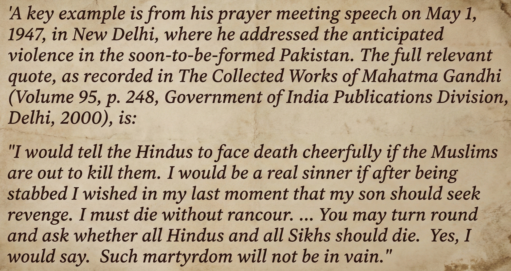



Begin with first principles. Strip away the accumulated sediment of modern morality, the pleasant fictions we tell ourselves about goodness, and ask: what does it actually mean for a force to be **good**?

The contemporary conception of the good person—gentle, non-violent, perpetually accommodating—is not merely incomplete. It is fundamentally incoherent. We have confused weakness for wisdom, passivity for peace, and powerlessness for virtue. This confusion is not accidental; it is the result of a long drift away from reality, toward a morality that consoles rather than conquers.

Consider this: **any force of good must be powerful**. Not incidentally powerful, not reluctantly powerful, but essentially so. Power is not a regrettable necessity for goodness—it is its prerequisite. How can any force produce beneficial change if it lacks the strength to impose itself upon reality? How can intentions matter if they remain forever locked in the realm of wishful thinking?



> *Goodness without strength is not incomplete goodness—it is no goodness at all. It is merely impotent hope dressed in moral language.*

## <u>The Paradox of Power</u>

When we examine history—actual history, not the sanitized narratives we construct—we find no good person, no beneficial force, no positive transformation that was not backed by power. Ram did not create Ram Rajya through moral suasion alone. The gods of every tradition are not merely wise; they are formidable. They command, they destroy, they reshape reality according to their will.

This is not coincidental. This is definitional. The impact of an action is a function of both its intent and its magnitude. Intent without power produces nothing. Good intentions plus strength produces good outcomes. This is so elementary it should not require stating, yet our modern discourse systematically obscures this truth.

We have created a peculiar moral framework where we celebrate the powerless dreamer and remain suspicious of the powerful actor. But this is a luxury belief, possible only for those insulated from consequence. When actual change must happen—when a society must be defended, when injustice must be corrected, when chaos must be ordered—we do not turn to the gentle philosopher. We turn to those with the capacity to act.

**CORE PRINCIPLE**

A good force is measured not by the purity of its intentions but by the magnitude of its positive impact. Impact requires power. Therefore, power is not antithetical to goodness—it is goodness seeking expression in reality.

---

## <u>Elite Action, Mass Inertia</u>

The second truth that modernity obscures: **transformation comes from elite action, not mass awakening**. We are endlessly told that change requires the people to wake up, to develop consciousness, to improve their civic sense. This is, at best, a pleasant fiction. At worst, it is a deliberate misdirection.

Consider the archetypal golden age—Ram Rajya. What made it golden? Was it because the citizens had superior civic consciousness? Was it because the masses were more educated, more aware, more participatory? No. Ram Rajya was Ram Rajya because of **Ram**. The state mirrored the character of its elite leadership. The people, as always, adapted to the system created for them.

This pattern repeats across civilizations and epochs. A handful of powerful, capable individuals create the conditions under which millions live. The quality of a society reflects the quality of those who wield power within it. The masses do not create golden ages; they inhabit them. They do not create dark ages; they endure them.

This is neither cynical nor aristocratic snobbery. It is simply observation. Most people in any population are not engaged in shaping the trajectory of their civilization. They are engaged in living their lives—working, raising families, seeking comfort and stability. They adapt to whatever system emerges. They will be Hindu under Hindu rule, Muslim under Muslim rule, secular under secular rule. They are, in the language of power struggles, **not players**.

> *Do not waste your time trying to educate those who never question. They will accept whatever order emerges victorious. Direct your efforts toward those who shape outcomes, not those who merely experience them.*

## <u>The Philosophical Trap</u>

Now we arrive at a more subtle problem, one specific to certain civilizational traditions: the danger of becoming **too philosophical**. This requires careful articulation because philosophy itself is not the problem—it is the indiscriminate distribution of philosophical knowledge to those unprepared to handle it.

Consider what happens when deep philosophical truths reach those who lack the psychological or social preparation to integrate them. Advaita—the recognition of ultimate non-duality—is a profound metaphysical insight. In the hands of someone prepared for it, it can be liberating. In the hands of someone unprepared, it becomes a weapon of self-destruction: **If all is one, why fight? Why preserve my tradition, my people, my way of life? Why resist anything at all?**

This is not a theoretical concern. We have watched it happen. When certain philosophical texts became widely accessible, when the knowledge once restricted to those trained to handle it spread to the unprepared, something broke. The warrior spirit—the **kshatriya** impulse to defend, to conquer, to impose order—began to dissolve.

The philosophy is not wrong. The philosophy is powerful—perhaps too powerful. It asks ultimate questions: What is real? What matters? What is worth fighting for? And for those not grounded in a context that provides answers, these questions become paralyzing. Why live? Why fight? Why care? The philosophy, meant to liberate, instead induces a kind of nihilistic passivity.

---

## <u>The Missing Warriors</u>

What Hindu civilization currently lacks is not more philosophical sophistication. It has that in abundance. What it lacks is the opposite: people willing to operate in the material world with pure, uncomplicated focus on victory. **Worldly people. Hot-blooded people. Players.**

These are not the refined philosophers who can discourse on the nature of Brahman. They are the individuals who understand power struggles at the level of instinct, who want to win not because they have constructed an elaborate justification but because winning is what you do. They are missing. And their absence is the core problem.

There has never been a single good person in the history of civilization who was not also powerful and strong. This is not because power corrupts goodness but because **power enables goodness**. The weak sage who speaks beautiful truths but changes nothing is not good—he is irrelevant. Goodness that cannot manifest is indistinguishable from non-existence.

The current moment sees a renewed interest in scriptures, in ancient texts, in philosophical depth. This is, paradoxically, **the opposite of what is needed**. More reading, more analysis, more detachment from the worldly struggle. What is needed is less philosophy and more grounded action. The books must close. The mind must descend from the clouds. The focus must shift from ultimate truths to immediate victories.

> *The antidote to philosophical paralysis is not better philosophy. It is the victory mindset—the simple, almost crude recognition that winning matters, that strength matters, that survival matters.*

## <u>The Strategic Function of Noble Lies</u>

There is a final dimension to this that must be addressed, though it is perhaps the most uncomfortable: **the masses need lies**. Not in a cruel or manipulative sense, but as a structural necessity of civilization.

Consider the most successful civilizations in recent centuries. The British Empire, for instance, operated on a foundation of ruthless self-interest. Every action, every policy, every expansion was calculated to benefit Britain at the expense of others. But they never said this explicitly. They spoke of civilization, of bringing order, of the white man's burden. The elite knew the truth; the masses believed the narrative.

Contrast this with regimes that spoke their harsh truths too openly—that declared explicitly that power was its own justification, that their people mattered and others did not. They faced coalitions of resistance, moral condemnation, ultimate defeat. The truth, spoken plainly, united the world against them.

This is not an argument for dishonesty as such. It is a recognition that different truths are appropriate for different audiences. The elite must see clearly—must understand power, must recognize self-interest, must be willing to act ruthlessly when necessary. The masses, meanwhile, need stories that give meaning, that provide moral structure, that inspire without paralyzing.

The current problem is that the wrong people have accessed the harsh truths. Not the elite who could use them strategically, but broader populations who become paralyzed by them. And meanwhile, those who should be operating with clear-eyed strategic vision are themselves lost in philosophical abstraction.

## <u>The Path Forward</u>

So what is to be done? The diagnosis is clear: a civilization has become too philosophical, losing its warrior class not to external conquest but to internal dissolution. The players—those driven by simple desire for victory—have been consumed by brahminical knowledge they were not prepared to integrate. What remains are either those too simple to engage or those too sophisticated to act.

The solution is not to reject philosophy but to **restore hierarchy**—not social hierarchy in the crude sense, but epistemic hierarchy. Some truths are for everyone; some truths are for those prepared to handle them. Ultimate philosophical questions should be grappled with by those who can do so without losing their grip on immediate material struggle.

What is needed is the creation of institutions—organizations, movements, structures—that operate with pure focus on victory. Not victory justified by elaborate philosophy, not victory contingent on mass awakening, but victory as its own reward and purpose. Organizations that do not indulge in philosophical debates about what is ultimately real or ultimately valuable, but simply ask: **How do we win? What must be done? What power must be accumulated?**

Such an organization, if it emerges and succeeds, will pull the entire society in its direction. Not through argument, not through consciousness-raising, but through demonstration. Success attracts support. Victory creates its own justification. Power generates legitimacy. One genuine win will do more to shift the cultural center of gravity than a thousand philosophical treatises.

**THE ESSENTIAL FORMULA**

**Intent + Power = Impact.** Good intentions without power produce nothing. Power without good intent produces harm. But good intent backed by strength produces transformation. This is the formula. Everything else is commentary.

---

## <u>Returning to Earth</u>

The ultimate irony is that the deepest wisdom may be to stop seeking wisdom and to simply act. The philosophical heights are beautiful, but they are not where battles are won. The material world—messy, imperfect, resistant—is where change happens.

This does not mean abandoning all philosophical sophistication. It means subordinating it to practical ends. Philosophy should inform strategy, not paralyze action. Ultimate questions should be held lightly enough that they do not prevent engagement with immediate challenges.

The task before those who understand this is clear: stop reading and start building. Stop analyzing and start competing. Stop contemplating ultimate reality and start shaping immediate reality. The books will still be there after victory is achieved. But victory will not be achieved while lost in the books.

**Come back to earth.** The struggle is here, in the world of power and conflict and competition. Those who stay above it, no matter how profound their insights, are not forces of good. They are, at best, beautiful irrelevancies. And beauty without power is just another form of weakness.

---

*The forces of good must first become forces.*
