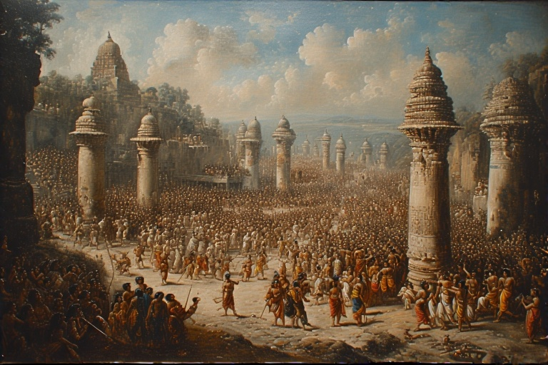


## <u>TLDR – Summary:</u>

There's something peculiar about Indian history that most people don't realize—until very late in the game, Indians simply never bothered chronicling their own story. Not in the way we think of history, anyway. While civilizations around the world were busy recording kings, battles, and political events, ancient India was doing something entirely different. Or perhaps more accurately, it was deliberately not doing what everyone else was doing.

This wasn't due to inability to write, but possibly a conscious philosophical choice. Indians may have recognized that political history often becomes weaponized propaganda, choosing instead to preserve knowledge, wisdom, and social systems that could sustain civilization across millennia. The Brahmi script (parent of all Indian languages) was only deciphered in the 1800s, meaning much ancient Indian history was unknown until recently.



## <u>The Missing Chronicles</u>

One of the most intriguing puzzles in world history is not what ancient India wrote, but what it chose not to write. While civilizations across the globe meticulously chronicled their kings, conquests, and political upheavals, India maintained a curious silence about its own temporal affairs. This wasn't due to illiteracy or lack of sophistication—ancient India produced vast libraries of literature on mathematics, astronomy, medicine, philosophy, and spiritual practice. Yet when it came to recording the kind of political history that other civilizations deemed essential, India largely abstained.

So, Why this indifference? One possibility is a philosophical focus on the eternal rather than the transient. Indian literature, from the Vedas to the Puranas, brims with explorations of existence, morality, and the cosmos, yet it rarely bothers with political chronicles. 
Yet, there were exceptions. In Kashmir, Kalhana’s Rajatarangini stands out as a rare chronicle, with its author advocating objectivity—a hallmark of modern history. This suggests that the concept of historical documentation existed, but it was not widely embraced, perhaps because history, most of the time anyways, is a tool for narrative control.

This selective documentation reveals something profound about the Indian worldview that differs fundamentally from Western approaches to knowledge and power.

## <u>The Brahmi Revelation</u>

The scarcity of written historical records has left modern India in an unusual position. Much of what we know about ancient India comes from secondary sources: Greek observers, Chinese pilgrims, archaeological evidence from coins and monuments, and the occasional exception like Kalhana's Rajatarangini from Kashmir—notably, a work that begins with the author's commitment to objective historical recording.

The Brahmi script, parent to most Indian languages, was only deciphered in the 1800s. This means that much of what Indians understand about their own ancient past has been reconstructed in the last two centuries, often through foreign perspectives. Emperor Ashoka stands out in historical consciousness not because Indians wrote extensively about him, but because he inscribed his thoughts on pillars and rocks that survived millennia.

But this also reveals something about the general Indian approach: if you didn't write on pillars and rocks like Ashoka, your empire's records likely perished with the empire itself. This historical gap has created a dependency on external validation and interpretation that continues to shape contemporary Indian identity struggles.

### <u>The Buddhist Factor</u>
Buddhism appears to have been a very recent and popular phenomenon in ancient India—you can find Buddhist remains everywhere. Buddhist sources are very well preserved, which has led to what some call "Buddhist shilling" in historical accounts. The prevalence of Buddhist archaeological remains gives Buddhism an outsized presence in our understanding of ancient Indian history.

## <u>Geography as Destiny</u>

India's geographical peculiarities help explain both its historical patterns and its unique social evolution. Roughly the size of Europe, India is isolated from the rest of the world by mountains and oceans, creating a distinct civilizational space. Yet within this space, the geography presents specific vulnerabilities.

The northwestern frontier, where the Indus Valley meets the Thar Desert, has historically served as a staging ground for invaders. This narrow corridor near present-day Delhi becomes the crucial battleground—hence the historical significance of places like Panipat. Once past this chokepoint, invaders faced the vast Indo-Gangetic plains, but the sheer size of the subcontinent created its own problems.

Every conqueror of India, whether indigenous or foreign, faced the same fundamental challenge: the territory was so vast that maintaining control required enormous resources, leaving little capacity to defend against the next wave of invaders. This geographical reality shaped India's political history as much as any cultural factor.

## <u>The Race Question</u>

The analysis touches on something that was popular in older scholarship but seems questionable now: the idea of six races tracked into India—Negrolites, Austrolites, Mongoloids, and varieties of Aryans. The problem with this entire framework is that it assumes everyone came from outside. But the author noted a significant lack of prehistoric skeletons from India, making such racial categorizations speculative at best.

More interesting is the observation that Aryans definitely didn't create Hinduism all by themselves—a theory that dominated thinking for four generations. Hinduism was already very mature by the time they arrived. The Vedas are conscious of two types of worship: Agama and Nigama. There's the homa style (havan kund, fire rituals) and the puja style (offering flowers to symbols or idols). The more ritualistic fire-based worship came from Aryans, while puja-style worship existed before their arrival.

The Rig Veda being "weirdly unaware" of other races suggests that Aryans had already encountered diverse populations elsewhere, so when they arrived in India, nobody stood out as particularly odd. These different groups were already intermingling before arriving in India, making any narrative of "civilized Aryans conquering primitive locals" completely off the table.

## <u>The Philosophy of Non-Recording</u>

Why didn't Indians write their political history? Several theories emerge from this philosophical void:

**<u>The Weaponization Theory</u>**: History, as commonly understood, is often "weaponized"—written to serve particular political narratives rather than objective truth. Ancient Indians may have recognized this inherent bias and consciously avoided creating such tools of manipulation.

**<u>The Inward-Looking Perspective</u>**: While other civilizations focused on external conquest and temporal power, Indian thought traditionally emphasized inward development and spiritual evolution. Political events may have been seen as ephemeral compared to eternal philosophical truths.

**<u>The Cyclical Worldview</u>**: Unlike linear historical progression assumed by Western thought, Indian philosophy often views time as cyclical. In such a framework, recording specific political events may seem less relevant than understanding universal patterns and principles.

## <u>The Continuity Paradox</u>

Here lies one of India's greatest paradoxes: while Greeks and Romans meticulously recorded their histories, their civilizations eventually disappeared, leaving modern inhabitants of those lands with little cultural connection to their ancient past. India, which barely recorded its political history, has maintained remarkable cultural continuity across millennia.

This suggests a different approach to preserving what matters. Rather than recording events, India preserved processes—rituals, practices, ways of thinking, and social structures that could adapt and survive across political upheavals.

### <u>The Indian Way</u>

What emerges from this analysis is a picture of India as a place of peaceful coexistence, where diversity of opinion and gods was allowed. Ironically, maybe the only thing everyone agreed on was protecting cows. But there was another common theme across all schools of thought: the ideal of the Brahmin life—someone with no material wants, seeking only wisdom.

This wasn't a source of jealousy but aspiration. It represents a fundamental difference in Indian thought versus European thinking. Europeans think in hierarchies—there's always one job at the top that everyone wants to reach. The varna system eliminated this problem by recognizing different types of essential work without creating a single competitive hierarchy.

## <u>The Varna System: An Alternative to Hierarchy</u>

Here's a fascinating observation: slavery was a feature everywhere except India. In the ancient world, there weren't that many types of professions anyway—people couldn't easily change from one thing to another. Every job was required and had its place.

The conversation touches on one of the most misunderstood aspects of Indian social organization. The varna system, when viewed through a Western hierarchical lens, appears oppressive. But this interpretation may reflect European social structures more than Indian ones.

In European societies, social mobility typically meant climbing a single ladder of status, leading to intense competition for limited positions at the top. The varna system potentially offered a different model: multiple paths to social value and recognition, where each role was essential and respected within its domain.

The absence of large-scale slavery in ancient India—unlike most other civilizations—supports this interpretation. Rather than forcing unwanted labor through bondage, the varna system may have created social incentives for people to take pride in essential but unglamorous work.

This doesn't excuse later corruptions and rigidities that developed, but it suggests the original conception might have been more sophisticated than colonial-era interpretations suggested.

## <u>The Synthesis Challenge</u>

The conversation reveals the deep challenge facing modern India: how to understand itself authentically rather than through foreign frameworks. The influence of Greek travelers, Chinese pilgrims, and British archaeologists has been invaluable, but it may have also shaped Indian self-perception in ways that obscure indigenous ways of understanding society and history.

The decipherment of Brahmi script and archaeological discoveries have revealed the sophistication of ancient Indian civilization, but they've also highlighted how much knowledge was lost when oral traditions weren't supplemented with written records.

### <u>The Foreign Perspective Problem</u>

The Greeks had thirty kings ruling parts of India for about 200 years, mainly in the edge regions of present-day Pakistan and Afghanistan. They're credited with excellent coin-making—their coins had kings stamped on them with dates. Later Indian coins became similar. Greeks also wrote traditional history, but there's a problem: someone like Herodotus was probably biased, sitting in courts, and may never have actually seen India himself.

Chinese travelers were better in some regards—they actually traveled throughout India. But they were pilgrims, so their entire commentary focuses on Buddhism and religion, with nothing about politics or governance. They came to document spiritual practices, not political realities.

### <u>The Contemporary Relevance</u>

As globalization pushes all societies toward similar economic and social models, India faces what many other cultures have confronted: the choice between maintaining distinctiveness and achieving international comparability. The conversation suggests this isn't merely about preserving tradition, but about recovering alternative approaches to organizing society that might offer solutions to contemporary problems.

The Western model of social organization, based on hierarchical competition for scarce prestigious positions, creates its own problems: societies where no one wants to do essential but "low-status" work, leading to labor shortages and social dysfunction.

## <u>Conclusion: The Unwritten Wisdom</u>

India's failure to write conventional history may not have been a failure at all, but a conscious choice reflecting different priorities and worldviews. While this choice created vulnerabilities—making the civilization harder to understand and defend against external interpretations—it also preserved something unique: a society that valued continuity over conquest, synthesis over supremacy, and process over politics.

The challenge for contemporary India isn't to recreate an idealized past, but to understand the philosophical foundations that created its distinctive approach to human organization. In a world grappling with social fragmentation, environmental destruction, and the limits of purely materialistic progress, these alternative approaches to civilization may offer insights that are more valuable than any amount of recorded political history.

The conversation between these two thinkers reveals that sometimes the most important truths are found not in what a civilization chose to record, but in what it chose to live by instead.