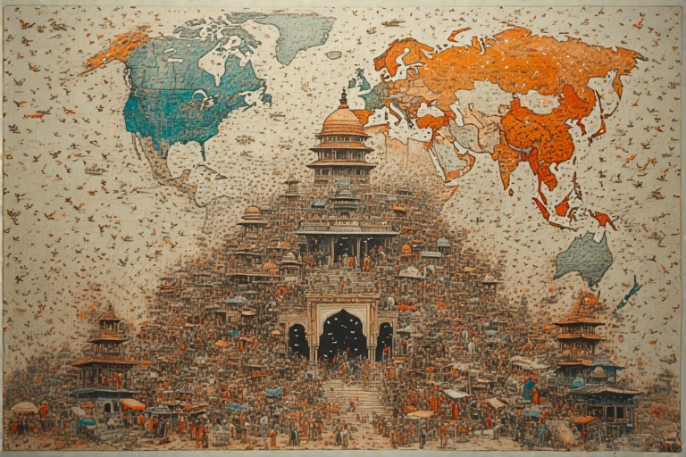


## <u>TLDR - Summary:</u>

This article explores how India's self-image and global perception are heavily influenced by both internal critics and Western media narratives. Unlike other Asian nations that maintain more control over their narratives, India's widespread use of English and vocal internal critics often leads to disproportionate amplification of its problems on the global stage. While acknowledging issues is important, the constant negative self-criticism by some Indians seeking Western validation, combined with biased Western media coverage, creates a skewed perception that undermines national confidence. The solution isn't blind nationalism, but rather a balanced approach that celebrates achievements while pragmatically addressing challenges - similar to how countries like China and Japan maintain cultural confidence while dealing with their own issues. The key is developing a healthy self-image that neither ignores problems nor dismisses progress.



## <u>Introduction</u>

In the digital age, India faces distinctive criticism from both international observers and its own population. Despite being one of the fastest-growing economies with a rich cultural heritage and clear progress, the country often finds itself portrayed unfavorably online. Issues such as economic disparity, political tensions, and social challenges are magnified beyond their reality, contributing to a distorted global image.

This article examines the reasons behind this phenomenon, focusing particularly on a unique group within India—the "good Indians," who, in seeking Western approval, significantly contribute to the disparagement of their own culture. Their influence raises crucial questions: Why do Indians highlight their nation's issues so prominently, and how does this shape India's image on the world stage?

---

## <u>Overemphasis on Indian Issues</u>

A distinctive pattern in Indian online criticism is the tendency to overemphasize societal problems. While India faces real challenges—from economic inequality to infrastructure gaps and social issues—the narrative around these problems often takes on an excessively harsh tone online. This pattern appears less frequently in other cultures, where internal issues are typically kept in perspective or approached more constructively.

This overemphasis stems less from external observers and more from a subset of Indians themselves. Known ironically as the "good Indians," these individuals highlight India's problems excessively, distancing themselves from these issues to project a Western-friendly image. Often positioning themselves as "the educated" or "the progressive," this group makes India's internal struggles appear worse to the outside world. Their criticism is quickly amplified by Western media, reinforcing negative stereotypes and narratives that prove difficult to dispel.

Consider how a similar social issue in Japan might be handled differently. The Japanese typically view their challenges—whether high suicide rates, workplace pressures, or public health concerns—as domestic matters to address rather than flaws that define their national identity. These issues are seen not as "Japan's failures" but as aspects of society to manage internally. Indians, by contrast, often transform even minor problems into major critiques that rapidly gain international attention.

---

## <u>Aspiration and Frustration: A Double-Edged Sword</u>

India holds a unique position among developing nations, combining a rapidly growing economy with deep historical and cultural roots. This swift progress breeds both pride and frustration—Indians see advancement yet yearn for more. This aspirational mindset serves as both motivator and challenge. The middle class, eager to see their nation reach the economic and social standards of developed countries, often grows impatient when change doesn't occur rapidly enough.

Other countries like Brazil and South Africa, though economically comparable or slightly wealthier, have reached plateaus. Their futures, while stable, lack the same sense of momentum. Yet this very progress creates pressure in India. Frustration builds because improvement, though visible, remains incomplete, leaving many Indians dissatisfied with their current circumstances.

This eagerness for change fuels the self-critical perspective many Indians hold. With India "in motion," citizens become hyper-aware of every potential obstacle to progress. This awareness, combined with global connectivity, leads Indians to fixate on their problems, often amplifying them online in hopes of spurring solutions. Unfortunately, this broadcasts every challenge to the world, making it easy for outsiders to view India primarily through its difficulties.

---

## <u>India's Exposure to Western Media and Memes</u>

India's widespread use of English creates a unique dynamic: deep connection to Western discourse and, consequently, global scrutiny. Unlike East Asian nations, whose issues remain somewhat shielded by language barriers, India's internal conversations are instantly accessible to international media, which often amplify local issues without full context.

Social media and online forums significantly shape narratives about India. National issues—from political debates to social protests and high-profile incidents—frequently become international memes. The farmer protests, for instance, garnered unprecedented global attention, drawing unexpected celebrity endorsements and worldwide coverage. Many Indians felt these events were highlighted more as ammunition for criticism than from genuine concern, especially when amplified by activists and media organizations unfamiliar with India's complexities.

East Asian countries, by contrast, typically maintain more control over their domestic narratives, as seen in Japan or South Korea. When their issues reach Western audiences, it's usually through isolated incidents rather than sustained criticism of societal flaws. India's constant exposure, however, creates an oversized portrait of national challenges, often resulting in stereotypical depictions of a country mired in backwardness and conflict.

## <u>The Role of Western Influence and Media Bias</u>

Western media's portrayal of non-Western nations, particularly developing countries, often focuses disproportionately on problems and deficiencies. India, like Russia, China, and occasionally South Korea, frequently appears as a nation besieged by obstacles that threaten progress or stability. Headlines predicting "China's collapse" or "Russia's implosion" exemplify this prevalent Western narrative, shaping how India is perceived and criticized without proper context.

India's situation stands apart, however. Western media's criticism gains extra weight through amplification by Indians themselves who adopt similar perspectives. Many Indians provide detailed critiques of their country that align with Western narratives. Unlike China, where critics often must leave to speak freely, Indian critics typically remain within the country, lending their views additional credibility in global observers' eyes. Western media outlets treat these Indian critiques as authoritative insider perspectives, giving them significant influence in international discussions about India's status and progress.

---

## <u>India's Internal Critics: Useful Idiots or Agents of Change?</u>

Within India exists a distinct group of internal critics who seek inspiration externally, often pursuing Western validation. Unlike nationalist groups, which exist in every country to uphold local culture, these critics frequently echo Western criticisms of India—sometimes so extensively that they reduce complex issues to simplistic, negative narratives.

Their influence reaches far. Often highly educated, well-connected, and vocal in both traditional and social media, these critics shape public discourse significantly. Though sometimes well-intentioned, their criticism frequently aligns with Western portrayals of India as backward or regressive. Ironically, they sometimes serve as "useful idiots" for external interests. Various entities, from international media to ideological groups, leverage these voices to shape India's global image in ways that serve external agendas.

The impact on India's reputation proves substantial. Critics speaking from within India, or even from abroad while maintaining Indian citizenship, carry special credibility as authentic voices. This lends their critiques a legitimacy that even sensationalist Western reporting cannot match. The result: a uniquely damaging effect on India's global image, as these critical voices unwittingly feed a cycle of negative perception that undermines national confidence.

## <u>Solution: A Balanced National Self-Confidence</u>

India's path forward lies not in blind nationalism but in cultivating balanced, realistic self-confidence. True progress requires a mindset that values achievements, acknowledges problems, and avoids both hyper-nationalism and excessive self-criticism. Understanding the world proves crucial—not just to recognize that other nations face significant challenges but to view India's issues in proper perspective.

Swami Vivekananda addressed this need for balance eloquently: "The child is taken to school, and the first thing he learns is that his father is a fool, the second thing that his grandfather is a lunatic, the third thing that all his teachers are hypocrites, the fourth that all the sacred books are lies!" His words remind us to value our heritage while pursuing progress—a balance that enables growth without sacrificing cultural confidence.

For Indians, understanding global realities—without idealizing Western nations as perfect—can foster stronger self-worth. While India faces challenges, it isn't alone, and recognizing other nations' successes and struggles helps reframe India's journey as one of strength and resilience. The goal isn't to reject Western values or dismiss legitimate criticism but to develop a perspective that values India's unique path and culture. Through this balanced lens, Indians can engage globally with confidence and pride.

---

## <u>Confidence in One's Own Society</u>

A key distinction between Indian society and nations like China, Japan, and South Korea lies in these countries' confidence in their systems and culture. While they acknowledge societal challenges, they prevent these issues from overshadowing achievements or defining national identity. Instead, they approach problems pragmatically, assured that their strengths outweigh their difficulties.

China, despite facing numerous criticisms internally and externally, doesn't let single issues spiral into wholesale condemnation of their society. They rarely rush to discard their cultural and political systems in favor of Western models. Instead, they address problems while maintaining pride in their progress.

Japan offers another instructive example. Despite challenges with demographic decline, workplace pressure, and social isolation, Japanese society continues celebrating its cultural distinctiveness and achievements in technology, art, and design. They seek solutions rooted in their own context rather than copying other nations wholesale. Their approach suggests: "Yes, we have problems, but look at what we've achieved."

Many Indians, conversely, view the West as utopian, seeing Western cultures as the ultimate model of societal and economic success. This often leads to dismissing India's strengths whenever problems arise. Some suggest that every issue—whether caste, corruption, or infrastructure—requires "deleting everything" to "copy the West." This overlooks how exchanging one set of problems for another doesn't guarantee progress. Western societies have their own flaws—often overlooked by Indians.

Indians must recognize their progress and successes as equally valuable. From maintaining a vibrant democracy to preserving cultural and linguistic diversity in unprecedented ways, India has much to celebrate. Life improves rapidly, with advances in technology, education, and infrastructure. Acknowledging these achievements while addressing challenges creates a balanced, confident national identity.

---

## <u>Conclusion</u>

India stands at a crucial juncture in the global narrative. It embodies immense progress, cultural depth, and potential, yet struggles with internal critics who magnify its challenges and external observers who amplify these criticisms. This creates a distorted self-image that dismisses achievements in favor of perceived shortcomings.

Moving forward requires a more balanced perspective: one that values progress while addressing challenges without losing self-respect. Societal confidence doesn't mean blind nationalism but rather acknowledging successes while working pragmatically on improvements. The West isn't perfect, and India isn't the failure some portray it as.

Swami Vivekananda's words resonate as a powerful reminder of what happens when society loses faith in itself: "The child is taken to school, and the first thing he learns is that his father is a fool, the second thing that his grandfather is a lunatic, the third thing that all his teachers are hypocrites, the fourth that all the sacred books are lies!" These words underscore the importance of pride, balance, and context in shaping our worldview.

India must stop measuring itself solely by Western standards. Every nation has unique strengths and weaknesses—no country exists without problems. By cultivating self-confidence and broader understanding, Indians can reshape their narrative—not by imitating others, but by building on their own strengths and progress.