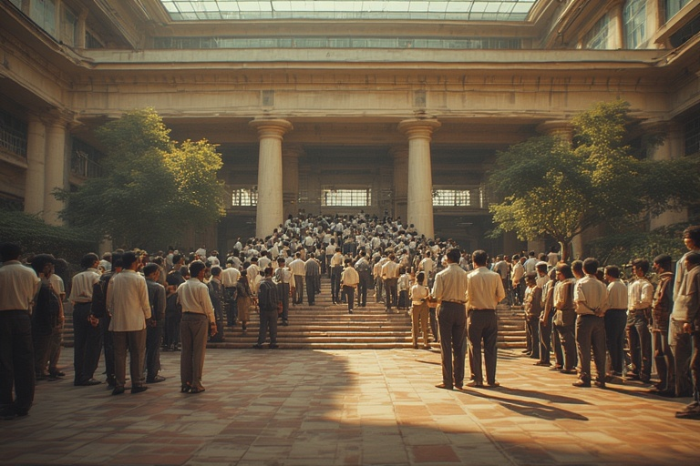


## <u>TLDR - Summary:</u>

Large democracies face unique challenges that smaller nations avoid. India's billion-plus population hasn't created mathematical impossibility of consensus—it has culturally chosen to grant permanent veto power to street protests, making electoral democracy meaningless when any small group can endlessly occupy public spaces without consequence. While America demonstrates that democracies can be agile despite polarization (swinging between extremes every four years), India remains paralyzed by its need to accommodate everyone, ultimately accommodating no one.

The diverging paths of India and China reveal how educational philosophy shapes nations. China's mass industrial education created a manufacturing workforce; India's elite institutions like IITs, conceived as innovation centers, devolved into job placement agencies because society views education purely as poverty alleviation rather than excellence cultivation. When half the seats go to reservations rather than merit, and when society measures success only in salary packages, brilliant minds focus on employment rather than entrepreneurship.

The core problem runs deeper than policy—it's about the destruction of natural hierarchies and the absence of martial spirit. Traditional societies understood that leadership required more than intelligence; it needed a mindset cultivated across generations. Modern India's egalitarian impulse has created a self-reinforcing mediocrity where those benefiting from lowered standards will never vote to raise them. Without honest conversations about excellence, hierarchy, and the limits of accommodation, India will remain trapped in ambitious mediocrity—forever planning transformations it lacks the social structure to achieve.



## <u>The Paradox of Size and Governance</u>

Democracy faces a fundamental challenge when scaled to populations exceeding a billion people. The evidence, though limited to just two major experiments—India and China—suggests that massive populations create unique governance problems that smaller democracies simply don't encounter. While the United States, with its 330 million people, maintains a functional if polarized democracy, nations with populations four times larger appear to hit critical thresholds where democratic consensus becomes nearly impossible to achieve.

But the problem isn't mathematical—it's cultural. Democracy naturally creates blocs around existing identities, turning every difference into a potential veto point. The real issue is how societies choose to handle dissent. In India, the street veto has become sacred, elevated to an almost religious status. While other democracies deploy effective deterrents—Trudeau freezing bank accounts, the UK's swift protest dispersals—India uniquely allows protests to continue indefinitely, hoping they'll simply exhaust themselves.

This isn't about the right to protest, which exists everywhere. It's about a poor understanding of democratic limits. When 10% can endlessly protest and override the votes of 90%, voting becomes meaningless. The sacrosanct nature of protest in India—absorbed from textbooks without understanding practical governance—means that small interest groups can hold the entire nation hostage. It's not that consensus is impossible; it's that consensus has been made irrelevant by accepting the permanent veto of whoever occupies the streets.

## <u>The American Exception and the Power of Agility</u>

The United States demonstrates a different model—one of institutional agility despite deep polarization. Within four years, the American system can swing from one ideological extreme to another, implementing sweeping changes through executive action. This isn't merely about having a powerful presidency; it's about a social contract that accepts winner-take-all outcomes. Americans don't seek to accommodate every viewpoint in every decision. They vote, accept the outcome, and prepare for the next electoral battle.

This agility comes with a price: extreme polarization. Yet paradoxically, this polarization enables rapid adaptation. The system's strength lies not in its unity but in its ability to pivot decisively when majorities shift. The founding fathers' insight—that an armed citizenry creates a practical check on government overreach—adds another layer to this dynamic. The threat of popular resistance, more than legal constraints, keeps even the most ambitious administrations from crossing certain lines.

## <u>The Education Divergence: China's Industrial Focus vs. India's Elite Aspirations</u>

The diverging paths of India and China since the mid-20th century offer a compelling study in educational philosophy and its consequences. Both nations faced similar challenges: massive populations, widespread poverty, and the need for rapid development. Their solutions, however, couldn't have been more different.

China pursued mass industrial education—teaching millions the basics needed for factory work. The goal was straightforward: create a workforce ready for manufacturing. Quality was secondary to quantity; the priority was getting everyone to a functional baseline. This approach, though producing no initial brilliance, created the human infrastructure for the world's manufacturing powerhouse.

India chose the opposite path, establishing elite institutions like the IITs before China had comparable universities. The strategy seemed sound: create centers of excellence that would drive innovation and development. Yet this approach has yielded disappointing returns. Despite producing brilliant graduates, these institutions haven't catalyzed the transformative changes their founders envisioned.

## <u>The Nobility Problem: When Meritocracy Becomes a Poverty Alleviation Scheme</u>

The failure of India's elite education strategy reveals a deeper cultural problem: the reduction of excellence to economic mobility. The IITs, conceived as crucibles for the nation's brightest minds, have become viewed primarily as ladders out of poverty. This isn't a failure of the students or even the institutions, but of a society that measures educational success solely in terms of salary packages.

When half the seats in elite institutions are filled through reservations—not for excellence but for social justice—the institutional culture inevitably shifts. The top 50% may possess extraordinary capability, but they're surrounded by those who see education as survival, not innovation. The result is predictable: graduates focused on securing high-paying jobs rather than creating transformative ventures.

This represents a fundamental misunderstanding of nobility and hierarchy. Traditional societies understood that certain positions required not just intelligence but a particular mindset—one cultivated through generations of leadership expectation. When societies overturn these hierarchies in the name of equality, they often discover that competence alone doesn't create leadership. The destruction of the warrior-administrator class, whether in post-independence India or elsewhere, leaves a vacuum that mere education cannot fill.

## <u>The Martial Spirit and National Ambition</u>

Nations require more than economic development; they need a animating spirit that transcends individual advancement. The contrast between American and Indian patriotism is instructive. Americans, regardless of political affiliation, largely embrace an "America First" mentality. This shared identity, however fractured on other issues, provides a foundation for national action.

In India, by contrast, a significant portion of the population exhibits ambivalence toward national symbols and identity. This isn't merely about political disagreement; it's about the absence of a martial spirit—a willingness to fight for and defend national interests. The focus on accommodation and non-violence, while morally admirable, may have created a society unable to make the hard choices that national development requires.

## <u>The Impossibility of Reversal</u>

Perhaps the most sobering realization is that these structural problems may be irreversible through democratic means. Once a society has reorganized itself around egalitarian principles, those benefiting from the new order will never voluntarily cede their positions. The conversation cannot even begin because it challenges the foundational myths of modern democracy.

The educated classes who might articulate these critiques are themselves products of the system they would need to challenge. Meanwhile, those in positions of power achieved them through the very mechanisms—reservations, populist politics, poverty alleviation schemes—that perpetuate mediocrity. It's a perfectly self-reinforcing system, stable in its dysfunction.

## <u>The Game Theory of Governance</u>

The fundamental issue returns to game theory and trust. In smaller, more homogeneous societies, people can afford to trust that short-term losses will yield long-term gains. They share enough cultural context to believe that today's winners won't permanently exclude today's losers. This trust enables the kind of creative destruction that drives progress.

In massive, diverse democracies, this trust evaporates. Every group fears that ceding ground means permanent marginalization. The result is a governance system focused on preventing loss rather than enabling gain. Everyone gets something, but no one gets enough to matter. The economy becomes a series of poverty alleviation schemes rather than wealth creation engines.

## <u>Conclusion: The Limits of Democratic Scale</u>

The evidence suggests that democracy, as currently conceived, may have natural limits of scale. Beyond a certain population size and diversity threshold, the mechanisms that make democracy function—compromise, consensus, shared identity—begin to break down. The system doesn't collapse dramatically; instead, it ossifies into a form of competitive stagnation where various groups fight over slices of a pie that never grows.

The solution, if one exists, likely requires reconceptualizing democracy itself. Perhaps massive nations need different governance models—more federalized, more varied, less insistent on universal accommodation. Or perhaps the age of billion-person nations is itself an anomaly, unsustainable in a democratic age.

What's certain is that the current trajectory—where elite institutions become poverty alleviation schemes, where accommodation prevents action, where equality of outcome supersedes excellence—leads nowhere productive. Until societies can have honest conversations about hierarchy, excellence, and the limits of egalitarianism, they will remain trapped in cycles of ambitious mediocrity, forever planning transformations they lack the social structure to achieve.