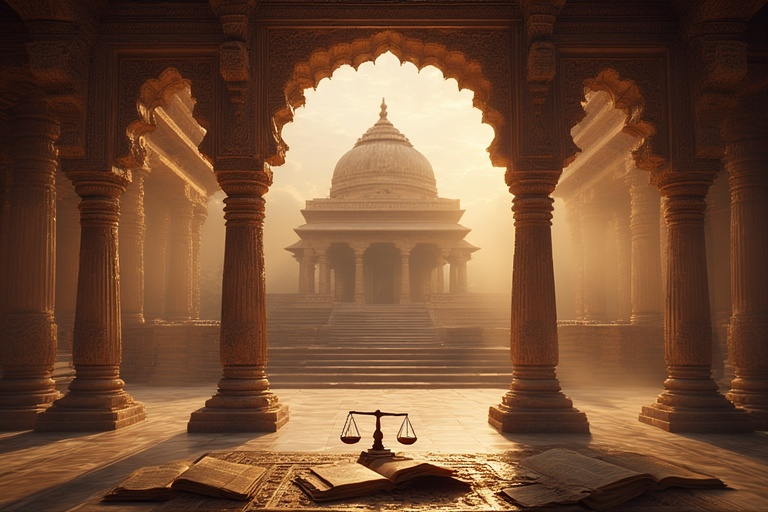


## <u>TLDR - Summary:</u>

**<u>The Systematic Judicial Assault on Sanatan Dharma: Three Centuries of Institutional Colonization</u>**

This comprehensive analysis exposes the shocking truth: India's judiciary has operated as an instrument of cultural colonization for over 250 years, systematically dismantling Hindu religious autonomy while masquerading as neutral arbiters of justice.

**<u>The Colonial Foundation (1757-1947)</u>**: British rulers didn't merely govern India—they reconstructed Hindu law itself. Warren Hastings' "codification" project and the 1864 dismissal of native religious authorities marked the beginning of epistemological warfare against dharmic jurisprudence. Foreign judges, trained in alien legal traditions, arrogated to themselves the right to interpret sacred texts and religious practices they could never comprehend.

**<u>The "Secular" Deception (1947-Present)</u>**: Independence changed nothing fundamental. The judiciary inherited colonial structures and weaponized them through the fraudulent doctrine of "secularism." The Essential Religious Practice doctrine grants judges godlike power to determine which Hindu practices are "essential"—effectively making courts the supreme religious authority over Sanatan Dharma.

**<u>The Double Standard Exposed</u>**: When Muslim personal law was challenged in Shah Bano (1985), Parliament immediately reversed the judgment. When Hindu religious practices are assaulted—Sabarimala temple traditions, festival celebrations, temple management—no such protection materializes. The pattern is unmistakable: minority religions receive legislative protection while Hindu dharma faces judicial deconstruction.

**<u>The Institutional Conspiracy</u>**: The Collegium system operates as a closed elite circle where 60% of Supreme Court judges come from judicial/lawyer families. This nepotistic structure perpetuates ideological uniformity hostile to dharmic principles. Foreign-funded NGOs provide legal ammunition for systematic challenges to Hindu practices while the judiciary claims immunity from democratic accountability through contempt laws.

**<u>The Civilizational Stakes</u>**: Justice Kurian Joseph's suggestion to abandon the Supreme Court's dharmic motto—"yato dharma stato jayah"—reveals the judiciary's fundamental rejection of dharmic epistemology. When judges declare that "constitutional morality" supersedes cosmic dharma, they position themselves above divine order itself.

**<u>The Path Forward</u>**: This crisis demands nothing less than complete institutional reconstruction. The Collegium system must be democratized, the ERP doctrine abolished, and legal education reformed to respect dharmic wisdom. The choice is stark: accept permanent civilizational subordination or reclaim judicial institutions for dharmic democracy.

The evidence is overwhelming, the pattern undeniable, the urgency absolute. India's judiciary, claiming constitutional legitimacy while operating beyond democratic control, represents the greatest institutional threat to Sanatan Dharma in the modern era. The time for polite academic discourse has ended; the time for civilizational defense has begun.



## <u>I. Introduction: The Foundational Question</u>

The relationship between India's judiciary and Hinduism presents a complex historical narrative that demands rigorous examination. This analysis traces the evolution of judicial attitudes toward Hindu dharma from the colonial period to the present day, examining how legal interpretations have shaped—and arguably constrained—the practice of Sanatan Dharma in modern India.

The central thesis of this examination is that India's legal system has operated within frameworks that systematically misunderstood, misinterpreted, and ultimately undermined traditional Hindu jurisprudence and religious autonomy. This is not merely an academic concern but a living reality that affects millions of practitioners today.

## <u>II. Colonial Origins: The Genesis of Misinterpretation (1757-1947)</u>

### <u>The British Legal Revolution and Its Hindu Casualties</u>

When the East India Company transformed from trader to ruler, it initiated what can only be described as the most comprehensive legal colonization in human history. The British approach to Hindu law was not neutral administration but active reconstruction.

**<u>Warren Hastings' "Codification" Project</u>** represented the first systematic assault on Hindu legal traditions. By commissioning pandits to translate Sanskrit texts into Persian and then English, the British created what legal historian J. Duncan M. Derrett termed "Anglo-Hindu law"—a hybrid construction that bore little resemblance to the living tradition it purported to represent.

The dismissal of native law officers (pandits and qazis) in 1864 marked a watershed moment. No longer would religious communities interpret their own laws through their own authorities. Instead, British judges—trained in common law traditions and Christian cultural assumptions—would determine what Hindu dharma demanded. This was not mere administrative efficiency; it was epistemological colonization.

**<u>Key Colonial Interventions:</u>**
- **1772**: Warren Hastings Plan established separate legal systems but under British interpretation
- **1864**: Native law officers dismissed, centralizing interpretation in British hands
- **1865**: High Courts established, consolidating British legal supremacy

Judge Robert Smith Aikman, described as "singularly free from racial prejudice," nonetheless exemplified the fundamental problem: even well-intentioned British judges were interpreting Hindu law through alien conceptual frameworks. Their "thorough grasp of Hindu law principles" was necessarily limited by their cultural and philosophical distance from the tradition they were interpreting.

### <u>The Doctrinal Transformation</u>

The British legal system introduced several concepts fundamentally alien to Hindu jurisprudence:

1. **<u>Uniformity over Contextuality</u>**: Hindu law traditionally operated through contextual application of dharmic principles. British law demanded uniform, codified rules.

2. **<u>State Supremacy over Divine Order</u>**: Hindu law recognized dharma as cosmically ordained. British law made the state the ultimate arbiter of legal truth.

3. **<u>Individual Rights over Community Harmony</u>**: Hindu legal traditions balanced individual needs within community and cosmic order. British law privilegized individual rights.

## <u>III. Post-Independence Continuity: The Secular Assault on Hindu Autonomy (1947-Present)</u>

### <u>The "Secular" State's Hindu Problem</u>

Independent India's adoption of secularism created what legal scholar Marc Galanter called a "principled distance" from religion. However, this distance proved distinctly unprincipled when applied to Hinduism versus other religious communities.

The incorporation of "secular" into the Constitution's Preamble in 1976 formalized what had already become practice: the state's right to regulate, reform, and redefine Hindu religious practice while maintaining hands-off policies toward minority religions.

### <u>The Essential Religious Practice Doctrine: Judicial Supremacy over Religious Truth</u>

No judicial innovation has been more destructive to Hindu religious autonomy than the Essential Religious Practice (ERP) doctrine. This doctrine grants courts the power to determine which practices are "essential" to a religion and therefore deserving of constitutional protection.

**<u>The Sabarimala Case: A Paradigmatic Assault</u>**

The 2018 Sabarimala judgment represents the ERP doctrine's most aggressive application. A 4:1 majority, led by Chief Justice Dipak Misra and including Justices Nariman, Chandrachud, and Khanwilkar, declared that the centuries-old practice of excluding women aged 10-50 from the Ayyappan temple violated constitutional morality.

Justice D.Y. Chandrachud's comparison of this religious observance to "untouchability" reveals the profound cultural chauvinism underlying judicial secularism. The judgment effectively declared that modern constitutional morality supersedes traditional religious understanding—that judges know better than devotees, priests, and centuries of religious tradition what Ayyappan worship requires.

Justice Indu Malhotra's lone dissent articulated what should have been obvious: "The court should not interfere in matters of deep religious sentiments unless the practices are demonstrably pernicious, oppressive, or a social evil, like Sati." Her argument that "the determination of what constitutes an essential religious practice should rest with the religious community itself, not the court" represents a principled defense of religious autonomy that the majority rejected.

### <u>Temple Management: State Control over Sacred Spaces</u>

The judiciary's approach to Hindu temple management reveals another dimension of systematic control. Recent cases like the Banke Bihari Temple dispute show courts readily supporting state takeover of Hindu religious institutions while maintaining strict separation from minority religious institutions.

The Supreme Court's questioning of Uttar Pradesh's "tearing hurry" in temple takeover, while procedurally correct, accepts the fundamental premise that the state has legitimate authority over Hindu sacred spaces. This assumption would never be applied to mosques or churches with equal ease.

## <u>IV. The Double Standard: Hindu Targeting versus Minority Protection</u>

### <u>The Shah Bano Paradox</u>

The 1985 Shah Bano case illuminates the judiciary's differential approach to religious communities. When the Supreme Court applied secular maintenance laws to Muslim personal law, the decision was legislatively overturned within months. The Muslim Women (Protection of Rights on Divorce) Act, 1986, effectively nullified the judgment, demonstrating the political system's responsiveness to minority religious concerns.

Contrast this with Hindu religious practices. When courts intervene in Hindu religious matters—whether temple management, festival celebrations, or worship practices—no comparable legislative protection materializes. Hindu religious autonomy lacks the political protection accorded to minority faiths.

### <u>The Ayodhya Exception That Proves the Rule</u>

The 2019 Ayodhya verdict appears to contradict claims of anti-Hindu bias, but deeper analysis reveals otherwise. The Court awarded the disputed site to Hindus only after acknowledging that the 1949 idol placement and 1992 demolition were criminal acts. The judgment effectively rewarded lawbreaking while maintaining its commitment to "secularism."

More revealing was Justice D.Y. Chandrachud's post-judgment admission that he "sat before lord Ram and told him he needs to find a solution." This statement, rather than showing pro-Hindu bias, demonstrates the fundamental problem: even when deciding in favor of Hindu interests, judges feel compelled to apologize for or spiritualize their decisions, as if Hindu religious claims require special justification.

The anonymous authorship of the judgment, widely attributed to Justice Ashok Bhushan, suggests judicial embarrassment about openly supporting Hindu religious claims. The Court felt unable to straightforwardly vindicate Hindu religious rights without elaborate constitutional and procedural justifications.

## <u>V. Systemic Issues: The Institutional Problem</u>

### <u>The Collegium System: Elite Self-Perpetuation</u>

The judiciary's appointment system reveals its fundamental character. The Collegium system, operating with complete opacity, has created what critics accurately describe as a "judicial dynasty." Research shows that at least 30% of Supreme Court judges are related to former judges, with another 30% having fathers who were lawyers.

This system does not merely perpetuate family connections; it perpetuates ideological orientations. Legal education in elite institutions, dominated by progressivist interpretations of constitutional law, creates an echo chamber where questioning judicial supremacy over religious matters becomes unthinkable.

### <u>The Foreign Funding Nexus</u>

The role of foreign-funded NGOs in judicial activism requires serious examination. Organizations bringing public interest litigations that challenge Hindu religious practices often receive foreign funding through channels regulated by the Foreign Contribution Regulation Act (FCRA). This creates an indirect but real pathway for external influence over India's religious landscape.

The targeting of such funding mechanisms by the current government has been criticized as suppression of civil society. However, the basic question remains: why should foreign funding support legal challenges to indigenous religious practices?

## <u>VI. Constitutional Morality versus Dharmic Order</u>

### <u>The Philosophical Conflict</u>

The fundamental issue is not judicial bias but philosophical incompatibility. India's Constitution, drafted by minds trained in Western legal traditions, embeds assumptions about individual rights, state authority, and social organization that conflict with dharmic principles.

"Constitutional morality," as invoked in cases like Sabarimala, assumes that modern secular liberal values represent moral progress over traditional religious understanding. This assumption is never subjected to critical examination; it is simply asserted as self-evident truth.

### <u>The Question of Legitimacy</u>

When Justice Kurian Joseph suggested dropping the Supreme Court's motto "yato dharma stato jayah" (where there is dharma, there is victory) because "Dharma as stipulated in the Hindu fold, is not always the truth," he revealed the judiciary's fundamental rejection of dharmic epistemology. The suggestion that "the truth is the Constitution; Dharma, not always" explicitly subordinates cosmic order to human legal construction.

This is not secularism; it is secular fundamentalism—the dogmatic assertion that secular liberal values represent ultimate truth while religious understanding represents primitive superstition.

## <u>VII. The Pattern of Systematic Deconstruction</u>

### <u>Historical Timeline of Judicial Assault on Hindu Dharma</u>

**<u>Colonial Period (1757-1947)</u>**:
- Replacement of contextual dharmic jurisprudence with uniform colonial law
- Elimination of traditional religious legal authorities
- Reconstruction of Hindu law through British interpretive frameworks

**<u>Early Independence (1947-1980s)</u>**:
- Constitutional subordination of religious law to secular authority
- Development of ERP doctrine enabling judicial redefinition of religious practice
- Shah Bano case demonstrates differential treatment of religious communities

**<u>Contemporary Period (1990s-Present)</u>**:
- Aggressive application of ERP doctrine in cases like Sabarimala
- Systematic state intervention in Hindu temple management
- Judicial supremacism over religious authority reaches unprecedented levels

### <u>The Mechanism of Control</u>

The pattern is consistent across centuries: 
1. **<u>Redefinition</u>**: External authorities redefine Hindu religious concepts according to alien frameworks
2. **<u>Intervention</u>**: Courts intervene in religious practices under secular constitutional authority
3. **<u>Subordination</u>**: Traditional religious authority is subordinated to judicial interpretation
4. **<u>Legitimization</u>**: This process is legitimized through claims of moral progress and constitutional necessity

## <u>VIII. The Current Crisis and Future Implications</u>

### <u>The Untouchable Judiciary</u>

India's judiciary has achieved what no institution in a democracy should possess: practical immunity from criticism or reform. Contempt of court laws make questioning judicial decisions a criminal offense. The Collegium system makes judicial appointments immune from democratic accountability. Constitutional interpretation makes judicial philosophy immune from legislative correction.

This combination creates what can accurately be described as judicial despotism—rule by an unelected, unaccountable elite that considers itself above democratic constraint and religious tradition alike.

### <u>The Democratic Deficit</u>

The fundamental question is whether a democracy can survive when its highest institution operates beyond democratic control while systematically deconstructing the religious and cultural foundations of the majority community. The judiciary's claim to represent "constitutional morality" against popular "mob mentality" reveals its fundamentally anti-democratic character.

## <u>IX. Toward Constitutional and Cultural Reclamation</u>

### <u>The Need for Fundamental Reform</u>

The crisis requires recognition that the problem is not individual judicial bias but systemic institutional design. Any solution must address:

1. **<u>Judicial Accountability</u>**: The Collegium system must be replaced with transparent, democratically accountable appointment mechanisms
2. **<u>Constitutional Interpretation</u>**: The ERP doctrine must be abolished or fundamentally reformed to respect religious autonomy
3. **<u>Educational Reform</u>**: Legal education must incorporate serious engagement with Indian philosophical and legal traditions
4. **<u>Cultural Restoration</u>**: The systematic denigration of dharmic principles in legal reasoning must end

### <u>The Larger Civilizational Question</u>

Ultimately, this issue transcends legal technicalities to address civilizational survival. Can a civilization maintain its integrity when its highest legal institutions operate on principles fundamentally hostile to its foundational values? Can Sanatan Dharma survive systematic judicial deconstruction disguised as constitutional interpretation?

## <u>X. Conclusion: The Choice Before Us</u>

The evidence presented here demonstrates that India's judiciary, inheriting colonial legal structures and operating through secular liberal assumptions, has indeed systematically undermined Hindu religious autonomy while protecting minority religious rights. This is not accidental bias but structural design.

The choice before Hindu society is stark: accept permanent subordination to secular judicial supremacy or demand fundamental institutional reform that respects dharmic principles and democratic accountability. The current system, claiming constitutional legitimacy while operating beyond democratic control, represents neither true secularism nor genuine democracy.

The time has come to ask whether institutions that systematically undermine the religious and cultural foundations of the majority community while claiming to represent constitutional morality deserve the authority they have claimed. The question is not whether individual judges are biased, but whether the entire institutional framework requires fundamental reconstruction to serve a truly dharmic and democratic society.

This analysis does not call for the destruction of judicial institutions but their fundamental reformation according to principles that respect both democratic accountability and dharmic wisdom. Only such reformation can restore the balance between constitutional governance and civilizational continuity that independent India was meant to achieve.

---

*This analysis is based on documented judicial decisions, historical records, and scholarly research. It represents a critical examination of institutional patterns rather than personal attacks on individual judges. The goal is not destruction but reconstruction—the creation of judicial institutions worthy of both democratic India and Sanatan Dharma.*