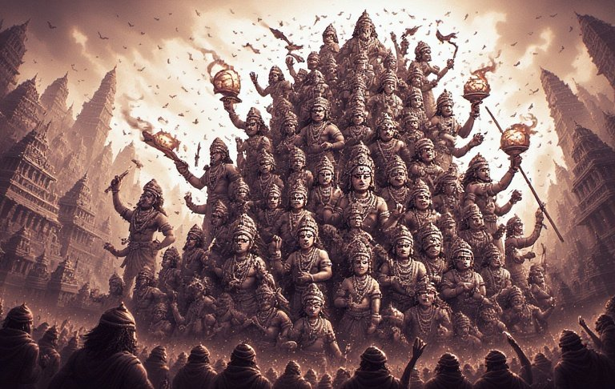


## <u>TLDR - Summary:</u>

The Jugantar revolutionary movement in early 20th-century Bengal exemplifies a recurring pattern in Hindu resistance: initial promise grounded in authentic cultural foundations, followed by secular dilution and organizational fragmentation. Founded on Sri Aurobindo's vision of spiritual nationalism, these gymnasium-based revolutionary cells achieved tactical sophistication—publishing influential newspapers, organizing funding through ideologically-sanctioned robberies, and coordinating international conspiracies—yet ultimately dissolved into the Indian National Congress and various secular political factions.

This trajectory reveals a deeper civilizational pathology: Hindu society consistently produces capable leaders but psychologically fails to sustain support for them. The British strategy wasn't elimination of traditional Kshatriya elites but their cooptation—defeated rulers were absorbed into colonial military structures, retaining social status while losing autonomous political agency. This created a "democracy of paralysis" where the masses, conditioned by centuries of subjugation, reflexively distrust indigenous leadership while remaining vulnerable to external manipulation.

The ancient concept of Kaliyuga emerges not as cosmic fatalism but as clinical diagnosis of these observed patterns—the elevation of expedience over principle, the fragmentation of traditional institutions, the prevalence of short-term thinking. Correspondingly, the Kalki prophecy, when understood through the operational patterns of previous avatars (Krishna, Rama), suggests divine intervention through extraordinary human agency rather than supernatural suspension of natural law.

Contemporary implications are stark: the same dynamics that doomed historical resistance movements continue operating today. Yet awareness of these patterns might constitute the beginning of their transcendence. The Kalki paradox implies that civilizational renewal emerges not from passive expectation of external salvation but from individuals who understand both the pathologies of decline and the principles of sustainable resistance—figures who appear entirely human yet possess the clarity to navigate successfully the psychological and organizational challenges that have repeatedly undermined their predecessors.



## The Gymnasium of Revolution

In the cramped streets of early 20th-century Calcutta, young Bengali men gathered in *akhadas*—ostensibly fitness clubs and gymnasiums, but in reality, clandestine networks for revolutionary training. The Jugantar group, emerging as a radical wing of the Anushilan Samiti around 1902, represented perhaps the most sophisticated attempt at Hindu nationalist resistance against British rule. These revolutionary cells, operating from addresses like 93/A Baubazar Street and 41 Champatola 1st Lane, embodied a unique synthesis: Western military discipline married to Hindu philosophical revivalism, with recruits pledging service to the nation through oaths on the Bhagavad Gita.

Yet for all their sophistication—their strategic use of physical culture as political cover, their newspaper *Jugantar Patrika* reaching 20,000 readers, their ambitious Indo-German Plot during World War I—the movement followed the familiar pattern of Hindu resistance: initial promise, tactical brilliance, and ultimate dissolution into secular fragments. By 1938, the Jugantar Society had officially merged with the Indian National Congress, its members dispersing across various political entities from the Communist Party to Subhas Chandra Bose's Forward Bloc.

This trajectory raises a fundamental question that extends far beyond the specific case of Bengali revolutionaries: Why does every Hindu resistance movement, no matter how promising its inception or sophisticated its methods, eventually fail to sustain its original vision?

## The Recurring Pattern of Dissolution

The Jugantar story reveals a pattern that seems to define Hindu organizational dynamics across centuries. Founded on the Hindu nationalist principles of Sri Aurobindo—who conceived the struggle as part of a "spiritual revolution" where the Indian motherland itself was divine—the movement initially possessed both ideological clarity and operational effectiveness. They successfully organized dacoities to fund operations (ideologically justified through articles like "Collection of Funds" which declared such acts "not a sin but a work of religious merit"), attempted assassinations of British officials, and even coordinated international conspiracies involving German arms shipments.

Yet within two decades, this movement had fractured along predictable lines. The 1920 decision to "set aside all violent actions and follow the path of the Non-Cooperation movement proposed by Gandhi" marked not tactical flexibility but ideological abandonment. When they resumed violent activities in 1930, it was no longer as a Hindu nationalist movement but as generic anti-colonial terrorists. The spiritual revolution Aurobindo envisioned had devolved into mere political expedience.

This pattern—initial Hindu nationalist foundation, followed by secular dilution, ending in organizational fragmentation—appears to be the governing dynamic of Hindu resistance throughout history. From the Maratha confederacy's inability to consolidate after Mughal decline, to the East India Company's recruitment of Hindu sepoys to suppress Hindu kingdoms, to the contemporary spectacle of Hindu-majority India producing more critics of "Hindu nationalism" than defenders, the same structural weakness manifests repeatedly.

## The Psychology of Paralysis

The more perplexing aspect of Hindu organizational failure lies not in the absence of potential leaders—every era has produced individuals of remarkable capability and clarity—but in society's consistent failure to support them. The traditional Kshatriya class, far from being eliminated, was systematically coopted: defeated by the British, then absorbed into colonial military structures where their martial prowess served imperial rather than civilizational purposes. They retained their social standing, their community networks, even their martial traditions, but lost their autonomous political agency.

This cooptation created a peculiar form of institutional castration. The Mewar royal families today possess wealth, social prestige, and historical legitimacy, yet remain politically neutered—capable of little more than managing hotel properties and tourist attractions. The transformation from sovereign rulers to service providers represents not physical elimination but psychological domestication.

The pattern extends beyond traditional elites. Contemporary Hindu society consistently produces individuals with the intellectual clarity and moral courage necessary for effective leadership. Yet these figures find themselves operating in a vacuum, unable to generate the sustained popular support that transforms individual excellence into collective action. The problem lies not in the supply of leaders but in the demand for leadership—or rather, in society's psychological incapacity to recognize and rally behind authentic authority.

This creates what might be termed the "democracy of paralysis"—a condition where the majority, having internalized centuries of subjugation, reflexively distrusts indigenous leadership while remaining susceptible to external manipulation. The masses don't actively betray their potential leaders so much as they fail to recognize them, creating a space that hostile forces inevitably exploit.

## The Secularism Trap

Perhaps the most insidious aspect of this dynamic is how movements that abandoned their Hindu foundations often gained broader appeal precisely because they required less from their adherents. Gandhi's non-violent resistance succeeded in mobilizing millions not because it was more strategically sound than armed resistance, but because it demanded less personal risk and cultural commitment from participants. The appeal was not spiritual but practical: "Take freedom now by doing nothing."

The Jugantar revolutionaries themselves recognized this trap. Their 1930 resumption of violent activities was explicitly described as an "antidote" to Gandhi's policy. Yet by then, the damage was done—the masses had tasted the easier path of passive resistance, and movements requiring genuine sacrifice found themselves increasingly isolated.

This creates a cruel irony: the more authentically Hindu a resistance movement, the more it demands from its adherents in terms of cultural knowledge, spiritual discipline, and personal commitment. But these very demands, which might make such movements more effective in the long term, make them less appealing to mass audiences in the short term. Meanwhile, secular alternatives can cast wider nets precisely because they ask for less—and consequently achieve less.

## Kaliyuga as Self-Diagnosis

The ancient concept of Kaliyuga—the age of darkness characterized by moral decline and social fragmentation—takes on new meaning when viewed through this lens. Rather than a cosmic prophecy about inevitable spiritual decline, it reads more like a clinical diagnosis of observed patterns in Hindu civilizational behavior. The characteristics traditionally attributed to Kaliyuga—the elevation of wealth over wisdom, the corruption of traditional institutions, the prevalence of deception over truth—map precisely onto the dynamics that have repeatedly undermined Hindu resistance movements.

The genius of this framework lies not in fatalistic acceptance but in its diagnostic precision. If Kaliyuga represents a description of specific civilizational pathologies, then Kalki—the prophesied avatar who ends this age—must represent their cure. But what kind of cure?

## The Kalki Paradox: Human Agency and Divine Intervention

Traditional interpretations of Kalki envision a literal divine intervention—a cosmic figure descending with supernatural powers to restore dharmic order through overwhelming force. Yet this reading contradicts everything we know about how avatars actually function within Hindu texts. Krishna possessed unlimited power but consistently chose to work within earthly constraints. Rama could have resolved the Ramayana's conflicts instantly but instead endured exile, built alliances, and fought conventional battles. The pattern suggests that divine intervention in human affairs operates not through the suspension of natural law but through its skillful employment.

If we apply this understanding to the Kalki prophecy, a different picture emerges. Rather than waiting for a supernatural savior, the prophecy might be describing the emergence of individuals who understand both the pathologies of Kaliyuga and the means of transcending them. Such figures would appear entirely human—they would use conventional methods, face ordinary constraints, and work within existing systems. Their "divinity" would manifest not through miraculous powers but through their capacity to inspire and organize sustained resistance to civilizational decline.

This interpretation transforms the Kalki prophecy from passive expectation into active responsibility. If Kalki represents the cure for Kaliyuga's pathologies, then those who understand these dynamics bear some responsibility for bringing that cure into existence.

## The Contemporary Implications

Viewed through this framework, contemporary Hindu organizational efforts take on added significance. The same dynamics that doomed the Jugantar revolutionaries—the tendency toward secular dilution, the appeal of easier paths, the absence of authentic leadership structures—continue to operate today. Yet awareness of these patterns might itself constitute the beginning of their solution.

The 5% of the population that recognizes long-term threats and understands cultural stakes faces the same challenge that confronted Sri Aurobindo and the Jugantar revolutionaries: how to translate individual clarity into collective action. The answer may lie not in recreating historical forms but in understanding the underlying principles that make sustainable resistance possible.

The Kalki paradox suggests that divine intervention in human affairs operates through human agency rather than in spite of it. The figures who end ages of decline do so not by transcending human limitations but by understanding and working skillfully within them. They don't suspend the laws of physics or politics; they simply understand those laws better than their contemporaries.

## Conclusion: The Democracy of Courage

The story of the Jugantar revolutionaries offers both warning and hope. Their failure illuminates the structural challenges that have repeatedly undermined Hindu resistance, while their initial success demonstrates that these challenges are not insurmountable. The gymnasium revolutionaries of early 20th-century Bengal proved that authentic Hindu nationalism could generate both ideological clarity and operational effectiveness. Their ultimate dissolution into secular fragments warns us about the forces that work against such clarity.

But perhaps most importantly, their story suggests that the solutions to civilizational challenges don't lie in waiting for external intervention but in understanding the dynamics that produce both decline and renewal. The Kalki prophecy, understood not as literal mythology but as sophisticated analysis, points toward the emergence of individuals who can navigate these dynamics successfully.

Whether such individuals emerge from among us—whether we collectively possess the wisdom to recognize them and the courage to support them—remains the defining question of our historical moment. The answer will determine not just the fate of Hindu civilization but the nature of divine intervention itself in human affairs.

After all, gods may work through ordinary means, but they still require extraordinary humans to recognize the possibilities inherent in any historical moment. The revolution begins in the gymnasium of the mind, where the muscles of discernment and the sinews of commitment are slowly, carefully strengthened for the trials that await.