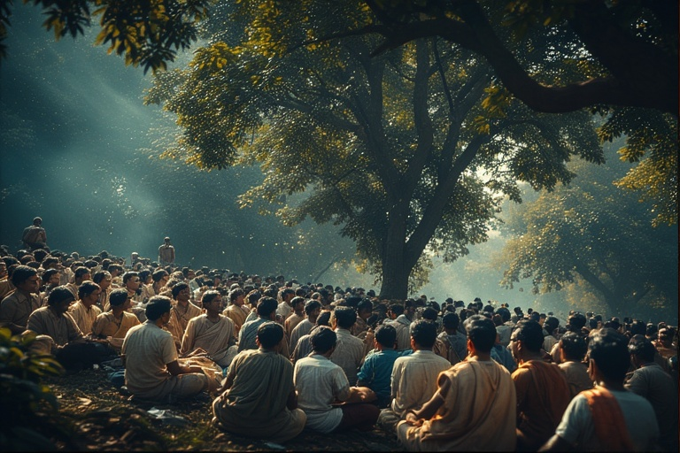



There's a peculiar phenomenon that runs through the fabric of contemporary Indian society—an overwhelming emphasis on appearance over substance, on the performance of values rather than their practice. From religious observance to professional life, from political discourse to educational pursuits, the culture has become profoundly ornamental. The talk is loud, but the sincerity is thin.



## <u>The Politics of Symbols</u>

Nowhere is this performative tendency more evident than in political discourse. Indian politics has become a ritual invocation of sacred names and principles that nobody actually believes in. Politicians speak endlessly of Ambedkar, Vallabhbhai Patel, secularism, the Constitution—not as living ideas to be debated and applied, but as symbols to be waved.

Consider an instructive anecdote: a Congress leader organizes a session on Ambedkar. The entire Congress division of that area is absent. Only the organizers show up. The hall sits empty. Yet the leader felt compelled to host the event, to speak about principles that even his own party members don't care enough about to attend. This is discourse as pure performance—words spoken into the void because speaking them is the point, not because anyone expects them to mean anything.

Nobody actually holds the Constitution as sacred the way Americans do, yet it's invoked constantly. There's little real discussion about actual problems facing people, or even about principles that anybody genuinely cares about. Instead, there's sloganeering. Invocation. Symbolic warfare.

When American infrastructure needs improvement, politicians cite Reagan's observation that America's development stems from its roads. The debate then focuses on roads—on concrete, practical matters. In India, we debate which historical figure said what about which abstract principle. We spend energy arguing about symbols while the roads crumble.

This symbolic politics pervades all sides. While the American left sometimes falls into this trap—speaking of "xyz rights" and "freedom to abc" as abstract principles detached from material reality—in India, everyone does it. The entire political spectrum operates at one remove from reality, speaking in symbols rather than substance.

This performative tendency manifests in curious ways. Indian politicians, across all parties, maintain their traditional attire—kurtas, dhotis, Gandhi topis—as visible markers of cultural authenticity. Yet this sartorial traditionalism masks a complete hollowing out of the cultural core. The population they represent desperately mimics Western culture in every meaningful dimension while the leaders perform tradition through clothing. The form is maintained, the substance abandoned. It's performance all the way down.

## <u>The Language Problem</u>

Perhaps the deepest manifestation of this crisis lies in language itself. India finds itself in a peculiar linguistic limbo—caught between English, Hindi, Urdu, and regional languages, yet unable to communicate clearly in any of them.

The problem isn't multilingualism per se. It's that Indian education teaches language as mere mapping—a mechanical translation exercise disconnected from cultural context. Children learn English by asking "what is roti in English?" and "what is sabzi in English?" They memorize which English word maps to which Hindi concept, but never engage with the cultural ecosystem that gives English words their meaning.

Language is not just vocabulary. It's what a specific culture uses to internally communicate specific ideas that are original to itself, in its own specific environment. To truly speak a language is to be immersed in the culture that produced it. Most Indians never achieve this with English—they learn the words without the cultural context that makes genuine expression possible.

This creates bizarre distortions. "Secularism" gets arbitrarily translated to "dharm nirpekshta" (religion-neutrality). The translation changes the meaning entirely, yet becomes the accepted understanding. "Racism" becomes synonymous with any discrimination. Basic terms lack stable definitions because they've been wrenched from their original cultural context and reassigned new meanings through hasty translation.

The result: people think in a khichdi language—a jumbled mix of English, Hindi, and Urdu—where words mean different things to different people. You speak, but you don't actually say anything. Understanding words down to their roots, their origins, their context—this fundamental linguistic competence is missing.

Words have lost their connection to concepts. In comments sections, in political debates, in everyday conversation, you encounter dozens of interpretations of the same term. This wouldn't be problematic if the confusion were acknowledged, if people recognized they were using private languages. But instead, this corrupted vocabulary becomes the medium through which Indians understand the world itself.

## <u>The Education System's Role</u>

The roots trace back to the English education system imposed during colonial rule and perpetuated afterward. The system taught people to mimic forms without understanding substance, to perform knowledge without acquiring wisdom. It created generations fluent in multiple languages but unable to express themselves clearly in any of them.

The mistake compounds when we prioritize higher education over primary schooling. By the time someone reaches college, the fundamental patterns of thought and expression are already set. If the foundation is built on mechanical translation rather than cultural immersion, on rote learning rather than genuine comprehension, no amount of advanced education can correct it.

## <u>Breaking the Cycle</u>

The performance culture creates a self-reinforcing trap. The pretense of knowledge and hard work prevents actual knowledge and hard work from developing. When everyone is busy maintaining appearances, no one has energy left for substance. When political discourse consists of invoking symbols that nobody believes in, there's no space to discuss real problems. When language is corrupted, clear thinking becomes impossible.

What would it take to break this cycle? Better primary education—not in the sense of more schooling, but education that teaches coherent language use. Education that helps children understand words down to their roots, that immerses them in the cultural context that gives language meaning. A linguistic foundation where words mean what they say, where concepts have stable definitions, where communication actually communicates.

This isn't about abandoning English or returning to some pure Hindi. It's about learning any language properly—deeply, contextually, with full cultural immersion rather than mechanical mapping. It's about creating the capacity for genuine expression and clear thought.

Until then, we remain caught in an elaborate theater. Politicians invoke symbols nobody believes in to empty halls. Employees perform productivity in offices where everyone knows nothing is being accomplished. People speak endlessly using words they don't truly understand, thinking in a jumbled language where meaning constantly shifts. Everyone plays their part, everyone knows it's a performance, but no one quite knows how to step off the stage.

The solution isn't complex, but it's foundational. Build the capacity for clear language. Everything else follows from there.