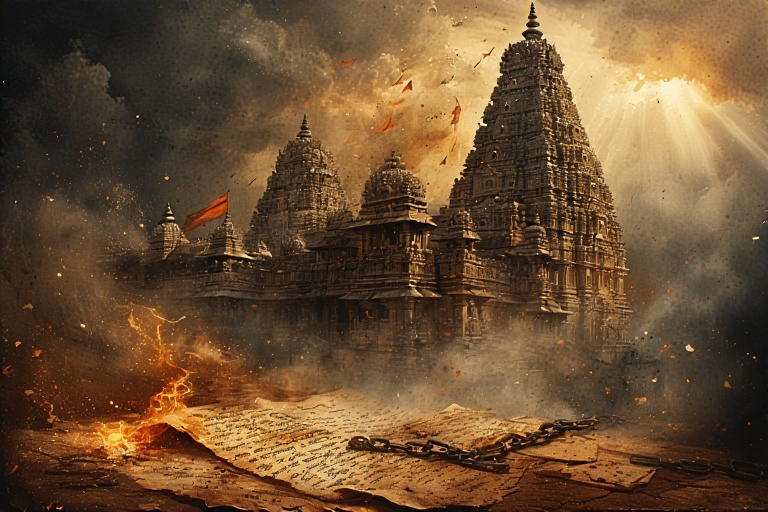

***Read the Main Article here - [How India's Founding Fathers Murdered a Civilisation](https://vicharamanjari.onrender.com/posts/our_founding_fathers/)***

***For a longer list of some of our most influential founding fathers, with their thoughts and actions for/against hinduism, refer to - [A list of the thoughts and actions of some our most influential Founding Fathers](https://vicharamanjari.onrender.com/posts/all_founding_fathers/)***

The following catalogues major government-led actions, laws or policies (in South and neighboring Asia) widely cited as targeting Hindus. Each item is supported by reliable sources; the focus is on concrete steps (legislation, official decrees, or physical acts by authorities) rather than rhetoric.

## <u>Pakistan</u>

**• Islamabad Hindu temple halted (July 2020):** Pakistan's Capital Development Authority (CDA) abruptly required a full building plan for a new Krishna temple in Islamabad, effectively stopping construction. This came after a "mob of fundamentalist" protestors had torn down part of the temple's boundary wall[[1]](https://timesofindia.indiatimes.com/world/pakistan/construction-work-at-hindu-temple-site-in-pakistan-halted-chinas-ministry-of-agriculture/articleshow/76792495.cms#:~:text=ISLAMABAD%3A%20The%20Islamabad%20Hindu%20Panchayat,apparently%20referring%20to%20the%20attack)[[2]](https://timesofindia.indiatimes.com/world/pakistan/construction-work-at-hindu-temple-site-in-pakistan-halted-chinas-ministry-of-agriculture/articleshow/76792495.cms#:~:text=There%20weren%E2%80%99t%20too%20many%20details,approach%20the%20CDA%20on%20Monday). Media and clerical pressure had reportedly forced the government to back down on allowing the temple[[3]](https://www.amnesty.org/en/latest/news/2020/07/pakistan-must-protect-religious-freedom-for-hindus/#:~:text=The%20human%20rights%20organization%E2%80%99s%20call,torn%20down%20by%20a%20mob)[[2]](https://timesofindia.indiatimes.com/world/pakistan/construction-work-at-hindu-temple-site-in-pakistan-halted-chinas-ministry-of-agriculture/articleshow/76792495.cms#:~:text=There%20weren%E2%80%99t%20too%20many%20details,approach%20the%20CDA%20on%20Monday).

**• Mob attacks on Hindus (2019–2020):** In Sindh province, Hindu properties and temples were attacked by mobs following false "blasphemy" accusations against Hindu individuals[[4]](https://www.amnesty.org/en/latest/news/2020/07/pakistan-must-protect-religious-freedom-for-hindus/#:~:text=The%20destruction%20of%20the%20Hindu,hundreds%20of%20young%20Hindu%20women)[[5]](https://www.amnesty.org/en/latest/news/2020/07/pakistan-must-protect-religious-freedom-for-hindus/#:~:text=forced%20marriage%20of%20hundreds%20of,young%20Hindu%20women). For example, in 2019 two separate incidents saw mobs vandalise Hindu sites after cleric-led protests. Human-rights observers note Hindus have faced "increasing marginalization," including false blasphemy charges, temple burnings, and hundreds of abductions/forced marriages of young Hindu women[[4]](https://www.amnesty.org/en/latest/news/2020/07/pakistan-must-protect-religious-freedom-for-hindus/#:~:text=The%20destruction%20of%20the%20Hindu,hundreds%20of%20young%20Hindu%20women)[[5]](https://www.amnesty.org/en/latest/news/2020/07/pakistan-must-protect-religious-freedom-for-hindus/#:~:text=forced%20marriage%20of%20hundreds%20of,young%20Hindu%20women).

**• Government capitulation to Islamist pressure:** Amnesty International reports that Pakistani authorities "capitulated to pressure from a discriminatory campaign mounted by politicians, media outlets and clerics" to stop the Islamabad temple[[3]](https://www.amnesty.org/en/latest/news/2020/07/pakistan-must-protect-religious-freedom-for-hindus/#:~:text=The%20human%20rights%20organization%E2%80%99s%20call,torn%20down%20by%20a%20mob). In effect, the federal government publicly halted the construction of the Hindu temple rather than risk Islamist backlash[[3]](https://www.amnesty.org/en/latest/news/2020/07/pakistan-must-protect-religious-freedom-for-hindus/#:~:text=The%20human%20rights%20organization%E2%80%99s%20call,torn%20down%20by%20a%20mob). (By contrast, the previous year Prime Minister Imran Khan had repeatedly pledged to protect non-Muslims -- e.g. warning in Feb. 2020 that anyone "targeting our non-Muslim citizens or their places of worship will be dealt with strictly"[[6]](https://www.amnesty.org/en/latest/news/2020/07/pakistan-must-protect-religious-freedom-for-hindus/#:~:text=Prime%20Minister%20Imran%20Khan%20has,%E2%80%9D) -- yet such pledges have not stopped attacks on Hindus.)

**• Lack of legal protection:** Pakistan has no specific laws protecting Hindus; instead existing blasphemy and "anti-terrorism" laws have frequently been misused against them. Critics note that under Pakistan's *blasphemy laws* (carrying a mandatory death penalty) Hindus effectively have a "presumption of guilt" if accused, with authorities often failing to protect them from mob violence[[4]](https://www.amnesty.org/en/latest/news/2020/07/pakistan-must-protect-religious-freedom-for-hindus/#:~:text=The%20destruction%20of%20the%20Hindu,hundreds%20of%20young%20Hindu%20women)[[6]](https://www.amnesty.org/en/latest/news/2020/07/pakistan-must-protect-religious-freedom-for-hindus/#:~:text=Prime%20Minister%20Imran%20Khan%20has,%E2%80%9D).

## <u>Bangladesh</u>

**• Constitutional Islamization (1988–2011):** Although Bangladesh's 1972 founding constitution was secular, the military regime of 1988 amended it to declare Islam the state religion. A 2011 amendment retained Islam's official status while nominally reinstating secular language. The High Court in 2016 upheld Islam as state religion and rejected a petition to remove this status[[7]](https://www.aljazeera.com/news/2016/3/28/bangladesh-court-upholds-islam-as-religion-of-the-state#:~:text=Dhaka%2C%20Bangladesh%20%E2%80%93%20%C2%A0Bangladesh%E2%80%99s%20High,majority%20South%20Asian%20nation)[[8]](https://www.aljazeera.com/news/2016/3/28/bangladesh-court-upholds-islam-as-religion-of-the-state#:~:text=Further%20impetus%20to%20challenge%20the,%E2%80%9Cequal%20status%E2%80%9D%20of%20other%20religions). Thus, Bangladesh's basic law now puts Islam "first and foremost," with other faiths (including Hinduism) accorded lesser status[[8]](https://www.aljazeera.com/news/2016/3/28/bangladesh-court-upholds-islam-as-religion-of-the-state#:~:text=Further%20impetus%20to%20challenge%20the,%E2%80%9Cequal%20status%E2%80%9D%20of%20other%20religions).

**• Enemy/Vested Property laws (1972–1976):** In the 1970s Bangladesh enacted "Enemy Property" and then "Vested Property" Acts that allowed the state to confiscate land from people deemed enemies (initially those who fled in 1971–72). These laws were used overwhelmingly to seize Hindu-owned properties. For example, the 1972 Presidential Order No.29 and the 1974 *Vested and Non-Resident Property Act* effectively transferred millions of acres of (mostly Hindu) land to state control[[9]](https://en.wikipedia.org/wiki/Vested_Property_Act_(Bangladesh)#:~:text=,XCIII%20of%201976). A 2001 *Vested Property Return Act* was passed under Khaleda Zia's government to restore properties, but implementation was poor and most land remained unrecovered[[10]](https://en.wikipedia.org/wiki/Vested_Property_Act_(Bangladesh)#:~:text=Properties%20Return%20Act%20,Zia%20government%20from%202001%20to).

**• Targeted violence and temple attacks (2024):** In late 2024, major anti-Hindu violence broke out after a Hindu youth was accused of blasphemy. Rioters in Sunamganj and Sylhet districts attacked Hindu villages: about 20 Hindu homes were looted and burned, and shops were destroyed[[11]](https://www.aljazeera.com/features/2024/12/12/our-lives-dont-matter-in-post-hasina-bangladesh-hindus-fear-future#:~:text=Stepping%20outside%2C%20he%20saw%20people,%E2%80%9D). Even the local ISKCON Hindu temple in Dowarabazar was vandalized by mobs[[12]](https://www.aljazeera.com/features/2024/12/12/our-lives-dont-matter-in-post-hasina-bangladesh-hindus-fear-future#:~:text=Image%3A%20In%20the%20Dowerbazar%2C%20the,Mehedi%20Hasan%20Marof%2FAl%20Jazeera). Authorities eventually protected the temple from total destruction, but the violence displaced Hindu families and spread fear[[11]](https://www.aljazeera.com/features/2024/12/12/our-lives-dont-matter-in-post-hasina-bangladesh-hindus-fear-future#:~:text=Stepping%20outside%2C%20he%20saw%20people,%E2%80%9D)[[12]](https://www.aljazeera.com/features/2024/12/12/our-lives-dont-matter-in-post-hasina-bangladesh-hindus-fear-future#:~:text=Image%3A%20In%20the%20Dowerbazar%2C%20the,Mehedi%20Hasan%20Marof%2FAl%20Jazeera). (Local officials have since downplayed the scale of the attacks[[12]](https://www.aljazeera.com/features/2024/12/12/our-lives-dont-matter-in-post-hasina-bangladesh-hindus-fear-future#:~:text=Image%3A%20In%20the%20Dowerbazar%2C%20the,Mehedi%20Hasan%20Marof%2FAl%20Jazeera), but witnesses documented major loss of Hindu property.)

## <u>Sri Lanka</u>

**• Temple appropriation by state (2020–2024):** Since 2020, Sri Lanka's government (first under President Gotabaya Rajapaksa, later Ranil Wickremesinghe) has pursued a policy of converting Tamil Hindu temple lands into Buddhist heritage sites. In December 2020 Rajapaksa established a "Presidential Task Force" (composed of senior military officers and Buddhist clergy) to manage archaeological heritage in Eastern Province[[13]](https://www.hrw.org/news/2024/07/28/sri-lanka-authorities-target-religious-minorities#:~:text=The%20campaign%20to%20redesignate%20Tamil,Rajapaksa%E2%80%99s%20successor%2C%20President%20Ranil%20Wickremesinghe). Under this task force hundreds of Hindu temples were surveyed and many were officially re-designated as ancient Buddhist sites. Although the task force formally disbanded, its policies continue today[[13]](https://www.hrw.org/news/2024/07/28/sri-lanka-authorities-target-religious-minorities#:~:text=The%20campaign%20to%20redesignate%20Tamil,Rajapaksa%E2%80%99s%20successor%2C%20President%20Ranil%20Wickremesinghe). HRW reports that government agencies (Archaeology Department, Forest & Wildlife Departments, police and military) have systematically aided Buddhist nationalist groups in "denying Hindus access" to their own temples[[14]](https://www.hrw.org/news/2024/07/28/sri-lanka-authorities-target-religious-minorities#:~:text=,to%20property%20and%20religious%20freedom)[[15]](https://www.hrw.org/news/2024/07/28/sri-lanka-authorities-target-religious-minorities#:~:text=Activists%20estimate%20that%20the%20government%E2%80%99s%C2%A0Department,and%20deny%20access%20to%20lands).

**• Temple access blocked by security forces:** In February 2024, police and soldiers physically prevented Hindu worshippers from entering the Kandasamy Murugan temple in Trincomalee, telling them the land "belongs to the Buddhist religion" and the archaeology department[[16]](https://www.hrw.org/news/2024/07/28/sri-lanka-authorities-target-religious-minorities#:~:text=On%20February%2023%2C%20police%20and,%E2%80%9D). Such incidents illustrate how state authorities are enforcing the reclassification of temple lands. Altogether, activists estimate that about 600 Hindu temples have been surveyed or taken over in the Eastern Province alone[[15]](https://www.hrw.org/news/2024/07/28/sri-lanka-authorities-target-religious-minorities#:~:text=Activists%20estimate%20that%20the%20government%E2%80%99s%C2%A0Department,and%20deny%20access%20to%20lands), with smaller temples stripped of idols and closed off by the state.

**• Promotion of Sinhala-Buddhist nationalism:** Human Rights Watch notes that Sri Lankan officials openly promote "Sinhalese Buddhist settlement" in former Tamil areas at the expense of Hindu and Muslim minorities[[14]](https://www.hrw.org/news/2024/07/28/sri-lanka-authorities-target-religious-minorities#:~:text=,to%20property%20and%20religious%20freedom). Notably, President Rajapaksa's brother and Defense Secretary (since 2021) was involved in these policies. President Wickremesinghe has publicly "quarreled" with archaeology officials, but has done "little" to stop temple seizures[[13]](https://www.hrw.org/news/2024/07/28/sri-lanka-authorities-target-religious-minorities#:~:text=The%20campaign%20to%20redesignate%20Tamil,Rajapaksa%E2%80%99s%20successor%2C%20President%20Ranil%20Wickremesinghe). Thus Sri Lanka's state apparatus, including the military and civil bureaucracy, has taken concrete actions (task forces, decrees, security interventions) that undermine Hindu religious sites.

## <u>Nepal</u>

**• Secularization by law (2006–2015):** Nepal was the world's only official Hindu kingdom until 2006. In May 2006, after pro-democracy protests forced King Gyanendra to reinstate parliament, the newly convened legislature "quickly moved... and declared Nepal a secular nation"[[17]](https://www.hinduismtoday.com/hpi/2006/05/28/2006-05-28-hindus-protest-nepal-s-declaration-as-secular-state/#:~:text=Nepal%20be%20declared%20a%20Hindu,three%20weeks%20after%20announcing%20a). The Interim Constitution of January 2007 formally made Nepal a secular state[[18]](https://rc-services-assets.s3.eu-west-1.amazonaws.com/s3fs-public/SecularismAndStatebuildingInNepal.pdf#:~:text=the%20second%20People%E2%80%99s%20Movement%20forced,first%20meeting%20in%20May%202008). The first Constituent Assembly then abolished the monarchy in 2008. Nepal's final (2015) Constitution reaffirmed the secular status. A proposal that year to re-establish Nepal as a Hindu state was defeated: over two-thirds of the assembly voted *against* restoring the Hindu kingdom[[19]](https://www.aljazeera.com/news/2015/9/14/nepal-rejects-reverting-back-to-a-hindu-state#:~:text=Nepal%E2%80%99s%20Constituent%20Assembly%20has%20rejected,of%20the%20monarchy%20in%202008).

**• Removal of Hindu symbols:** In practice, the secular reforms included removal of Hindu royal symbols. (For example, after 2006 the king stopped using the title "Chakravartin" and no government official is required to attend any Hindu rituals.) Many Nepalese Hindus protested these changes -- at one protest in May 2006 over 5,000 demonstrators clashed with police, demanding Nepal remain Hindu[[20]](https://www.hinduismtoday.com/hpi/2006/05/28/2006-05-28-hindus-protest-nepal-s-declaration-as-secular-state/#:~:text=to%20in%20April%20of%20this,bowed%20to%20weeks%20of%20pro) -- but the secularization measures were passed into law and implemented by successive governments. Thus top leaders from all major parties (including PM Girija Prasad Koirala and Maoist leaders) took explicit steps to end Nepal's Hindu state status[[17]](https://www.hinduismtoday.com/hpi/2006/05/28/2006-05-28-hindus-protest-nepal-s-declaration-as-secular-state/#:~:text=Nepal%20be%20declared%20a%20Hindu,three%20weeks%20after%20announcing%20a)[[19]](https://www.aljazeera.com/news/2015/9/14/nepal-rejects-reverting-back-to-a-hindu-state#:~:text=Nepal%E2%80%99s%20Constituent%20Assembly%20has%20rejected,of%20the%20monarchy%20in%202008).

## <u>Bhutan (*selected example*)</u>

**• Citizenship law targeting Hindus (1985):** In 1985 Bhutan's National Assembly enacted a Citizenship Act requiring proof of residence *before 1958* for citizenship eligibility. This cutoff disenfranchised tens of thousands of ethnic Nepali Hindus (Lhotshampas) who had settled in southern Bhutan, effectively making them stateless[[21]](https://en.wikipedia.org/wiki/Ethnic_cleansing_in_Bhutan#:~:text=criteria%20for%20return,37). In subsequent years, over 100,000 Lhotshampas (many Hindu) were expelled or fled to Nepal under this policy. (Though before the 2000s, this law and its enforcement are widely regarded as anti-Hindu in effect.)

**Sources:** Credible reports and news media have documented these events and laws[[1]](https://timesofindia.indiatimes.com/world/pakistan/construction-work-at-hindu-temple-site-in-pakistan-halted-chinas-ministry-of-agriculture/articleshow/76792495.cms#:~:text=ISLAMABAD%3A%20The%20Islamabad%20Hindu%20Panchayat,apparently%20referring%20to%20the%20attack)[[3]](https://www.amnesty.org/en/latest/news/2020/07/pakistan-must-protect-religious-freedom-for-hindus/#:~:text=The%20human%20rights%20organization%E2%80%99s%20call,torn%20down%20by%20a%20mob)[[7]](https://www.aljazeera.com/news/2016/3/28/bangladesh-court-upholds-islam-as-religion-of-the-state#:~:text=Dhaka%2C%20Bangladesh%20%E2%80%93%20%C2%A0Bangladesh%E2%80%99s%20High,majority%20South%20Asian%20nation)[[11]](https://www.aljazeera.com/features/2024/12/12/our-lives-dont-matter-in-post-hasina-bangladesh-hindus-fear-future#:~:text=Stepping%20outside%2C%20he%20saw%20people,%E2%80%9D)[[13]](https://www.hrw.org/news/2024/07/28/sri-lanka-authorities-target-religious-minorities#:~:text=The%20campaign%20to%20redesignate%20Tamil,Rajapaksa%E2%80%99s%20successor%2C%20President%20Ranil%20Wickremesinghe)[[19]](https://www.aljazeera.com/news/2015/9/14/nepal-rejects-reverting-back-to-a-hindu-state#:~:text=Nepal%E2%80%99s%20Constituent%20Assembly%20has%20rejected,of%20the%20monarchy%20in%202008)[[21]](https://en.wikipedia.org/wiki/Ethnic_cleansing_in_Bhutan#:~:text=criteria%20for%20return,37). Each cited source corresponds to a direct quote or description of the events above. If a given law/action is not found in open sources, it is not included; this list focuses only on documented cases.

## <u>References</u>

[[1]](https://timesofindia.indiatimes.com/world/pakistan/construction-work-at-hindu-temple-site-in-pakistan-halted-chinas-ministry-of-agriculture/articleshow/76792495.cms#:~:text=ISLAMABAD%3A%20The%20Islamabad%20Hindu%20Panchayat,apparently%20referring%20to%20the%20attack) [[2]](https://timesofindia.indiatimes.com/world/pakistan/construction-work-at-hindu-temple-site-in-pakistan-halted-chinas-ministry-of-agriculture/articleshow/76792495.cms#:~:text=There%20weren%E2%80%99t%20too%20many%20details,approach%20the%20CDA%20on%20Monday) Construction work at Hindu temple site in Pakistan halted China's ministry of agriculture - Times of India  
https://timesofindia.indiatimes.com/world/pakistan/construction-work-at-hindu-temple-site-in-pakistan-halted-chinas-ministry-of-agriculture/articleshow/76792495.cms

[[3]](https://www.amnesty.org/en/latest/news/2020/07/pakistan-must-protect-religious-freedom-for-hindus/#:~:text=The%20human%20rights%20organization%E2%80%99s%20call,torn%20down%20by%20a%20mob) [[4]](https://www.amnesty.org/en/latest/news/2020/07/pakistan-must-protect-religious-freedom-for-hindus/#:~:text=The%20destruction%20of%20the%20Hindu,hundreds%20of%20young%20Hindu%20women) [[5]](https://www.amnesty.org/en/latest/news/2020/07/pakistan-must-protect-religious-freedom-for-hindus/#:~:text=forced%20marriage%20of%20hundreds%20of,young%20Hindu%20women) [[6]](https://www.amnesty.org/en/latest/news/2020/07/pakistan-must-protect-religious-freedom-for-hindus/#:~:text=Prime%20Minister%20Imran%20Khan%20has,%E2%80%9D) Pakistan must protect religious freedom for Hindus  
https://www.amnesty.org/en/latest/news/2020/07/pakistan-must-protect-religious-freedom-for-hindus/

[[7]](https://www.aljazeera.com/news/2016/3/28/bangladesh-court-upholds-islam-as-religion-of-the-state#:~:text=Dhaka%2C%20Bangladesh%20%E2%80%93%20%C2%A0Bangladesh%E2%80%99s%20High,majority%20South%20Asian%20nation) [[8]](https://www.aljazeera.com/news/2016/3/28/bangladesh-court-upholds-islam-as-religion-of-the-state#:~:text=Further%20impetus%20to%20challenge%20the,%E2%80%9Cequal%20status%E2%80%9D%20of%20other%20religions) Bangladesh court upholds Islam as religion of the state | Religion News | Al Jazeera  
https://www.aljazeera.com/news/2016/3/28/bangladesh-court-upholds-islam-as-religion-of-the-state

[[9]](https://en.wikipedia.org/wiki/Vested_Property_Act_(Bangladesh)#:~:text=,XCIII%20of%201976) [[10]](https://en.wikipedia.org/wiki/Vested_Property_Act_(Bangladesh)#:~:text=Properties%20Return%20Act%20,Zia%20government%20from%202001%20to) Vested Property Act (Bangladesh) - Wikipedia  
https://en.wikipedia.org/wiki/Vested_Property_Act_(Bangladesh)

[[11]](https://www.aljazeera.com/features/2024/12/12/our-lives-dont-matter-in-post-hasina-bangladesh-hindus-fear-future#:~:text=Stepping%20outside%2C%20he%20saw%20people,%E2%80%9D) [[12]](https://www.aljazeera.com/features/2024/12/12/our-lives-dont-matter-in-post-hasina-bangladesh-hindus-fear-future#:~:text=Image%3A%20In%20the%20Dowerbazar%2C%20the,Mehedi%20Hasan%20Marof%2FAl%20Jazeera) 'Our lives don't matter': Bangladeshi Hindus under attack after Hasina exit | Religion | Al Jazeera  
https://www.aljazeera.com/features/2024/12/12/our-lives-dont-matter-in-post-hasina-bangladesh-hindus-fear-future

[[13]](https://www.hrw.org/news/2024/07/28/sri-lanka-authorities-target-religious-minorities#:~:text=The%20campaign%20to%20redesignate%20Tamil,Rajapaksa%E2%80%99s%20successor%2C%20President%20Ranil%20Wickremesinghe) [[14]](https://www.hrw.org/news/2024/07/28/sri-lanka-authorities-target-religious-minorities#:~:text=,to%20property%20and%20religious%20freedom) [[15]](https://www.hrw.org/news/2024/07/28/sri-lanka-authorities-target-religious-minorities#:~:text=Activists%20estimate%20that%20the%20government%E2%80%99s%C2%A0Department,and%20deny%20access%20to%20lands) [[16]](https://www.hrw.org/news/2024/07/28/sri-lanka-authorities-target-religious-minorities#:~:text=On%20February%2023%2C%20police%20and,%E2%80%9D) Sri Lanka: Authorities Target Religious Minorities | Human Rights Watch  
https://www.hrw.org/news/2024/07/28/sri-lanka-authorities-target-religious-minorities

[[17]](https://www.hinduismtoday.com/hpi/2006/05/28/2006-05-28-hindus-protest-nepal-s-declaration-as-secular-state/#:~:text=Nepal%20be%20declared%20a%20Hindu,three%20weeks%20after%20announcing%20a) [[20]](https://www.hinduismtoday.com/hpi/2006/05/28/2006-05-28-hindus-protest-nepal-s-declaration-as-secular-state/#:~:text=to%20in%20April%20of%20this,bowed%20to%20weeks%20of%20pro) Hindus Protest Nepal's Declaration as Secular State -- Hindu Press International  
https://www.hinduismtoday.com/hpi/2006/05/28/2006-05-28-hindus-protest-nepal-s-declaration-as-secular-state/

[[18]](https://rc-services-assets.s3.eu-west-1.amazonaws.com/s3fs-public/SecularismAndStatebuildingInNepal.pdf#:~:text=the%20second%20People%E2%80%99s%20Movement%20forced,first%20meeting%20in%20May%202008) rc-services-assets.s3.eu-west-1.amazonaws.com  
https://rc-services-assets.s3.eu-west-1.amazonaws.com/s3fs-public/SecularismAndStatebuildingInNepal.pdf

[[19]](https://www.aljazeera.com/news/2015/9/14/nepal-rejects-reverting-back-to-a-hindu-state#:~:text=Nepal%E2%80%99s%20Constituent%20Assembly%20has%20rejected,of%20the%20monarchy%20in%202008) Nepal rejects reverting back to a Hindu state | Religion News | Al Jazeera  
https://www.aljazeera.com/news/2015/9/14/nepal-rejects-reverting-back-to-a-hindu-state

[[21]](https://en.wikipedia.org/wiki/Ethnic_cleansing_in_Bhutan#:~:text=criteria%20for%20return,37) Ethnic cleansing in Bhutan - Wikipedia  
https://en.wikipedia.org/wiki/Ethnic_cleansing_in_Bhutan