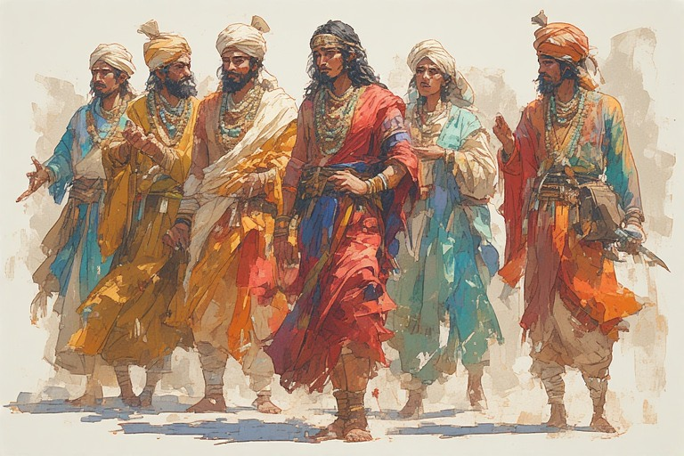



There is a pattern so consistent across history that it almost qualifies as a law of politics: when people encounter friction between groups, their first instinct is to abolish one of the groups. Not to manage the tension. Not to find a structure that holds both. To eliminate. The Marxist sees class conflict and concludes that class itself must go. The progressive sees gender friction and concludes that gender must go. The social reformer sees caste tension and concludes that caste must go. The Western liberal sees civilizational difference and concludes that all civilizational differences must be dissolved into a single global identity. One race, human race.

It all sounds incredibly grand. And it is the dumbest idea humans have ever come up with.

The proof is hiding in plain sight — in a civilization that solved this problem thousands of years ago, quietly, without anyone in the modern world giving it sufficient credit.



## <u>The Problem Nobody Is Naming Correctly</u>

Consider the following thought experiment. There is ongoing friction between Tamil, Maratha and other communities in India. Someone stands up and proposes: the solution to Tamil-Maratha tension is to abolish Tamil identity. No more Tamil culture, Tamil language, Tamil pride. Dissolve it all into something homogeneous, and the friction disappears.

Every person in the room would immediately recognize this as absurd. Nobody would accept it. The proposal would be laughed out of any serious forum.

Yet when it comes to caste, the identical logic is not only accepted — it is celebrated. The friction between caste communities is real, so the prescribed solution is to abolish caste identity entirely. Jati khatam karo. The debate ends there. And anyone who questions this prescription is suspected of wanting to preserve oppression.

The logic is identical. The reception is completely different. This asymmetry deserves far more attention than it gets.

The reason the Tamil example feels obviously wrong is that regional identity is visible, recent, and politically legible. People can immediately see that abolishing Tamil culture would be a catastrophic overreach — it would destroy something real and living. But caste, having been successfully framed for a century as nothing but a system of exploitation, no longer registers as a living identity with legitimate roots. The destruction of it therefore seems not like a loss but like a liberation.

But identity does not work that way. You cannot surgically remove one layer of human belonging without consequence. Identity is not a disease growing on an otherwise healthy body. It is the body. Regional identity creates friction too. Family creates friction. Gender creates friction. If the solution to all friction is abolition of the category causing it, you end up with the Western end-state: individuals atomized to the point where no meaningful collective structure exists at all, where the word "community" has become nearly meaningless, and where a civilization that once built cathedrals now cannot agree on what a woman is.

This is the uniformity trap. And Hindu society has been stumbling into it, following a map drawn by people whose entire framework was hostile to Hinduism's actual genius.

---

## <u>What Hinduism Actually Achieved</u>

At some point in this civilization's long history, someone — or more likely, many people across many generations — figured out something genuinely extraordinary: you do not need uniformity to have unity. You need a larger identity that sits above the smaller ones, one capacious enough to hold all the diversity beneath it without requiring any of it to disappear.

Think about what India actually is. Thousands of years of continuous habitation. Hundreds of languages. Traditions so different from one another that an outside observer could be forgiven for thinking they belong to entirely separate civilizations — a Vaishnav temple's aesthetic sensibility has almost nothing in common with a Shakta temple's, which practices things the Vaishnav might find completely alien, including animal sacrifice. Jains are philosophically opposed to much of what Shaivas do. The dietary rules, the ritual calendars, the cosmologies, the social arrangements — all of it varies wildly across this landmass.

And yet. A Hindu from one corner of this country can walk into a temple in a completely different corner, dedicated to a deity they have never heard of, worshipped in a tradition they were not raised in, and feel instinctive respect. Not tolerance. Not grudging coexistence. Genuine reverence. The other deity is recognized as worthy, as real, as belonging to the same vast reality that their own tradition points toward.

This does not happen by accident. It happens because of a deep civilizational programming — one that says all these forms are legitimate expressions of something that exceeds all of them. It is not relativism. It is a specific metaphysical position: that the ultimate reality is one, that it manifests in infinite forms, and that the appropriate response to any sincere expression of that reality is respect. Advaita is not the same as saying "all gods are imaginary, so none of them matter." It is saying the opposite: all these gods are real in the sense that matters, because they are all faces of the one thing that is truly real.

This is extraordinarily difficult to achieve. Westerners, encountering it, have consistently failed to understand it. How can you worship ten crore gods? How can you claim to be monotheist and polytheist simultaneously? The question reveals the limits of the questioner's framework, not a contradiction in the tradition being questioned. The tradition is operating on a register that the question cannot reach.

But the achievement is not just metaphysical. It is social and political. Hinduism created a structure in which enormous diversity could be held together without forcing anyone to become someone else. The smaller identities — jati, regional, linguistic, sectarian — were all given legitimate space within a larger frame. You did not have to stop being what you were in order to participate in the civilization. You just had to recognize that your particular tradition was one note in a symphony much larger than itself.

What holds the symphony together is not sameness. It is the shared recognition that there *is* a symphony.

---

## <u>How the Marxist Brain Destroyed This Understanding</u>

The Marxist intellectual framework — and here we must be careful, because Marxism has seeped far beyond anyone who would self-identify as a Marxist — operates with a specific assumption: that friction between groups is a problem to be solved by eliminating the distinction between groups. Class conflict means no more classes. Gender conflict means no more gender. Caste conflict means no more caste.

The appeal of this framework is not mysterious. It promises a world without the particular friction you are currently experiencing. It clothes itself in the language of liberation. It is also, beneath the appealing surface, a profoundly Western and specifically Christian/Islamic inheritance.

Both Christianity and Islam are, at their structural core, universalist projects. There is one God. There is one true path to that God. Everyone must eventually walk that path. The diversity of human religious and cultural expression is not a feature — it is an error to be corrected. The missionary impulse is not an aberration within these traditions; it is their logical conclusion. Get everyone to the same place, and friction disappears.

Marxism secularized this impulse. The one God became History or the State or the Proletariat. The missionaries became cadres. The heretics became class enemies. But the underlying move — erase distinction, enforce uniformity, achieve peace through sameness — remained identical.

When this framework entered Hindu society, particularly during British rule when dissidents and reformers were actively supported, funded, and given institutional legitimacy they could never have achieved on their own, it did not arrive labeled as an enemy. It arrived wearing the language of social justice, of equality, of human dignity. These are not bad words. The framework wearing them was using them to do something very different from what Hindu society would have done with the same ideals.

Hindu society had its own ways of thinking about dignity and equality — ways rooted in dharma, in the recognition of cosmic order, in the idea that each person has a role appropriate to their nature and that no role is inherently degrading. These were imperfect in practice, as all human institutions are imperfect. But the solution to their imperfection was not to import a completely alien framework and graft it onto a civilization that had developed over millennia. The solution was internal reform — and Hindu civilization had always been capable of internal reform, had always had its own mechanisms for questioning, debating, and adjusting.

The British disruption did not just change politics. It decapitated the intellectual class. The learned men who had maintained and transmitted the civilizational framework were systematically marginalized. The frameworks they maintained were dismissed as superstition or oppression. And into the resulting vacuum poured the Marxist universalism, which was the dominant intellectual export of the colonial era.

Humans are extraordinarily easy to educate. You can teach almost anyone almost anything, given enough time and institutional backing. The tragedy is not that Indians were susceptible to bad ideas — every population is. The tragedy is that the intellectual class that would have distinguished the bad ideas from the good ones, and that would have articulated why the Hindu framework was actually solving real problems the imported frameworks could not even see, was not there. It had been systematically removed.

---

## <u>The Problem of Defining Hinduism</u>

One consequence of this intellectual disruption is that Hinduism today has no clear institutional boundary. And without a boundary, it cannot defend itself.

Every tradition needs to be able to say: this is within us, this is not. Not out of arbitrary exclusion, but because without a definition, anything can claim to be the tradition. Any demand, however hostile to the tradition's core, can dress itself up as reform and demand accommodation. The tradition, trained to see flexibility as a virtue, cannot distinguish between a legitimate internal critique and an outright attack wearing the costume of a critique.

This is not a hypothetical vulnerability. It has been exploited, repeatedly. Figures who explicitly rejected the foundational elements of the tradition — who in fact formulated vows of rejection, publicly declaring they did not believe in Ram, Krishna, or Kali — have been incorporated into the tradition's public identity as reformers. The question of whether someone who has taken a formal vow to reject the tradition's gods can still be considered part of the tradition seems like it should have an obvious answer. It does not, in contemporary discourse. This is a failure of boundary maintenance with real consequences.

The path forward is not to resolve every theological dispute within Hinduism — those debates have been ongoing for millennia and are, in their way, part of the tradition's vitality. The path forward is to establish the minimum conditions for inclusion. Not what you must believe, but what you cannot deny and still claim to be part of this. If you reject the Vedas as having any authority whatsoever, you are not in a dispute with Hinduism — you have placed yourself outside it. If you hold that every expression of the divine within this tradition is worthless and should be abandoned, you are not reforming it. You are attacking it.

These are not difficult lines to draw. What makes them difficult is that three generations of intellectual disruption have trained people to see the drawing of any line as violence. Every boundary becomes oppression. Every definition becomes exclusion. This is the uniformity trap in its most insidious form: the demand that even the definition of a tradition must be abolished, because definition itself is suspect.

---

## <u>Hinduism's Civilizational Framework: What the West Has Not Figured Out</u>

The West's fundamental unsolved problem is diversity. Not diversity as a word used in HR departments, but actual, irreducible human diversity — the fact that people are different in ways that create friction, and that this friction does not disappear when you pretend the differences do not exist.

The West has tried two approaches. The first is religious universalism: one true God, one path, force everyone onto it. This worked to create internal cohesion within Christian civilizations for many centuries but required constant violence against everyone outside, and eventually broke down as the religious authority holding it together collapsed. The second is liberal universalism: one true humanity, transcending all particular identities, replace all particular loyalties with loyalty to universal human values. This is the current experiment, and it is clearly failing — the diversity it was supposed to manage has simply reorganized around other axes, identity politics has proliferated rather than diminished, and the societies running this experiment are more fractured than they were when they started.

Neither approach has grasped what the Hindu framework understood: that the solution to diversity is not a destination where diversity disappears. The solution is a structure that gives diversity its proper place.

Every identity needs a home. Every tradition needs to be able to be fully itself. What Hinduism built — imperfectly, over millennia — was a civilization-level framework that could hold all these homes together without requiring any of them to be demolished. The diversity was not managed by reducing it. It was managed by giving it a large enough container.

Hinduism also understood something about human nature that the Enlightenment universalists refused to accept: that conflict, ambition, hierarchy, and difference are permanent features of human life, not errors to be corrected. War happens. The Hindu response to this was not to pretend war could be abolished but to construct rules for it — to make it as limited and professional as possible. Women, children, and Brahmins were off the table. Society continues even as kings change. The rules of engagement exist not because war is good but because war is real, and reality must be accommodated rather than denied.

Compare this with the Western utopian tradition, which has spent two thousand years promising that equality is achievable, that conflict can be transcended, that the permanent features of human life can be willed away through the right institutional design. The gap between the promise and the lived reality has generated enormous human suffering, as each generation discovers that the promised equality has not arrived and looks for someone to blame.

The Hindu framework does not promise a destination. It promises a way of navigating the journey. And precisely because it promises a way of navigating rather than an endpoint to arrive at, it has proven more durable than any ideology with a fixed endpoint.

Empires rise and fall. Ideologies have a shelf life. Two thousand years seems to be roughly the limit before a framework begins to buckle under its own accumulated contradictions. But a civilization built on philosophy rather than ideology — one that accommodates human nature rather than demanding that human nature change — has the potential to outlast every particular arrangement it passes through.

---

## <u>The Current Moment</u>

The present situation is not, despite appearances, hopeless. It is clarifying.

For decades, the political vehicles of Hindu nationalism absorbed the energy and expectations of a large portion of the Hindu population. This created a structural vulnerability: when an entire civilization's political consciousness flows into a single party or organization, the flaws of that party become the flaws of the entire project. The party's political compulsions — the need to win elections, the need to manage coalition partners, the need to not do things that would cost votes — become constraints on everything.

The disillusionment that is now spreading is, in the long run, corrective. The dependency on political parties to do the civilizational work was always misplaced. Civilizational revival is not something a political party can deliver. It is something a society must do for itself — through its own intellectual vitality, its own institutional creativity, its own willingness to define, defend, and transmit what it values.

The British state once had a near-monopoly on narrative. It controlled what was printed, what was taught, which intellectuals got funding and which did not. That monopoly determined, for generations, which ideas were legitimate and which were fringe. The internet has broken that monopoly. Truth can get out from any corner. The conversations that needed to happen — about what Hinduism actually is, what it achieved, why its framework is worth defending, and where its current defenders have failed it — are happening now, broadly and freely, in ways that would have been impossible twenty years ago.

This does not guarantee anything. Knowledge is not automatically clarifying. An open information environment produces noise as well as signal, and bad ideas circulate just as easily as good ones. The work of building a genuine intellectual class — one that can read the civilization's actual texts, argue about them seriously, distinguish legitimate internal debate from external attack, and articulate why the framework matters in terms contemporary people can understand — that work is still largely undone.

But the conditions for it exist. What was once controlled and suppressed is now discussable. The next generation is not dependent on state-approved curricula to encounter their own civilization's ideas. And the failure of the alternatives — the Marxist uniformity project, the liberal dissolution project, the political-party-as-savior project — is visible enough that even those who once had faith in them are looking for something else.

---

## <u>The Real Colonial Era</u>

If Hindu civilization recovers — and there is reason to believe it can — this period will likely be understood as the actual era of colonization. Not because foreign armies were present, but because foreign ideas occupied the minds of the civilization's own people. A colonization of categories, of frameworks, of the very terms in which the civilization understood itself.

The great task is not political. It is intellectual. It is recovering the ability to think from within the tradition rather than about it, to see the world through a framework built over millennia of hard-won experience rather than through frameworks imported from civilizations that are, by any honest historical measure, much younger and much less tested.

And the first step, as with most recoveries, is the clearest and most difficult: to recognize what has been lost, and why it mattered.

Hinduism gave the world a working model of how to hold diversity together without demanding uniformity. It built a civilization that survived every empire that tried to break it, absorbed every influence that passed through it, and maintained a recognizable core identity across thousands of years and thousands of kilometers. It solved the problem the West is now visibly failing to solve.

That knowledge did not disappear. It was suppressed, distorted, and confused — but it still exists, in texts, in living traditions, in the instincts of people who have never been formally taught any of it but carry it anyway. The task is to find it, articulate it, and build with it again.

Not to copy the past. The past is not coming back, and most of it should not. But to understand what the framework *was* — so that what gets built next can be grounded in something real, something tested, something true to the nature of the civilization that is trying to survive.

The uniformity trap will keep being set. The demand to dissolve identity, to erase distinction, to achieve peace through sameness — it will keep coming, because it always sounds reasonable right up until you see what it actually produces. The answer is not to refuse all change. The answer is to refuse the premise that diversity is the problem.

Diversity was never the problem. The problem has always been the absence of a structure large enough to hold it.

Hinduism knew how to build that structure. The question is whether enough people still remember.
