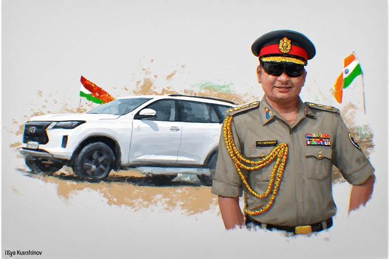



When India's Army Chief recently handed over twenty SUVs to the Sri Lankan military—a gesture saving them millions in rental costs—it prompted a question that echoes across decades of Indian foreign policy: why do we keep doing this? Why does India continue extending goodwill to neighbors with dubious track records of loyalty, repeating patterns that yield little strategic return? The answer, it turns out, isn't about generosity or naivety. It's about something far more structural: a bureaucratic system that was never designed for strategic thinking in the first place.



## <u>The Philosophy Problem</u>

India's foreign policy often appears reactive rather than proactive, generous rather than calculated, passive rather than relentless. Compare this to American or Chinese diplomacy—both characterized by constant scheming, plotting, and strategic maneuvering. The difference isn't just about national personality or political will. It's about the very architecture of how decisions get made.

The people crafting and implementing India's policies—from foreign relations to domestic administration—are products of a specific system: the Union Public Service Commission exam. This isn't merely an entrance test. It's the gateway to India's entire administrative apparatus, from the Indian Administrative Service to the Indian Foreign Service. And herein lies a fundamental contradiction: these positions don't require exam-taking ability at the world stage. They require real experience, strategic vision, and domain expertise.

Yet India has built its entire governance structure on the opposite premise—that the ability to memorize vast amounts of information and perform well in a standardized test is the primary qualification for running a country.

## <u>The Exam-Centric Anomaly</u>

To understand how unusual this is, consider how other major democracies staff their bureaucracies.

In the United States, the President directly appoints secretaries for every portfolio. These appointees don't need to write exams or be elected. They simply need to be the right person for the job—whether that means a former CEO for Commerce, an experienced diplomat for State, or a respected general for Defense. The system is agile, allowing for rapid adaptation and the injection of specialized expertise wherever needed.

The United Kingdom, despite being the original architect of exam-based civil services, abandoned this model decades ago. There is no single "UPSC-like" exam in Britain. Instead, each department recruits separately based on role requirements. Recruitment is competency-based, not cadre-based. You apply for specific jobs, undergo assessments tailored to those roles, and get hired on merit and fit—not on your rank in a national exam taken in your early twenties.

The UK does have the Fast Stream programme, which might seem similar to UPSC on the surface. But the differences are instructive: Fast Stream candidates choose specializations, intake is limited, performance matters continuously, and there's no guarantee of lifetime employment or automatic authority. It's more akin to a management trainee program than a permanent ruling class.

Most importantly, the UK civil service prioritizes specialists over generalists. Economists, lawyers, scientists, and technology experts are directly hired into senior positions. Domain expertise isn't just valued—it's expected. Lateral entry is normal and respected, not controversial.

In India, by contrast, generalist IAS officers dominate. The same person might manage a district's law and order, then be transferred to run an education department, then oversee infrastructure projects—all based on a single exam they took years earlier that tested none of these specific competencies.

## <u>The Colonial Inheritance We Never Questioned</u>

Here's the uncomfortable truth that explains this anomaly: India didn't design the UPSC system. It inherited it nearly wholesale from the British Empire—and then froze it in time while Britain itself evolved.

The system's origins lie in the Indian Civil Service, often called "the steel frame of the Raj." The British needed a way to rule a massive, diverse, restive colony with minimal manpower. Their solution was elegant in its efficiency: create a single, brutally competitive exam to select a small elite, give them enormous administrative power, and train them on the job. This elite would be loyal, capable, and unified in purpose.

This was never designed for democracy. It was designed for colonial control.

The exam system made sense in the 1800s context. There was no internet, no modern management theory, no professional public policy schools. A centralized exam was objective, cheap, corruption-resistant by imperial standards, and easy to standardize across a vast territory. The British held the exam initially in London, later in India, recruited generalists, and gave them combined judicial and executive power.

This is the direct ancestor of today's IAS.

## <u>The Critical Fork of 1947</u>

When India gained independence, it faced a fundamental choice. One option was to dismantle the colonial bureaucracy entirely—to build new institutions, decentralize power, create specialist services, and risk the chaos that might come with such upheaval in a newborn nation. The other option was to keep the "steel frame," rename ICS to IAS, retain the centralized exam system, and ensure continuity and stability.

India chose continuity.

The reasons were understandable, even compelling. Post-independence India faced partition trauma, a refugee crisis, the integration of princely states, and severe language, caste, and regional tensions. Leaders like Sardar Patel argued that removing the steel frame would cause the entire structure to collapse. The need for stability was existential.

There was also a deep mistrust of mass politics among the founding generation. Nehru and others wanted a neutral, educated elite to serve as a stabilizing force against what they saw as the potential chaos of popular democracy. They made bureaucrats permanent, protected, and powerful.

Additionally, India simply lacked alternatives. There were almost no trained specialists, no policy schools, and very low literacy rates. Generalists selected through standardized exams were the only feasible option for staffing a modern state apparatus.

## <u>The Irony of Divergent Paths</u>

Here's where the irony becomes painful: by the mid-20th century, Britain itself had dismantled ICS-style elitism. The UK moved toward a professional, role-based civil service, reduced bureaucratic power, and embraced flexibility and specialization.

India, meanwhile, turned UPSC into a national religion. IAS power expanded rather than contracted. More services were added to the exam system. The social prestige associated with these positions grew massively. What was once a tool of empire became a symbol of merit, fairness, and national unity.

The system that Britain abandoned became the system India sanctified.

## <u>Why Reform Remains Impossible</u>

You might ask: if the problems are so obvious, why hasn't the system been reformed? The answer lies in what UPSC has become beyond its administrative function.

The exam system has evolved into a powerful social institution. It represents a ladder of social mobility, a moral symbol of fairness, and a political shield against corruption charges. In a country marked by deep inequalities and historical injustices, UPSC offers something precious: the promise that merit alone can elevate anyone to positions of power and prestige.

This makes reform extraordinarily difficult. Any attempt to move away from exam-based selection risks accusations of elitism, charges of favoritism, and massive political backlash. The system is particularly protected by reservation policies, which guarantee specific percentages of positions for historically marginalized communities. These quotas are deeply embedded in the exam structure.

When the government has floated ideas about lateral entry—bringing in specialists from institutions like the IIMs or from the private sector—opposition has been fierce, often centered on concerns about bypassing reservation systems. The fear is that opening alternative pathways would undermine hard-won protections for marginalized groups.

This creates a tragic bind: the very features that make UPSC "fair" in terms of access also make it deeply dysfunctional in terms of governance outcomes.

## <u>The Vicious Cycle</u>

Here's the fundamental paradox at the heart of modern India: everything—IIT admissions, medical college seats, bureaucratic positions—has become a poverty eradication and social mobility scheme. The pursuit of equitable access has become so all-consuming that it compromises the functional effectiveness of institutions themselves.

This isn't to argue against equity or social justice. Rather, it's to highlight that India has conflated access with excellence, entry with outcomes, fairness in selection with competence in execution.

The result is a bureaucracy selected for exam-taking ability rather than strategic thinking, for generalist knowledge rather than specialized expertise, for performance at age 25 rather than sustained excellence over a career.

## <u>What This Means for Policy</u>

Return to that original question about India's foreign policy—or its infrastructure development, or its economic strategy, or any domain requiring sustained strategic vision. The people making these decisions are primarily career bureaucrats who:

- Were selected based on an exam testing breadth of general knowledge
- Have lifetime job security regardless of policy outcomes  
- Rotate between vastly different domains every few years
- Face no market pressure or performance accountability
- Operate within a colonial-era framework of authority

This explains the passivity, the lack of original thinking, the repetition of failed patterns. It's not a failure of individual intelligence or dedication. It's a structural feature of how the system selects and incentivizes behavior.

When you select for exam performance, you get excellent exam performers. When you provide lifetime security, you get risk aversion. When you rotate generalists across domains, you get surface-level understanding. When you insulate from consequences, you get drift rather than drive.

## <u>The Uncomfortable Conclusion</u>

India's UPSC system exists because what was built to rule India was repurposed to run India—and then made sacred. It is colonial in origin, authoritarian in design, and democratic only in access.

India is attempting to run a 21st-century nation with a 19th-century administrative solution.

Yet here's the deeper tragedy: the system has also prevented state collapse, unified administration across incredible diversity, and created a common national ethos. It has provided genuine social mobility for millions. These are not small achievements. They explain why, despite all its flaws, the system persists.

But persistence should not be confused with optimality. The question isn't whether UPSC served a purpose—it clearly has. The question is whether it remains fit for the challenges India now faces.

A country competing on the world stage needs relentless diplomacy, not passive goodwill gestures. It needs domain experts crafting policy, not generalists rotating through portfolios. It needs accountability for outcomes, not security regardless of performance. It needs the ability to rapidly adapt, not a frozen administrative framework from the colonial era.

The bottleneck isn't at the top or the bottom. It's in the very structure of how India identifies, selects, and deploys administrative talent. And unlike most bottlenecks, this one is protected by powerful historical, social, and political forces that make reform extraordinarily difficult.

Which raises a final, uncomfortable question: can a system this entrenched be reformed without revolutionary change? Or has India created a permanent structural ceiling on its own potential—a steel frame that, instead of supporting the building, now limits how high it can rise?

The answer to that question will determine not just India's administrative effectiveness, but its trajectory as a civilization in the century ahead.
